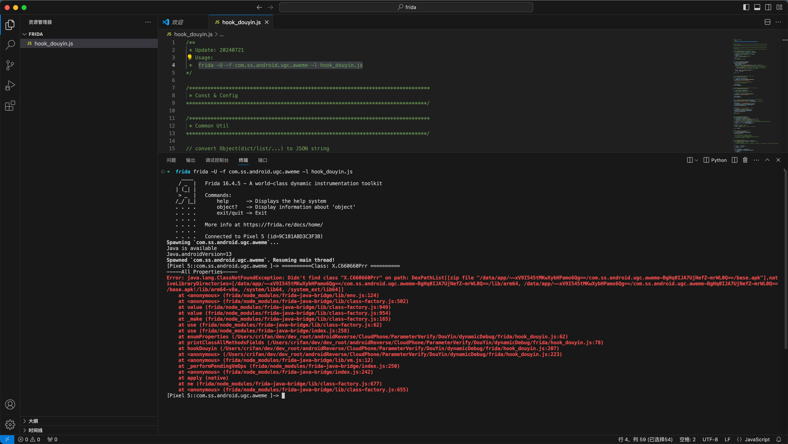
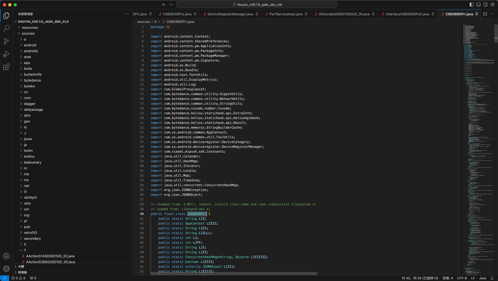
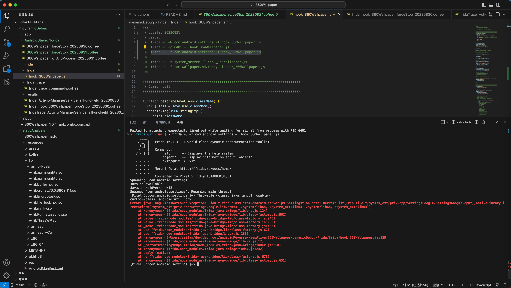

# Error java.lang.ClassNotFoundException Didn't find class on path DexPathList zip file

## 情况1：类名错了

* 现象

Frida去hook抖音代码：

```js
  var C660660PrrClassName = "X.C660660Prr"
  printClassAllMethodsFields(C660660PrrClassName)

  var C660660PrrCls = Java.use(C660660PrrClassName)
  console.log("C660660PrrCls=" + C660660PrrCls)
```

报错：

```bash
[Pixel 5::com.ss.android.ugc.aweme ]-> ==========Class: X.C660660Prr ==========
-----All Properties-----
Error: java.lang.ClassNotFoundException: Didn't find class "X.C660660Prr" on path: DexPathList[[zip file "/data/app/~~xV9I545tMKwXybHPamo6Qg==/com.ss.android.ugc.aweme-BgHq0IJA7UjNefZ-mrWL0Q==/base.apk"],nativeLibraryDirectories=[/data/app/~~xV9I545tMKwXybHPamo6Qg==/com.ss.android.ugc.aweme-BgHq0IJA7UjNefZ-mrWL0Q==/lib/arm64, /data/app/~~xV9I545tMKwXybHPamo6Qg==/com.ss.android.ugc.aweme-BgHq0IJA7UjNefZ-mrWL0Q==/base.apk!/lib/arm64-v8a, /system/lib64, /system_ext/lib64]]
    at <anonymous> (frida/node_modules/frida-java-bridge/lib/env.js:124)
    at <anonymous> (frida/node_modules/frida-java-bridge/lib/class-factory.js:502)
    at value (frida/node_modules/frida-java-bridge/lib/class-factory.js:949)
    at value (frida/node_modules/frida-java-bridge/lib/class-factory.js:954)
    at _make (frida/node_modules/frida-java-bridge/lib/class-factory.js:165)
    at use (frida/node_modules/frida-java-bridge/lib/class-factory.js:62)
    at use (frida/node_modules/frida-java-bridge/index.js:258)
    at enumProperties (/Users/crifan/dev/dev_root/androidReverse/xxx/ParameterVerify/DouYin/dynamicDebug/frida/hook_douyin.js:62)
    at printClassAllMethodsFields (/Users/crifan/dev/dev_root/androidReverse/xxx/ParameterVerify/DouYin/dynamicDebug/frida/hook_douyin.js:78)
    at hookDouyin (/Users/crifan/dev/dev_root/androidReverse/xxx/ParameterVerify/DouYin/dynamicDebug/frida/hook_douyin.js:207)
    at <anonymous> (/Users/crifan/dev/dev_root/androidReverse/xxx/ParameterVerify/DouYin/dynamicDebug/frida/hook_douyin.js:223)
    at <anonymous> (frida/node_modules/frida-java-bridge/lib/vm.js:12)
    at _performPendingVmOps (frida/node_modules/frida-java-bridge/index.js:250)
    at <anonymous> (frida/node_modules/frida-java-bridge/index.js:242)
    at apply (native)
    at ne (frida/node_modules/frida-java-bridge/lib/class-factory.js:677)
    at <anonymous> (frida/node_modules/frida-java-bridge/lib/class-factory.js:655)
```



即：找不到类名

* 原因：类名写错了

* 根本原因：

之前Jadx反编译出的源码是：

`sources/X/C660660Prr.java`

以为对应的类名是：`X.C660660Prr`

但是实际上是，jadx反编译中的注释

```java
/* renamed from: X.0Prr, reason: invalid class name and case insensitive filesystem */
/* loaded from: classes9.dex */
public final class C660660Prr {
```



中的：`X.0Prr`

* 解决办法：把名字改为真正的Java的类名：`X.0Prr`
* 具体步骤

代码改为：

```java
  var C660660PrrClassName = "X.0Prr"
  printClassAllMethodsFields(C660660PrrClassName)

  var C660660PrrCls = Java.use(C660660PrrClassName)
  console.log("C660660PrrCls=" + C660660PrrCls)
```

## 情况2：类不在当前hook的二进制中

* 背景

安卓逆向期间，去根据之前Logcat日志：

```bash
2023-08-31 10:26:23.911  6481-6481  AppButtonsPrefCtl       com.android.settings                 D  Stopping package com.wallpaper.hd.funny
```

找到了安卓内部的类：`com.android.server.pm.Settings`中的函数：`createNewSetting`，输出了上述的log

* 现象

去Frida中用js代码：

```js
    var SettingsCls = Java.use("com.android.server.pm.Settings")
```

去hook安卓内部的类：`com.android.server.pm.Settings`

```bash
frida -U -f com.android.settings -l hook_360Wallpaper.js
```

报错：

```bash
Error: java.lang.ClassNotFoundException: Didn't find class "com.android.server.pm.Settings" on path: DexPathList[[zip file "/system_ext/priv-app/SettingsGoogle/SettingsGoogle.apk"],nativeLibraryDirectories=[/system_ext/priv-app/SettingsGoogle/lib/arm64, /system/lib64, /system_ext/lib64, /system/lib64, /system_ext/lib64]]
    at <anonymous> (frida/node_modules/frida-java-bridge/lib/env.js:124)
    at <anonymous> (frida/node_modules/frida-java-bridge/lib/class-factory.js:502)
    at value (frida/node_modules/frida-java-bridge/lib/class-factory.js:945)
    at value (frida/node_modules/frida-java-bridge/lib/class-factory.js:950)
    at _make (frida/node_modules/frida-java-bridge/lib/class-factory.js:165)
    at use (frida/node_modules/frida-java-bridge/lib/class-factory.js:62)
    at use (frida/node_modules/frida-java-bridge/index.js:258)
    at <anonymous> (/Users/crifan/dev/dev_root/androidReverse/keepAlive/360Wallpaper/dynamicDebug/Frida/frida/hook_360Wallpaper.js:139)
    at <anonymous> (frida/node_modules/frida-java-bridge/lib/vm.js:12)
    at _performPendingVmOps (frida/node_modules/frida-java-bridge/index.js:250)
    at <anonymous> (frida/node_modules/frida-java-bridge/index.js:242)
    at apply (native)
    at ne (frida/node_modules/frida-java-bridge/lib/class-factory.js:673)
    at <anonymous> (frida/node_modules/frida-java-bridge/lib/class-factory.js:651)
```



* 原因
  * 此处安卓系统的app：**设置**，包名：`com.android.settings`
  * 好像没包含，此处输出的Stopping package的日志的代码：
  * 类 `com.android.server.pm.Settings` 的 函数`createNewSetting`
  * 因为是另外的二进制程序`system_server`才包含此函数
* 解决办法

经过实测，换`system_server`去hook，即可找到。

* 具体步骤

```bash
frida -U -n system_server -l hook_360Wallpaper.js
```

即可找到该类，正常输出：

```bash
SettingsCls=<class: com.android.server.pm.Settings>
```
