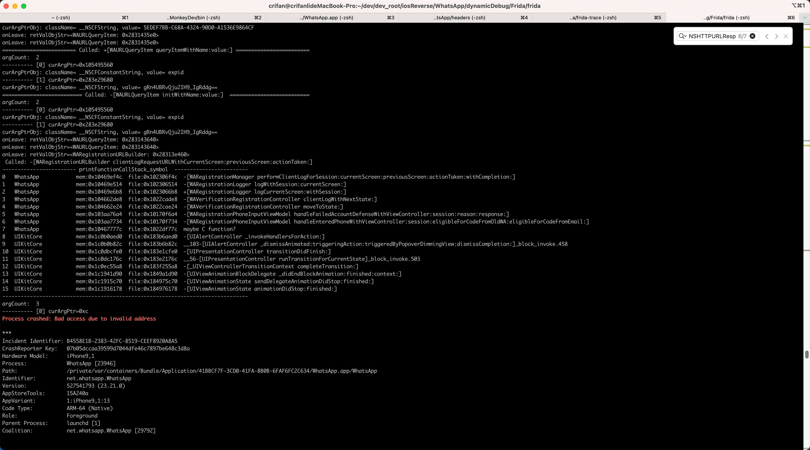

# Process crashed: Bad access due to invalid address

* 问题：

```bash
Called: -[WARegistrationURLBuilder clientLogRequestURLWithCurrentScreen:previousScreen:actionTaken:]
...
argCount:  3
---------- [0] curArgPtr=0xc
Process crashed: Bad access due to invalid address
...
```



* 原因
  * 表面原因：访问了非法地址：`0xc`
  * 深层次原因：对于值明显异常的地址，没有做过滤，没有排除掉
* 解决办法：加上过滤，排除掉，地址值明显异常的地址
* 具体步骤：

代码改为：

```js
// check pointer is valid or not
// example
//         0x103e79560 => true
//         0xc => false
function isValidPointer(curPtr){
    let MinValidPointer = 0x10000
    var isValid = curPtr > MinValidPointer
    return isValid
}

...

  if (isValidPointer(curArg)) {
    ...
  }
```

即可避免访问非法地址指针，避免崩溃。
