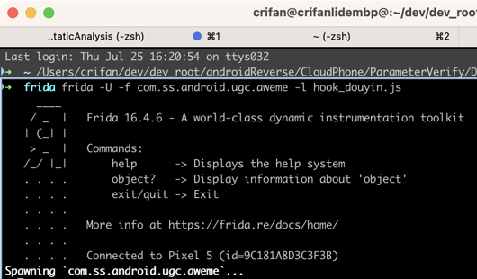
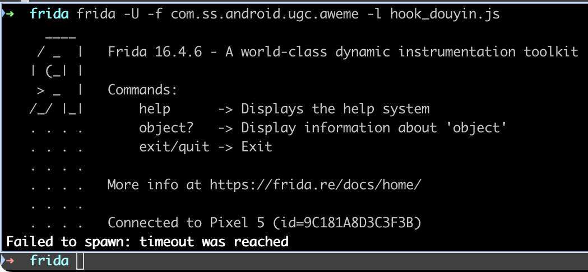
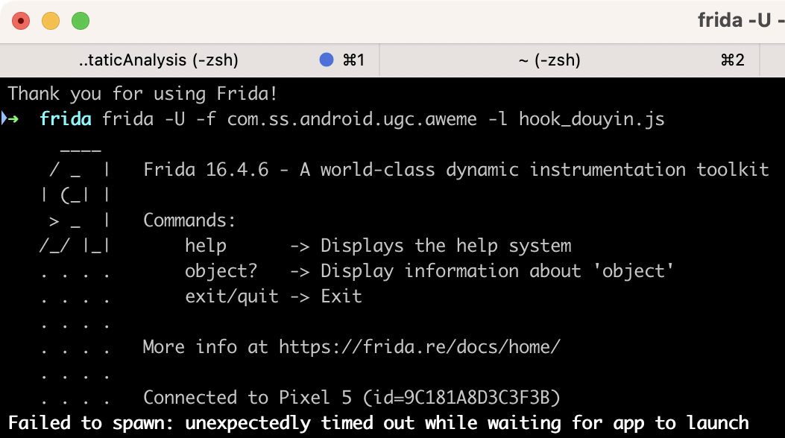

# 卡死在Spawning

* 现象：frida去hook时，一直显示=卡死在`Spawning`
  ```bash
  ➜  frida frida -U -f com.ss.android.ugc.aweme -l hook_douyin.js
      ____
      / _  |   Frida 16.4.6 - A world-class dynamic instrumentation toolkit
    | (_| |
      > _  |   Commands:
    /_/ |_|       help      -> Displays the help system
    . . . .       object?   -> Display information about 'object'
    . . . .       exit/quit -> Exit
    . . . .
    . . . .   More info at https://frida.re/docs/home/
    . . . .
    . . . .   Connected to Pixel 5 (id=9C181A8D3C3F3B)
  Spawning `com.ss.android.ugc.aweme`...
  ```
  * 
  * -> 当时的错误操作：以为真的卡死了，所以去找别的可能的原因，所以就去直接用`Ctrl+C`中断运行了
* 原因：其实并没有卡死，而是多等会，会有最终结果
  * 是超时报错，还是能正常运行
* 解决办法：多等一会，看看最终的结果

## 结果1：正常

结果1：正常继续hook和输出log

```bash
➜  frida frida -U -f com.ss.android.ugc.aweme -l hook_douyin.js
...
Spawning `com.ss.android.ugc.aweme`...
Java is available
Java.androidVersion=13
Spawned `com.ss.android.ugc.aweme`. Resuming main thread!
[Pixel 5::com.ss.android.ugc.aweme ]->
```

* 解决办法：无需任何操作，只是稍微多等会

## 结果2：异常

结果1：报错超时等异常

### 情况1

```bash
➜  frida frida -U -f com.ss.android.ugc.aweme -l hook_douyin.js
...
  . . . .   Connected to Pixel 5 (id=9C181A8D3C3F3B)
Failed to spawn: timeout was reached
```



* 此处的背景
  * 此处之前Frida的hook，触发输出太多log，自己强制输入（多次输入，因为输出log太多，都无法顺利输入）exit退出Frida后，然后不知道什么情况，总之是：导致了安卓端的Frida异常
* 解决办法：重启Android手机

### 情况2

```bash
➜  frida frida -U -f com.ss.android.ugc.aweme -l hook_douyin.js
...
  . . . .   Connected to Pixel 5 (id=9C181A8D3C3F3B)
Failed to spawn: unexpectedly timed out while waiting for app to launch
```



* 解决办法：多试试几次（有时候就正常了）
