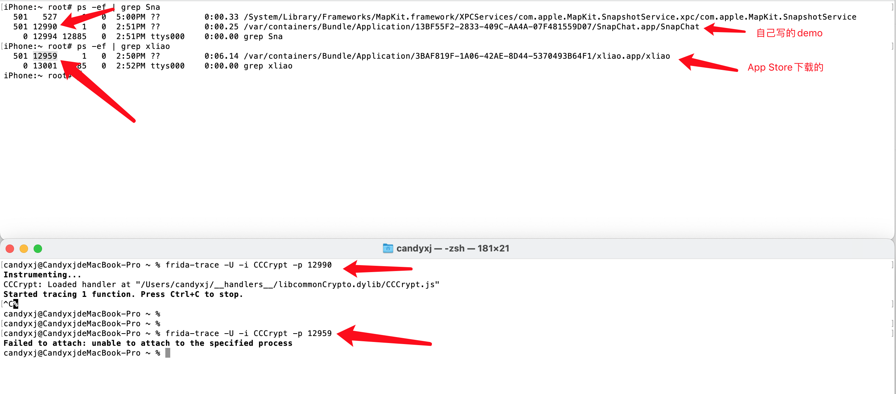
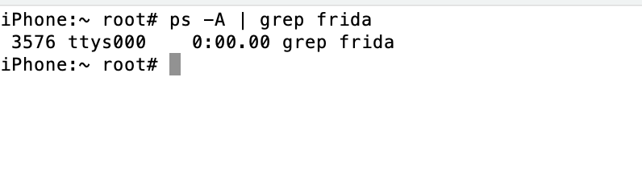

# Failed to attach unable to attach to the specified proces

* 背景：用`palera1nC`越狱后
  * 注：之前只有`palera1nC`能越狱`15.6`的系统
* 现象：`frida-trace`去hook调试报错
  ```bash
  ~% frida-trace -U -i CCCrypt -p 12959
  Failed to attach: unable to attach to the specified proces
  ```
  * 
* 原因：iPhone端的frida（`frida-server`）没有正常运行
  * 如何确认=如何找到的问题的原因？
    ```bash
    iPhone:~ root# ps -A l grep frida
    3576 ttys000
    0:00.00 grep frida
    iPhone:~root#
    ```
    * 
* 解决办法
  * iPhone端，重新安装frida，确保安装后`frida-server`已正常启动在运行
