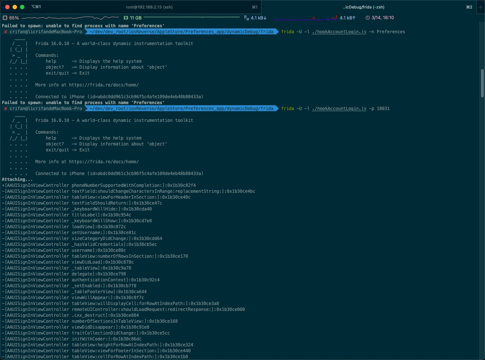

# ApiResolver

## 查找类`AAUISignInViewController`中的所有函数

* Frida命令

```bash
frida -U -p 18031 -l ./hookAccountLogin.js
```

* js文件`hookAccountLogin.js`的内容

```js
var resolver = new ApiResolver('objc');
resolver.enumerateMatches('*[AAUISignInViewController *]', {
  onMatch: function(match) {
    console.log(match['name'] + ":" + match['address']);
  },

  onComplete: function() {}
});
```

* 输出



```bash
✘ crifan@licrifandeMacBook-Pro  ~/dev/dev_root/iosReverse/AppleStore/Preferences_app/dynamicDebug/frida  frida -U -l ./hookAccountLogin.js -p 18031
     ____
    / _  |   Frida 16.0.10 - A world-class dynamic instrumentation toolkit
   | (_| |
    > _  |   Commands:
   /_/ |_|       help      -> Displays the help system
   . . . .       object?   -> Display information about 'object'
   . . . .       exit/quit -> Exit
   . . . .
   . . . .   More info at https://frida.re/docs/home/
   . . . .
   . . . .   Connected to iPhone (id=abdc0dd961c3cb96f5c4afe109de4eb48b88433a)
Attaching...
+[AAUISignInViewController phoneNumberSupportedWithCompletion:]:0x1b30c82f4
-[AAUISignInViewController textField:shouldChangeCharactersInRange:replacementString:]:0x1b30ce4bc
-[AAUISignInViewController tableView:viewForHeaderInSection:]:0x1b30ce40c
-[AAUISignInViewController textFieldShouldReturn:]:0x1b30ce47c
-[AAUISignInViewController _keyboardWillHide:]:0x1b30cda40
-[AAUISignInViewController titleLabel]:0x1b30c954c
-[AAUISignInViewController _keyboardWillShow:]:0x1b30cd7e8
-[AAUISignInViewController loadView]:0x1b30c872c
-[AAUISignInViewController setUsername:]:0x1b30ce81c
-[AAUISignInViewController sizeCategoryDidChange:]:0x1b30cdd64
-[AAUISignInViewController _hasValidCredentials]:0x1b30cb5ec
-[AAUISignInViewController username]:0x1b30ce80c
-[AAUISignInViewController tableView:numberOfRowsInSection:]:0x1b30ce170
-[AAUISignInViewController viewDidLoad]:0x1b30c878c
-[AAUISignInViewController _tableView]:0x1b30c9a70
-[AAUISignInViewController delegate]:0x1b30ce798
-[AAUISignInViewController authenticationContext]:0x1b30c92c4
-[AAUISignInViewController _setEnabled:]:0x1b30cb7f8
-[AAUISignInViewController _tableFooterView]:0x1b30ca644
-[AAUISignInViewController viewWillAppear:]:0x1b30c8f7c
-[AAUISignInViewController tableView:willDisplayCell:forRowAtIndexPath:]:0x1b30ce3a8
-[AAUISignInViewController remoteUIController:shouldLoadRequest:redirectResponse:]:0x1b30ce000
-[AAUISignInViewController .cxx_destruct]:0x1b30ce884
-[AAUISignInViewController numberOfSectionsInTableView:]:0x1b30ce168
-[AAUISignInViewController viewDidDisappear:]:0x1b30c91e8
-[AAUISignInViewController traitCollectionDidChange:]:0x1b30ce5cc
-[AAUISignInViewController initWithCoder:]:0x1b30c86dc
-[AAUISignInViewController tableView:heightForRowAtIndexPath:]:0x1b30ce324
-[AAUISignInViewController tableView:viewForFooterInSection:]:0x1b30ce440
-[AAUISignInViewController tableView:cellForRowAtIndexPath:]:0x1b30ce1b0
-[AAUISignInViewController setDelegate:]:0x1b30ce7b8
-[AAUISignInViewController _tableHeaderView]:0x1b30c9708
-[AAUISignInViewController tableView:shouldDrawTopSeparatorForSection:]:0x1b30ce474
-[AAUISignInViewController messageLabel]:0x1b30c95a0
-[AAUISignInViewController initWithNibName:bundle:]:0x1b30c8498
-[AAUISignInViewController dealloc]:0x1b30c9258
-[AAUISignInViewController _cancelBarButtonItem]:0x1b30c95f4
-[AAUISignInViewController viewDidLayoutSubviews]:0x1b30c9144
-[AAUISignInViewController _cancelPasswordDelegateIfNecessary]:0x1b30ccecc
-[AAUISignInViewController context:needsPasswordWithCompletion:]:0x1b30cdfa0
-[AAUISignInViewController _passwordCell]:0x1b30ca1c0
-[AAUISignInViewController _textFieldDidChange:]:0x1b30cd4d4
-[AAUISignInViewController _nextBarButtonItem]:0x1b30c9638
-[AAUISignInViewController _updateConstraintsForTraitCollection:]:0x1b30ce6c0
-[AAUISignInViewController _beginObservingTextFieldDidChangeNotifications]:0x1b30cd40c
-[AAUISignInViewController _beginObservingKeyboardWillShowNotifications]:0x1b30cd5f0
-[AAUISignInViewController _beginObservingSizeCategoryNotification]:0x1b30cdc9c
-[AAUISignInViewController _usernameCell]:0x1b30c9c00
-[AAUISignInViewController _updateContentInsetWithHeight:]:0x1b30cdb74
-[AAUISignInViewController _endObservingSizeCategoryNotification]:0x1b30cdd04
-[AAUISignInViewController _endObservingTextFieldDidChangeNotifications]:0x1b30cd474
-[AAUISignInViewController _endObservingKeyboardWillShowNotifications]:0x1b30cd6f8
-[AAUISignInViewController _akServiceType]:0x1b30ce758
-[AAUISignInViewController _shouldAnticipatePiggybacking]:0x1b30ce778
-[AAUISignInViewController _accountsHeaderView]:0x1b30c97b0
-[AAUISignInViewController _cancelButtonSelected:]:0x1b30cb96c
-[AAUISignInViewController _nextButtonSelected:]:0x1b30cb978
-[AAUISignInViewController constrainView:toFillHeaderFooterView:]:0x1b30cb1d0
-[AAUISignInViewController allowsAccountCreation]:0x1b30ce7cc
-[AAUISignInViewController _actionButtonSelected:]:0x1b30cb9ac
-[AAUISignInViewController showServiceIcons]:0x1b30ce7ec
-[AAUISignInViewController _stringForFooter]:0x1b30cb6c4
-[AAUISignInViewController privacyLinkIdentifiers]:0x1b30ce848
-[AAUISignInViewController _showOnlyPassword]:0x1b30cccac
-[AAUISignInViewController _isGreenTeaCapable]:0x1b30cb6b8
-[AAUISignInViewController _setUsernameCellWaiting:]:0x1b30cd31c
-[AAUISignInViewController _delegate_signInViewControllerDidCancel]:0x1b30cdf10
-[AAUISignInViewController _attemptAuthentication]:0x1b30cc070
-[AAUISignInViewController _prewarmSignInFlowIfApplicable]:0x1b30cc018
-[AAUISignInViewController _presentForgotAppleIDPane]:0x1b30cbf48
-[AAUISignInViewController _presentCreateAppleIDPane]:0x1b30cbe78
-[AAUISignInViewController _attemptAuthenticationWithContext:]:0x1b30cc364
-[AAUISignInViewController _isPasswordFieldVisible]:0x1b30cb670
-[AAUISignInViewController _isRunningInSettings]:0x1b30cb774
-[AAUISignInViewController _repairCloudAccountWithAuthenticationResults:]:0x1b30cc89c
-[AAUISignInViewController _delegate_signInViewControllerDidCompleteWithAuthenticationResults:]:0x1b30cde68
-[AAUISignInViewController _authorizationValueForAuthenticationResults:]:0x1b30ccd30
-[AAUISignInViewController _passwordFieldIndexPath]:0x1b30cd3f0
-[AAUISignInViewController _setPasswordFieldHidden:]:0x1b30ccf68
-[AAUISignInViewController _setAkServiceType:]:0x1b30ce768
-[AAUISignInViewController _setShouldAnticipatePiggybacking:]:0x1b30ce788
-[AAUISignInViewController setAllowsAccountCreation:]:0x1b30ce7dc
-[AAUISignInViewController setShowServiceIcons:]:0x1b30ce7fc
-[AAUISignInViewController canEditUsername]:0x1b30ce828
-[AAUISignInViewController setCanEditUsername:]:0x1b30ce838
-[AAUISignInViewController setPrivacyLinkIdentifiers:]:0x1b30ce858
-[AAUISignInViewController showingPasswordCell]:0x1b30ce864
-[AAUISignInViewController setShowingPasswordCell:]:0x1b30ce874
[iPhone::PID::18031 ]->
```
