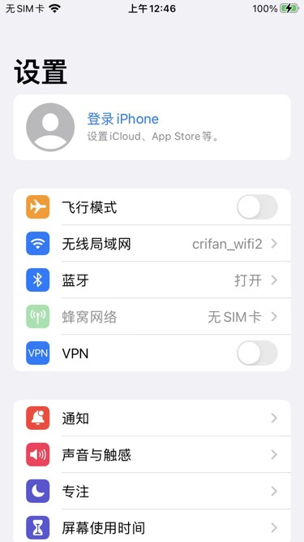
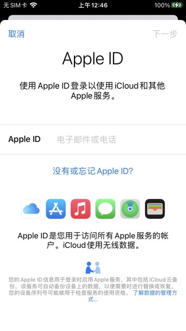
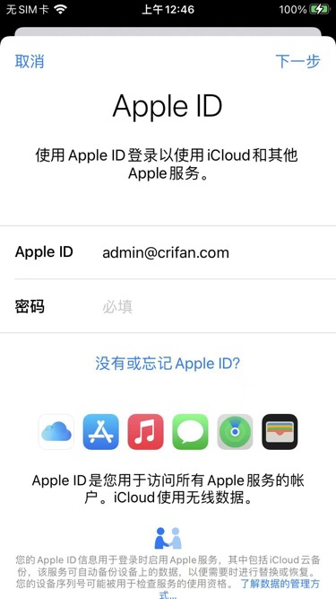
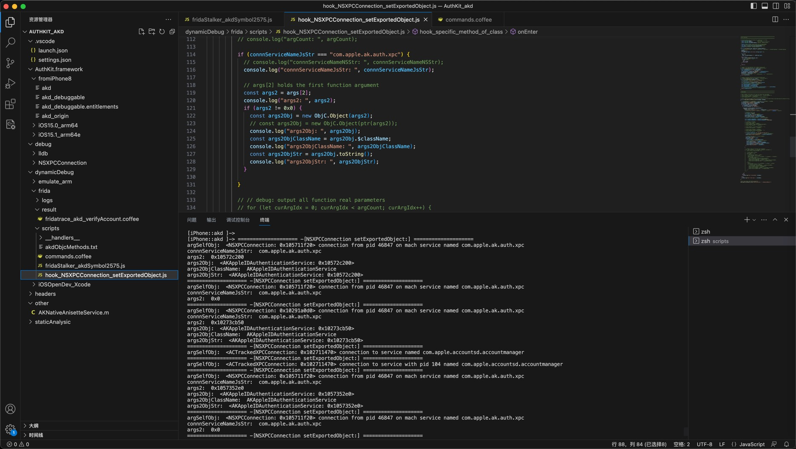

# 单个类的单个函数

## Frida去hook调试ObjC函数：`-[NSXPCConnection setExportedObject:]`

* 背景

调试iPhone中的，`设置`app中点击Apple账号登录的过程，内部会触发akd进程中的`iOS`的`ObjC`函数：

`-[NSXPCConnection setExportedObject:]`

此处去写frida的js脚本，去调试hook，打印参数值

涉及到的操作iPhone中的app的页面有：







### 最基础的，hook类的函数，只是打印参数值

* 适用场景：确定要hook的类和函数是：能找到的=是存在的 -》代码才能正确hook，否则会报错找不到
  * 写法：直接把`类名`和`函数名`放到`ObjC.classes`的后面
  * 代码
    ```js
    const curMethod = ObjC.classes.NSXPCConnection["- setExportedObject:"];
    // console.log("curMethod: ", curMethod);
    // const iOSObjCallStr = "-[NSXPCConnection setExportedObject:]";

          Interceptor.attach(curMethod.implementation, {
            onEnter: function(args) {
              // console.log("==================== " + iOSObjCallStr + " ====================");
              console.log("argSelf=" + args[0] + ", argSel=" + args[1] + ", realArg1=" + args[2]);
            }
          });
    ```
* 适用场景：要hook的类和函数，不确定是否存在，所以加上判断
  * 写法：传入`类名`和`函数名`，先去查找在不在，找到后，才hook
  * 代码
    ```js
    // https://github.com/noobpk/frida-ios-hook/blob/master/frida-ios-hook/frida-scripts/hook-specific-method-of-class.js
    function hook_specific_method_of_class(className, funcName)
    {
      // console.log("className=" + className + ", funcName=" + funcName)
      var curClass = ObjC.classes[className];
      if (typeof(curClass) !== 'undefined') {
        var curMethod = curClass[funcName];
        if (typeof(curMethod) !== 'undefined') {
          Interceptor.attach(curMethod.implementation, {
            onEnter: function(args) {
              console.log("argSelf=" + args[0] + ", argSel=" + args[1] + ", realArg1=" + args[2]);
            }
          });
        }else{
          console.log("Can't find method", funcName);
        }
      }else{
        console.log("Can't find class: ", className);
      }
    }

    //Your class name  and function name here
    hook_specific_method_of_class("NSXPCConnection", "- setExportedObject:")
    ```

典型输出log：

```log
➜  scripts frida -U -n akd -l hook_NSXPCConnection_setExportedObject.js
     ____
    / _  |   Frida 16.0.19 - A world-class dynamic instrumentation toolkit
   | (_| |
    > _  |   Commands:
   /_/ |_|       help      -> Displays the help system
   . . . .       object?   -> Display information about 'object'
   . . . .       exit/quit -> Exit
   . . . .
   . . . .   More info at https://frida.re/docs/home/
   . . . .
   . . . .   Connected to iPhone (id=abdc0dd961c3cb96f5c4afe109de4eb48b88433a)
                                                                                
[iPhone::akd ]-> %resume

...

==================== -[NSXPCConnection setExportedObject:] ====================
argSelf=0x102725ce0, argSel=0x19b362b44, realArg1=0x102926640
==================== -[NSXPCConnection setExportedObject:] ====================
argSelf=0x102928300, argSel=0x19b362b44, realArg1=0x1029211b0
==================== -[NSXPCConnection setExportedObject:] ====================
argSelf=0x102725ce0, argSel=0x19b362b44, realArg1=0x0
==================== -[NSXPCConnection setExportedObject:] ====================
argSelf=0x102a21570, argSel=0x19b362b44, realArg1=0x0
```

### 简单优化：加上额外的参数的转换和打印相关值

再去加上额外的，参数类型转换

* 把常见参数转换成ObjC的Object
* 把ObjC的SEL转换成String
* 等等

对应代码是：

```js
function hook_specific_method_of_class(className, funcName)
{
  var iOSObjCallStr = "className=" + className + ", funcName=" + funcName
  console.log("iOSObjCallStr=", iOSObjCallStr)
  var curClass = ObjC.classes[className];
  if (typeof(curClass) !== 'undefined') {
    var curMethod = curClass[funcName];
    if (typeof(curMethod) !== 'undefined') {

      Interceptor.attach(curMethod.implementation, {
        onEnter: function(args) {
          console.log("==================== " + iOSObjCallStr + " ====================");
          // args[0] is self = id
          const argSelf = args[0];
          console.log("argSelf: ", argSelf);
          const argSelfObj = new ObjC.Object(argSelf);
          console.log("argSelfObj: ", argSelfObj);
          const argSelfClassName = argSelfObj.$className;
          console.log("argSelfClassName: ", argSelfClassName);

          // args[1] is selector
          const argSel = args[1];
          console.log("argSel: ", argSel);
          const argSelStr = ObjC.selectorAsString(argSel);
          console.log("argSelStr: ", argSelStr);

            // args[2] holds the first function argument
            const args2 = args[2];
            console.log("args2: ", args2);
            if (args2 != 0x0) {
              const args2Obj = new ObjC.Object(args2);
              // const args2Obj = new ObjC.Object(ptr(args2));
              console.log("args2Obj: ", args2Obj);
              const args2ObjClassName = args2Obj.$className;
              console.log("args2ObjClassName: ", args2ObjClassName);
              const args2ObjStr = args2Obj.toString();
              console.log("args2ObjStr: ", args2ObjStr);
            }
        }
      });
    }else{
      console.log("Can't find method", funcName);
    }
  }else{
    console.log("Can't find class: ", className);
  }
}

//Your class name  and function name here
hook_specific_method_of_class("NSXPCConnection", "- setExportedObject:")
```

### 优化日志：把Frida类名和函数名转换为ObjC的类名和函数名

可以继续去加上：

* `toiOSObjcCall`
  * 作用举例
    * 输入：`["NSXPCConnection", "- setExportedObject:"]`
    * 输出：`"-[NSXPCConnection setExportedObject:]"`

* 目的：实现优化日志打印
  * 输出的ObjC的类和函数名 -》 方便调试和查看具体调用了哪个ObjC的类和函数

代码：

```js
// convert from frida function call to ObjC function call
// "NSURL", "- initWithString:" => "-[NSURL initWithString:]"
function toiOSObjcCall(class_name, method_name){
	const instanceCallStart = "-[" + class_name + " ";
	const classCallStart = "+[" + class_name + " ";
	var objcFuncCall = method_name.replace("- ", instanceCallStart);
	objcFuncCall = objcFuncCall.replace("+ ", classCallStart);
	objcFuncCall = objcFuncCall + "]";
	// console.log(class_name + " -> " + method_name + " => " + objcFuncCall);
	return objcFuncCall;
}

function hook_specific_method_of_class(className, funcName)
{
  var iOSObjCallStr = toiOSObjcCall(className, funcName)
  console.log("iOSObjCallStr=", iOSObjCallStr)
  var curClass = ObjC.classes[className];
  if (typeof(curClass) !== 'undefined') {
    var curMethod = curClass[funcName];
    if (typeof(curMethod) !== 'undefined') {

      Interceptor.attach(curMethod.implementation, {
        onEnter: function(args) {
          console.log("==================== " + iOSObjCallStr + " ====================");
          // args[0] is self = id
          const argSelf = args[0];
          console.log("argSelf: ", argSelf);
          const argSelfObj = new ObjC.Object(argSelf);
          console.log("argSelfObj: ", argSelfObj);
          const argSelfClassName = argSelfObj.$className;
          console.log("argSelfClassName: ", argSelfClassName);

          // args[1] is selector
          const argSel = args[1];
          console.log("argSel: ", argSel);
          const argSelStr = ObjC.selectorAsString(argSel);
          console.log("argSelStr: ", argSelStr);

            // args[2] holds the first function argument
            const args2 = args[2];
            console.log("args2: ", args2);
            if (args2 != 0x0) {
              const args2Obj = new ObjC.Object(args2);
              // const args2Obj = new ObjC.Object(ptr(args2));
              console.log("args2Obj: ", args2Obj);
              const args2ObjClassName = args2Obj.$className;
              console.log("args2ObjClassName: ", args2ObjClassName);
              const args2ObjStr = args2Obj.toString();
              console.log("args2ObjStr: ", args2ObjStr);
            }
        }
      });
    }else{
      console.log("Can't find method", funcName);
    }
  }else{
    console.log("Can't find class: ", className);
  }
}

//Your class name  and function name here
hook_specific_method_of_class("NSXPCConnection", "- setExportedObject:")
```

### 优化参数：打印函数全部的真正参数

如之前 [ObjC的参数](../../../../use_frida/frida_cli/ios_objc/objc_para.md) 中的`计算ObjC的函数的真正参数的个数 + 打印全部参数`的实例代码，加到此处，略作调整变成：

```js
/*******************************************************************************
* Util Functions
*******************************************************************************/

/** Function that count occurrences of a substring in a string;
 * @param {String} string               The string
 * @param {String} subString            The sub string to search for
 * @param {Boolean} [allowOverlapping]  Optional. (Default:false)
 *
 * @author Vitim.us https://gist.github.com/victornpb/7736865
 * @see Unit Test https://jsfiddle.net/Victornpb/5axuh96u/
 * @see https://stackoverflow.com/a/7924240/938822
 * @example occurrences("- setExportedObject:", ":") => 1
 */
function occurrences(string, subString, allowOverlapping) {
	// console.log("string=" + string + ",subString=" + subString + ", allowOverlapping=" + allowOverlapping)
	string += "";
	subString += "";
	if (subString.length <= 0) return (string.length + 1);

	var n = 0,
		pos = 0,
		step = allowOverlapping ? 1 : subString.length;

	while (true) {
		pos = string.indexOf(subString, pos);
		// console.log("pos=" + pos)
		if (pos >= 0) {
			++n;
			pos += step;
		} else break;
	}

	return n;
}

// convert from frida function call to ObjC function call
// "NSURL", "- initWithString:" => "-[NSURL initWithString:]"
function toiOSObjcCall(class_name, method_name){
	const instanceCallStart = "-[" + class_name + " ";
	const classCallStart = "+[" + class_name + " ";
	var objcFuncCall = method_name.replace("- ", instanceCallStart);
	objcFuncCall = objcFuncCall.replace("+ ", classCallStart);
	objcFuncCall = objcFuncCall + "]";
	// console.log(class_name + " -> " + method_name + " => " + objcFuncCall);
	return objcFuncCall;
}

/*******************************************************************************
* Frida Hook
*******************************************************************************/

// https://github.com/noobpk/frida-ios-hook/blob/master/frida-ios-hook/frida-scripts/hook-specific-method-of-class.js
function hook_specific_method_of_class(className, funcName)
{
  var iOSObjCallStr = toiOSObjcCall(className, funcName)
  console.log("iOSObjCallStr=", iOSObjCallStr)
  var curClass = ObjC.classes[className];
  if (typeof(curClass) !== 'undefined') {
    var curMethod = curClass[funcName];
    if (typeof(curMethod) !== 'undefined') {

      Interceptor.attach(curMethod.implementation, {
        onEnter: function(args) {
          console.log("==================== " + iOSObjCallStr + " ====================");

          // args[0] is self = id
          const argSelf = args[0];
          console.log("argSelf: ", argSelf);
          const argSelfObj = new ObjC.Object(argSelf);
          console.log("argSelfObj: ", argSelfObj);
          const argSelfClassName = argSelfObj.$className;
          console.log("argSelfClassName: ", argSelfClassName);

          // args[1] is selector
          const argSel = args[1];
          console.log("argSel: ", argSel);
          const argSelStr = ObjC.selectorAsString(argSel);
          console.log("argSelStr: ", argSelStr);

          const argCount = occurrences(argSelStr, ":");
          console.log("argCount: ", argCount);

          // console.log("funcName=", funcName);
          // const argCount = occurrences(funcName, ":");
          // console.log("argCount: ", argCount);

          for (let curArgIdx = 0; curArgIdx < argCount; curArgIdx++) {
            const curArg = args[curArgIdx + 2];

            // const usePtr = false;
            const usePtr = true;
            if (usePtr) {
              // console.log("usePtr=", usePtr);
              const curArgPtr = ptr(curArg);
              console.log("---------- [" + curArgIdx + "] curArgPtr=" + curArgPtr);
              if (!curArgPtr.isNull()) {
                const curArgPtrObj = new ObjC.Object(curArgPtr);
                console.log("curArgPtrObj: ", curArgPtrObj);
                console.log("curArgPtrObj className: ", curArgPtrObj.$className);
                console.log("curArgPtrObj kind: ", curArgPtrObj.$kind);
              }
            } else {
              console.log("---------- [" + curArgIdx + "] curArg=" + curArg);
              if (curArg && (curArg != 0x0)) {
                // console.log("curArg className: ", curArg.$className);
                const curArgObj = new ObjC.Object(curArg);
                console.log("curArgObj: ", curArgObj);
                console.log("curArgObj className: ", curArgObj.$className);
                console.log("curArgObj kind: ", curArgObj.$kind);
              }
            }
          }

        }
      });
    }else{
      console.log("Can't find method", funcName);
    }
  }else{
    console.log("Can't find class: ", className);
  }
}

//Your class name  and function name here
hook_specific_method_of_class("NSXPCConnection", "- setExportedObject:")
```

典型log输出：

```bash
==================== -[NSXPCConnection setExportedObject:] ====================
argSelf:  0x1057047a0
argSelfObj:  <NSXPCConnection: 0x1057047a0> connection from pid 46847 on mach service named com.apple.ak.auth.xpc
argSelfClassName:  NSXPCConnection
argSel:  0x19b362b44
argSelStr:  setExportedObject:
funcName= - setExportedObject:
argCount:  1
---------- [0] curArgPtr=0x105743aa0
curArgPtrObj:  <AKAppleIDAuthenticationService: 0x105743aa0>
curArgPtrObj className:  AKAppleIDAuthenticationService
curArgPtrObj kind:  instance
==================== -[NSXPCConnection setExportedObject:] ====================
argSelf:  0x1057047a0
argSelfObj:  <NSXPCConnection: 0x1057047a0> connection from pid 46847 on mach service named com.apple.ak.auth.xpc
argSelfClassName:  NSXPCConnection
argSel:  0x19b362b44
argSelStr:  setExportedObject:
argCount:  1
---------- [0] curArgPtr=0x0
```

* 关于argCount的计算

另外，计算`argCount`的代码，如果从：

```js
          const argCount = occurrences(argSelStr, ":");
          console.log("argCount: ", argCount);

          // console.log("funcName=", funcName);
          // const argCount = occurrences(funcName, ":");
          // console.log("argCount: ", argCount);
```

换成：

```js
          // const argCount = occurrences(argSelStr, ":");
          // console.log("argCount: ", argCount);

          console.log("funcName=", funcName);
          const argCount = occurrences(funcName, ":");
          console.log("argCount: ", argCount);
```

则对应部分输出从：

```bash
argSelStr:  setExportedObject:
argCount:  1
```

变成：

```bash
argSelStr:  setExportedObject:
funcName= - setExportedObject:
argCount:  1
```

### 优化逻辑：加上参数值的判断和过滤

如果此处需要有类似于，过滤参数的值，判断参数的值，并且过滤只输出对应值，则可以去：

* 把ObjC的NSString转换成js的String
* 然后再去用`===`去对比判断字符串

完整代码：

```js
/*******************************************************************************
* Util Functions
*******************************************************************************/

// convert from frida function call to ObjC function call
// "NSURL", "- initWithString:" => "-[NSURL initWithString:]"
function toiOSObjcCall(class_name, method_name){
	const instanceCallStart = "-[" + class_name + " ";
	const classCallStart = "+[" + class_name + " ";
	var objcFuncCall = method_name.replace("- ", instanceCallStart);
	objcFuncCall = objcFuncCall.replace("+ ", classCallStart);
	objcFuncCall = objcFuncCall + "]";
	// console.log(class_name + " -> " + method_name + " => " + objcFuncCall);
	return objcFuncCall;
}

/*******************************************************************************
* Frida Hook
*******************************************************************************/

// https://github.com/noobpk/frida-ios-hook/blob/master/frida-ios-hook/frida-scripts/hook-specific-method-of-class.js
function hook_specific_method_of_class(className, funcName)
{
  var iOSObjCallStr = toiOSObjcCall(className, funcName)
  console.log("iOSObjCallStr=", iOSObjCallStr)
  var curClass = ObjC.classes[className];
  if (typeof(curClass) !== 'undefined') {
    var curMethod = curClass[funcName];
    if (typeof(curMethod) !== 'undefined') {

      Interceptor.attach(curMethod.implementation, {
        onEnter: function(args) {
          console.log("==================== " + iOSObjCallStr + " ====================");

          // args[0] is self = id
          const argSelf = args[0];
          console.log("argSelf: ", argSelf);
          const argSelfObj = new ObjC.Object(argSelf);
          console.log("argSelfObj: ", argSelfObj);
          const argSelfClassName = argSelfObj.$className;
          console.log("argSelfClassName: ", argSelfClassName);

          const connnServiceNameNSStr = argSelfObj.serviceName();
          const connnServiceNameJsStr = connnServiceNameNSStr.UTF8String()

          // args[1] is selector
          const argSel = args[1];
          console.log("argSel: ", argSel);
          const argSelStr = ObjC.selectorAsString(argSel);
          console.log("argSelStr: ", argSelStr);

          if (connnServiceNameJsStr === "com.apple.ak.auth.xpc") {
            console.log("connnServiceNameNSStr: ", connnServiceNameNSStr);
            console.log("connnServiceNameJsStr: ", connnServiceNameJsStr);

            // args[2] holds the first function argument
            const args2 = args[2];
            console.log("args2: ", args2);
            if (args2 != 0x0) {
              const args2Obj = new ObjC.Object(args2);
              // const args2Obj = new ObjC.Object(ptr(args2));
              console.log("args2Obj: ", args2Obj);
              const args2ObjClassName = args2Obj.$className;
              console.log("args2ObjClassName: ", args2ObjClassName);
              const args2ObjStr = args2Obj.toString();
              console.log("args2ObjStr: ", args2ObjStr);
            }

          }

        }
      });
    }else{
      console.log("Can't find method", funcName);
    }
  }else{
    console.log("Can't find class: ", className);
  }
}

//Your class name  and function name here
hook_specific_method_of_class("NSXPCConnection", "- setExportedObject:")
```

典型log输出：

```bash
==================== -[NSXPCConnection setExportedObject:] ====================
argSelf:  0x1057047a0
argSelfObj:  <NSXPCConnection: 0x1057047a0> connection from pid 46847 on mach service named com.apple.ak.auth.xpc
argSelfClassName:  NSXPCConnection
argSel:  0x19b362b44
argSelStr:  setExportedObject:
argCount:  1
connnServiceNameNSStr:  com.apple.ak.auth.xpc
connnServiceNameJsStr:  com.apple.ak.auth.xpc
args2:  0x105743aa0
args2Obj:  <AKAppleIDAuthenticationService: 0x105743aa0>
args2ObjClassName:  AKAppleIDAuthenticationService
args2ObjStr:  <AKAppleIDAuthenticationService: 0x105743aa0>
==================== -[NSXPCConnection setExportedObject:] ====================
argSelf:  0x1057047a0
argSelfObj:  <NSXPCConnection: 0x1057047a0> connection from pid 46847 on mach service named com.apple.ak.auth.xpc
argSelfClassName:  NSXPCConnection
argSel:  0x19b362b44
argSelStr:  setExportedObject:
argCount:  1
connnServiceNameNSStr:  com.apple.ak.auth.xpc
connnServiceNameJsStr:  com.apple.ak.auth.xpc
args2:  0x0
```

即：

只打印`serviceName`是`com.apple.ak.auth.xpc`的`NSXPCConnection`，过滤掉其他的，比如之前会打印的：

```bash
==================== -[NSXPCConnection setExportedObject:] ====================
argSelf:  0x102d35b60
argSelfObj:  <NSXPCConnection: 0x102d35b60> connection from pid 46847 on mach service named com.apple.ak.anisette.xpc
connnServiceName:  com.apple.ak.anisette.xpc
argSelfClassName:  NSXPCConnection
args2:  0x0

==================== -[NSXPCConnection setExportedObject:] ====================
argSelf:  0x102d34e00
argSelfObj:  <NSXPCConnection: 0x102d34e00> connection from pid 31901 on mach service named com.apple.ak.authorizationservices.xpc
connnServiceName:  com.apple.ak.authorizationservices.xpc
argSelfClassName:  NSXPCConnection
args2:  0x102d513c0
args2Obj:  <AKAuthorizationDaemonService: 0x102d513c0>
args2ObjClassName:  AKAuthorizationDaemonService
args2ObjStr:  <AKAuthorizationDaemonService: 0x102d513c0>

==================== -[NSXPCConnection setExportedObject:] ====================
argSelf:  0x102d35a30
argSelfObj:  <ACTrackedXPCConnection: 0x102d35a30> connection to service with pid 104 named com.apple.accountsd.accountmanager
connnServiceName:  com.apple.accountsd.accountmanager
argSelfClassName:  ACTrackedXPCConnection
args2:  0x0
```

等内容。

### 最终代码

```js
/*******************************************************************************
* Util Functions
*******************************************************************************/

/** Function that count occurrences of a substring in a string;
 * @param {String} string               The string
 * @param {String} subString            The sub string to search for
 * @param {Boolean} [allowOverlapping]  Optional. (Default:false)
 *
 * @author Vitim.us https://gist.github.com/victornpb/7736865
 * @see Unit Test https://jsfiddle.net/Victornpb/5axuh96u/
 * @see https://stackoverflow.com/a/7924240/938822
 * @example occurrences("- setExportedObject:", ":") => 1
 */
function occurrences(string, subString, allowOverlapping) {
	// console.log("string=" + string + ",subString=" + subString + ", allowOverlapping=" + allowOverlapping)
	string += "";
	subString += "";
	if (subString.length <= 0) return (string.length + 1);

	var n = 0,
		pos = 0,
		step = allowOverlapping ? 1 : subString.length;

	while (true) {
		pos = string.indexOf(subString, pos);
		// console.log("pos=" + pos)
		if (pos >= 0) {
			++n;
			pos += step;
		} else break;
	}

	return n;
}

// convert from frida function call to ObjC function call
// "NSURL", "- initWithString:" => "-[NSURL initWithString:]"
function toiOSObjcCall(class_name, method_name){
	const instanceCallStart = "-[" + class_name + " ";
	const classCallStart = "+[" + class_name + " ";
	var objcFuncCall = method_name.replace("- ", instanceCallStart);
	objcFuncCall = objcFuncCall.replace("+ ", classCallStart);
	objcFuncCall = objcFuncCall + "]";
	// console.log(class_name + " -> " + method_name + " => " + objcFuncCall);
	return objcFuncCall;
}

// convert from ObjC function call to frida function call
// "-[NSURL initWithString:]" => ["NSURL", "- initWithString:"]
function toFridaObjcCall(fridaObjcCallStr){
	// console.log("fridaObjcCallStr=" + fridaObjcCallStr)
	const funcCallP = /^([+-])\[(\w+)\s+([\w:]+)\]$/
	// console.log("funcCallP=" + funcCallP)
	const funcCallMatch = fridaObjcCallStr.match(funcCallP)
	// console.log("funcCallMatch=" + funcCallMatch)
	const objcFuncTypeChar = funcCallMatch[1]
	const objcClassName = funcCallMatch[2]
	const objcFuncName = funcCallMatch[3]
	const fridaFuncCallList = [objcClassName, objcFuncTypeChar + " " + objcFuncName]
	// console.log("fridaFuncCallList=" + fridaFuncCallList)
	return fridaFuncCallList
}

// NSString instance -> js string
function nsStrToJsStr(curNsStr){
  // method 1
  return curNsStr.UTF8String()
  // // method 2:
  // const NSUTF8StringEncoding = 4;
  // https://developer.apple.com/documentation/foundation/nsstring/1408489-cstringusingencoding?language=objc
  // return curNsStr.cStringUsingEncoding_(NSUTF8StringEncoding)
}

/*******************************************************************************
* Frida Hook
*******************************************************************************/

// Note: Another write type for for sure can found class and method
// const curMethod = ObjC.classes.NSXPCConnection["- setExportedObject:"];
// console.log("curMethod: ", curMethod);
// const iOSObjCallStr = "-[NSXPCConnection setExportedObject:]";

// https://github.com/noobpk/frida-ios-hook/blob/master/frida-ios-hook/frida-scripts/hook-specific-method-of-class.js
function hook_specific_method_of_class(className, funcName)
{
  // var iOSObjCallStr = "className=" + className + ", funcName=" + funcName
  var iOSObjCallStr = toiOSObjcCall(className, funcName)
  console.log("iOSObjCallStr=", iOSObjCallStr)
  var curClass = ObjC.classes[className];
  if (typeof(curClass) !== 'undefined') {
    var curMethod = curClass[funcName];
    if (typeof(curMethod) !== 'undefined') {

      Interceptor.attach(curMethod.implementation, {
        onEnter: function(args) {
          console.log("==================== " + iOSObjCallStr + " ====================");
          // console.log("argSelf=" + args[0] + ", argSel=" + args[1] + ", realArg1=" + args[2]);

          // args[0] is self = id
          const argSelf = args[0];
          // console.log("argSelf: ", argSelf);
          const argSelfObj = new ObjC.Object(argSelf);
          console.log("argSelfObj: ", argSelfObj);
          const argSelfClassName = argSelfObj.$className;
          // console.log("argSelfClassName: ", argSelfClassName);

          const connnServiceNameNSStr = argSelfObj.serviceName();
          // const connnServiceNameJsStr = connnServiceNameNSStr.UTF8String()
          const connnServiceNameJsStr = nsStrToJsStr(connnServiceNameNSStr)

          // // args[1] is selector
          // const argSel = args[1];
          // console.log("argSel: ", argSel);
          // const argSelStr = ObjC.selectorAsString(argSel);
          // console.log("argSelStr: ", argSelStr);

          // const argCount = occurrences(argSelStr, ":");
          // console.log("argCount: ", argCount);

          // console.log("funcName=", funcName);
          // const argCount = occurrences(funcName, ":");
          // console.log("argCount: ", argCount);

          if (connnServiceNameJsStr === "com.apple.ak.auth.xpc") {
            // console.log("connnServiceNameNSStr: ", connnServiceNameNSStr);
            console.log("connnServiceNameJsStr: ", connnServiceNameJsStr);

            // args[2] holds the first function argument
            const args2 = args[2];
            console.log("args2: ", args2);
            if (args2 != 0x0) {
              const args2Obj = new ObjC.Object(args2);
              // const args2Obj = new ObjC.Object(ptr(args2));
              console.log("args2Obj: ", args2Obj);
              const args2ObjClassName = args2Obj.$className;
              console.log("args2ObjClassName: ", args2ObjClassName);
              const args2ObjStr = args2Obj.toString();
              console.log("args2ObjStr: ", args2ObjStr);
            }

          }

          // // debug: output all function real parameters
          // for (let curArgIdx = 0; curArgIdx < argCount; curArgIdx++) {
          //   const curArg = args[curArgIdx + 2];

          //   // const usePtr = false;
          //   const usePtr = true;
          //   if (usePtr) {
          //     // console.log("usePtr=", usePtr);
          //     const curArgPtr = ptr(curArg);
          //     console.log("---------- [" + curArgIdx + "] curArgPtr=" + curArgPtr);
          //     if (!curArgPtr.isNull()) {
          //       const curArgPtrObj = new ObjC.Object(curArgPtr);
          //       console.log("curArgPtrObj: ", curArgPtrObj);
          //       console.log("curArgPtrObj className: ", curArgPtrObj.$className);
          //       console.log("curArgPtrObj kind: ", curArgPtrObj.$kind);
          //     }
          //   } else {
          //     console.log("---------- [" + curArgIdx + "] curArg=" + curArg);
          //     if (curArg && (curArg != 0x0)) {
          //       // console.log("curArg className: ", curArg.$className);
          //       const curArgObj = new ObjC.Object(curArg);
          //       console.log("curArgObj: ", curArgObj);
          //       console.log("curArgObj className: ", curArgObj.$className);
          //       console.log("curArgObj kind: ", curArgObj.$kind);
          //     }
          //   }
          // }

        }
      });
    }else{
      console.log("Can't find method", funcName);
    }
  }else{
    console.log("Can't find class: ", className);
  }
}

//Your class name  and function name here
hook_specific_method_of_class("NSXPCConnection", "- setExportedObject:")
```

输出log：

```bash
==================== -[NSXPCConnection setExportedObject:] ====================
argSelfObj:  <NSXPCConnection: 0x105711f20> connection from pid 46847 on mach service named com.apple.ak.auth.xpc
connnServiceNameJsStr:  com.apple.ak.auth.xpc
args2:  0x10572c200
args2Obj:  <AKAppleIDAuthenticationService: 0x10572c200>
args2ObjClassName:  AKAppleIDAuthenticationService
args2ObjStr:  <AKAppleIDAuthenticationService: 0x10572c200>
==================== -[NSXPCConnection setExportedObject:] ====================
argSelfObj:  <NSXPCConnection: 0x105711f20> connection from pid 46847 on mach service named com.apple.ak.auth.xpc
connnServiceNameJsStr:  com.apple.ak.auth.xpc
args2:  0x0
==================== -[NSXPCConnection setExportedObject:] ====================
argSelfObj:  <NSXPCConnection: 0x10291a0d0> connection from pid 46847 on mach service named com.apple.ak.auth.xpc
connnServiceNameJsStr:  com.apple.ak.auth.xpc
args2:  0x10273cb50
args2Obj:  <AKAppleIDAuthenticationService: 0x10273cb50>
args2ObjClassName:  AKAppleIDAuthenticationService
args2ObjStr:  <AKAppleIDAuthenticationService: 0x10273cb50>
==================== -[NSXPCConnection setExportedObject:] ====================
argSelfObj:  <ACTrackedXPCConnection: 0x102711470> connection to service named com.apple.accountsd.accountmanager
==================== -[NSXPCConnection setExportedObject:] ====================
argSelfObj:  <ACTrackedXPCConnection: 0x102711470> connection to service with pid 104 named com.apple.accountsd.accountmanager
```



