# akd中Apple账号验证过程

此处去记录`frida-trace`追踪`akd`中Apple账号验证过程：

* 设备：
  * `iOS 15.0`的`iPhone8`
      * `palera1n`的rootful普通越狱

去追踪调试：

* 设置Preferences中，点击登录Apple账号
    * 输入账号，点击下一步

的Apple账号验证过程中，函数调用的过程的结果

## frida-trace命令

```bash
frida-trace -U -n akd -O akdObjcMethods.txt
```

### Option文件`akdObjcMethods.txt`内容

```txt
-m "*[AA* *]"
-m "*[AK* *]"
-m "*[AS* *]"
-m "*[NSXPC* *]"
-M "-[NSXPC*coder *]"
-M "-[NSXPCConnection replacementObjectForEncoder:object:]"
```

## 输出

### 截图

完整的截图如下：

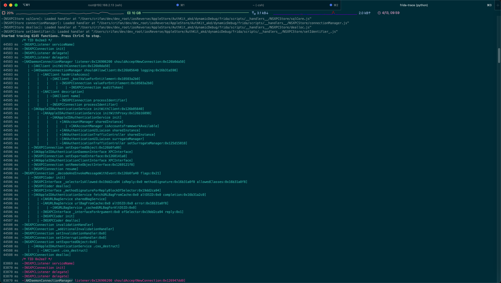
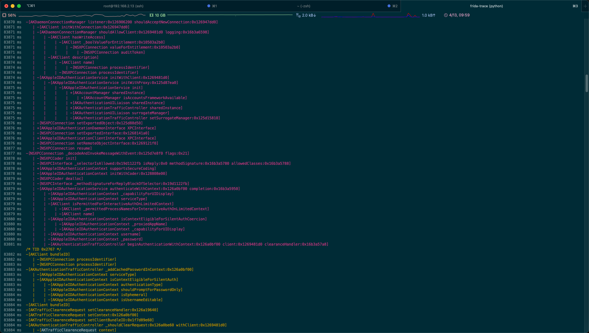
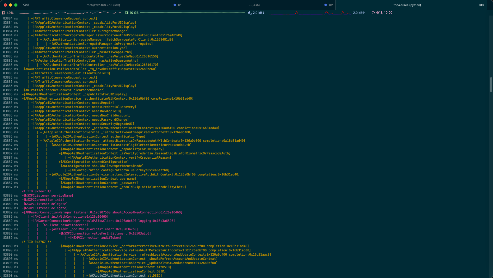
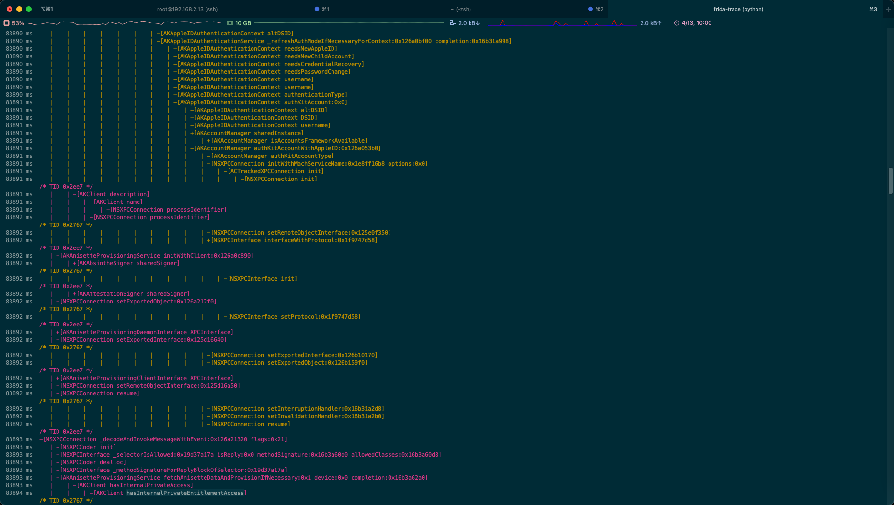
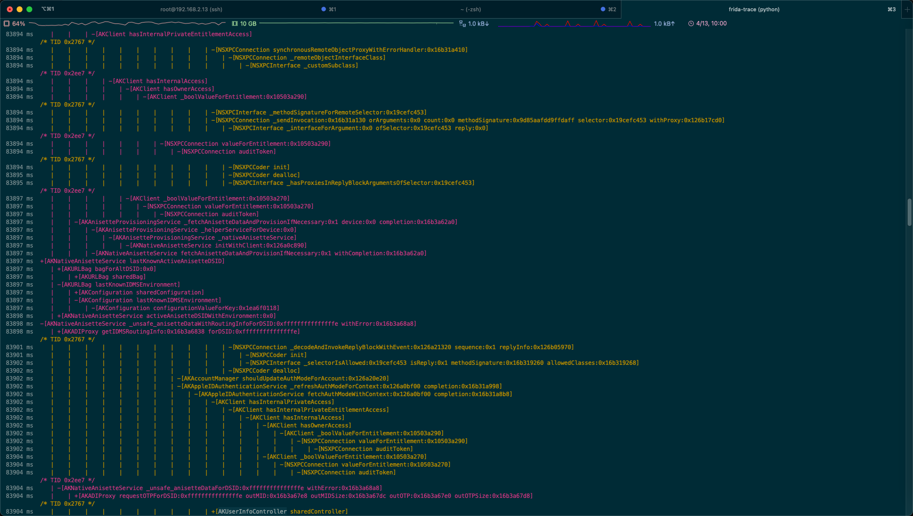
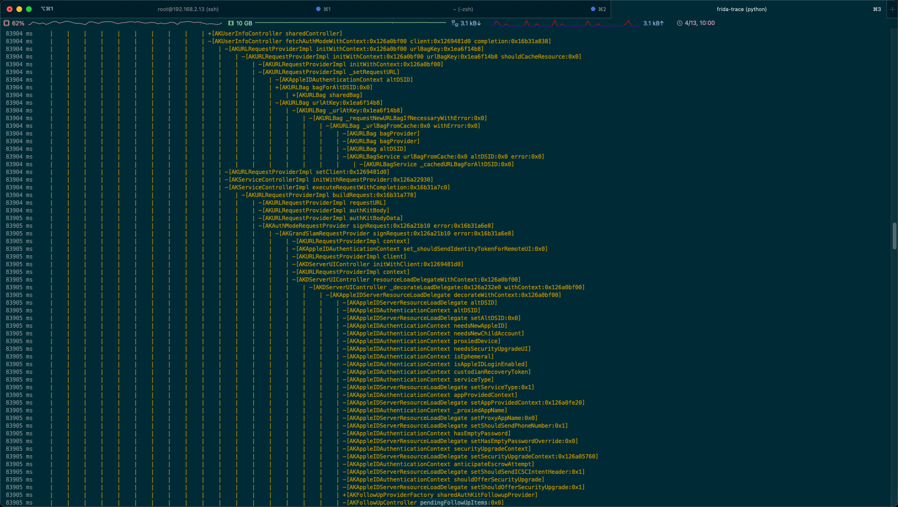
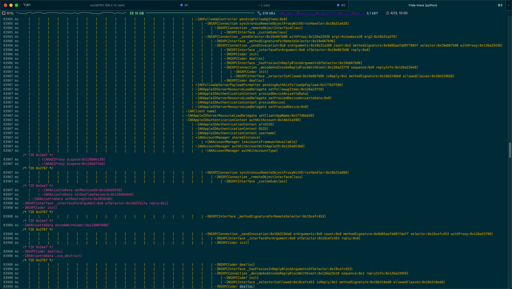
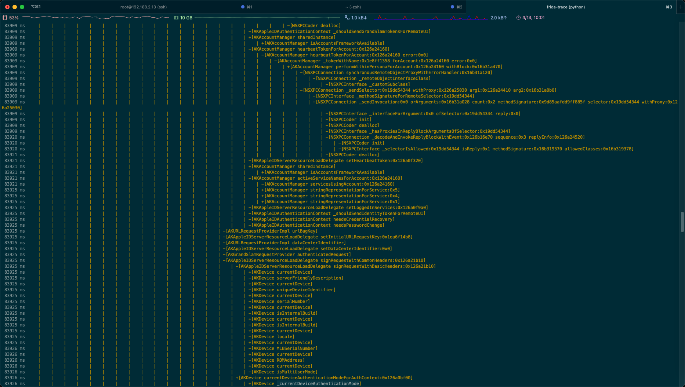
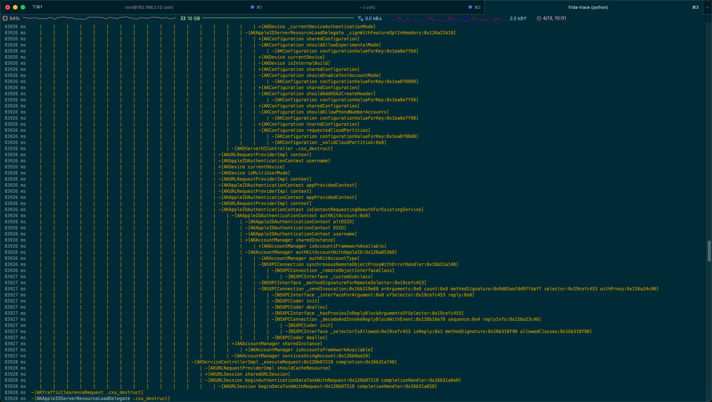
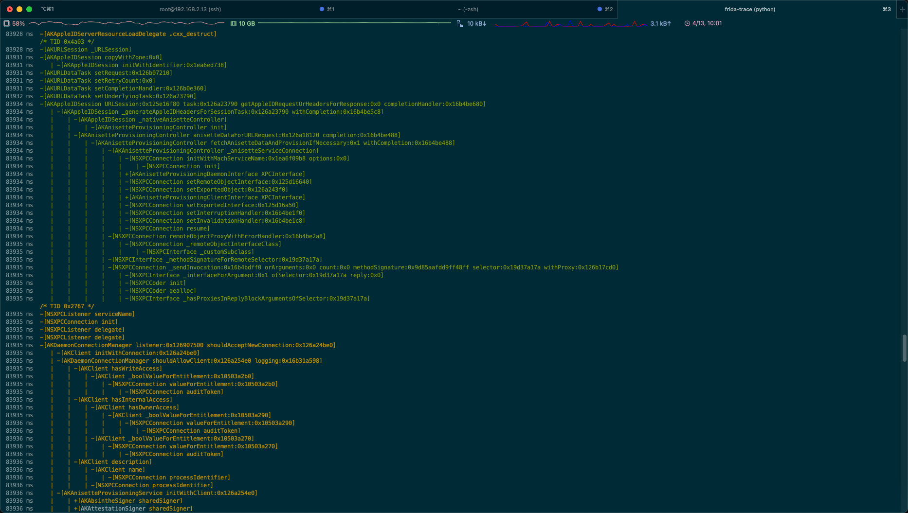
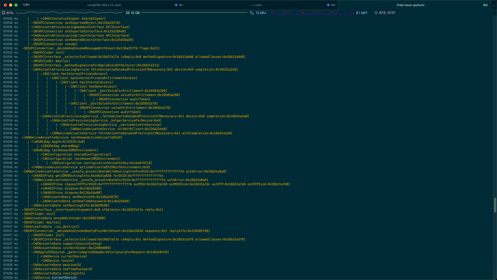
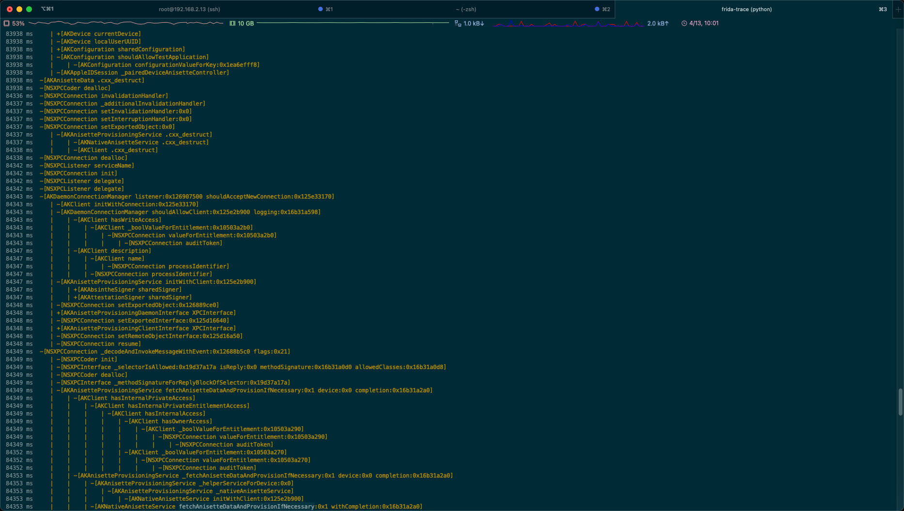
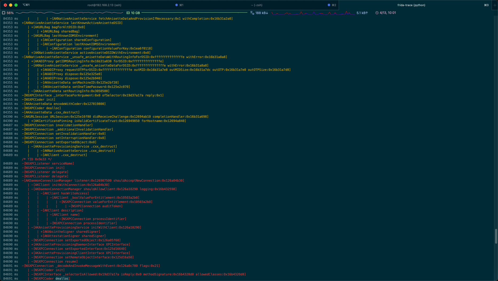
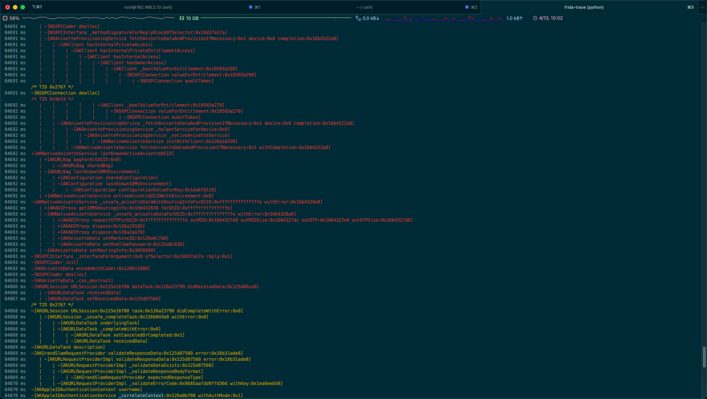
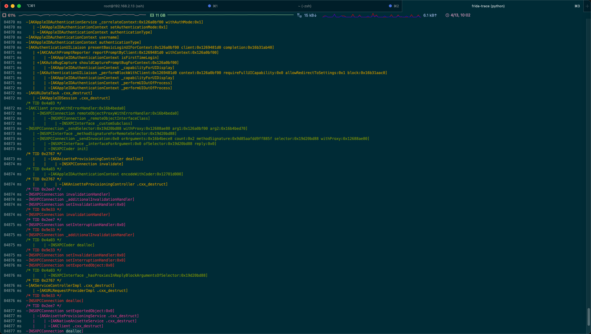
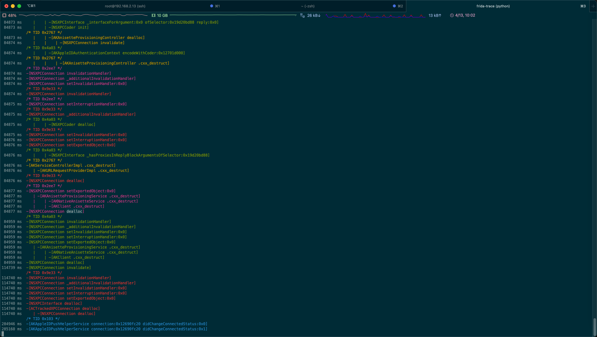

### log日志

```txt
...
-[NSXPCStore dealloc]: Loaded handler at "/Users/crifan/dev/dev_root/iosReverse/AppleStore/AuthKit_akd/dynamicDebug/frida/scripts/__handlers__/NSXPCStore/dealloc.js"
-[NSXPCStore setIdentifier:]: Loaded handler at "/Users/crifan/dev/dev_root/iosReverse/AppleStore/AuthKit_akd/dynamicDebug/frida/scripts/__handlers__/NSXPCStore/setIdentifier_.js"
Started tracing 6145 functions. Press Ctrl+C to stop.


           /* TID 0x2ee3 */
 44503 ms  -[NSXPCListener serviceName]
 44503 ms  -[NSXPCConnection init]
 44503 ms  -[NSXPCListener delegate]
 44503 ms  -[NSXPCListener delegate]
 44503 ms  -[AKDaemonConnectionManager listener:0x126906200 shouldAcceptNewConnection:0x126b0da50]
 44503 ms     | -[AKClient initWithConnection:0x126b0da50]
 44503 ms     | -[AKDaemonConnectionManager shouldAllowClient:0x126b05640 logging:0x16b31a598]
 44503 ms     |    | -[AKClient hasWriteAccess]
 44503 ms     |    |    | -[AKClient _boolValueForEntitlement:0x10503a2b0]
 44503 ms     |    |    |    | -[NSXPCConnection valueForEntitlement:0x10503a2b0]
 44503 ms     |    |    |    |    | -[NSXPCConnection auditToken]
 44505 ms     |    | -[AKClient description]
 44505 ms     |    |    | -[AKClient name]
 44505 ms     |    |    |    | -[NSXPCConnection processIdentifier]
 44505 ms     |    |    | -[NSXPCConnection processIdentifier]
 44505 ms     | -[AKAppleIDAuthenticationService initWithClient:0x126b05640]
 44505 ms     |    | -[AKAppleIDAuthenticationService initWithProxy:0x126b16890]
 44505 ms     |    |    | -[AKAppleIDAuthenticationService init]
 44505 ms     |    |    |    | +[AKAccountManager sharedInstance]
 44505 ms     |    |    |    |    | +[AKAccountManager isAccountsFrameworkAvailable]
 44505 ms     |    |    |    | +[AKAuthenticationUILiaison sharedInstance]
 44505 ms     |    |    |    | +[AKAuthenticationTrafficController sharedInstance]
 44505 ms     |    |    |    | -[AKAuthenticationUILiaison surrogateManager]
 44505 ms     |    |    |    | -[AKAuthenticationTrafficController setSurrogateManager:0x125d15810]
 44506 ms     | -[NSXPCConnection setExportedObject:0x126b0fa00]
 44506 ms     | +[AKAppleIDAuthenticationDaemonInterface XPCInterface]
 44506 ms     | -[NSXPCConnection setExportedInterface:0x1268141a0]
 44506 ms     | +[AKAppleIDAuthenticationClientInterface XPCInterface]
 44506 ms     | -[NSXPCConnection setRemoteObjectInterface:0x1269121f0]
 44506 ms     | -[NSXPCConnection resume]
 44506 ms  -[NSXPCConnection _decodeAndInvokeMessageWithEvent:0x126b0fa40 flags:0x21]
 44506 ms     | -[NSXPCCoder init]
 44506 ms     | -[NSXPCInterface _selectorIsAllowed:0x19dd2ca94 isReply:0x0 methodSignature:0x16b31a0f0 allowedClasses:0x16b31a0f8]
 44506 ms     | -[NSXPCCoder dealloc]
 44506 ms     | -[NSXPCInterface _methodSignatureForReplyBlockOfSelector:0x19dd2ca94]
 44506 ms     | -[AKAppleIDAuthenticationService fetchURLBagFromCache:0x0 altDSID:0x0 completion:0x16b31a2c0]
 44506 ms     |    | +[AKURLBagService sharedBagService]
 44506 ms     |    | -[AKURLBagService urlBagFromCache:0x0 altDSID:0x0 error:0x16b31a0f8]
 44506 ms     |    |    | -[AKURLBagService _cachedURLBagForAltDSID:0x0]
 44506 ms     |    | -[NSXPCInterface _interfaceForArgument:0x0 ofSelector:0x19dd2ca94 reply:0x1]
 44506 ms     |    | -[NSXPCCoder init]
 44507 ms     |    | -[NSXPCCoder dealloc]
 44508 ms  -[NSXPCConnection invalidationHandler]
 44508 ms  -[NSXPCConnection _additionalInvalidationHandler]
 44508 ms  -[NSXPCConnection setInvalidationHandler:0x0]
 44508 ms  -[NSXPCConnection setInterruptionHandler:0x0]
 44508 ms  -[NSXPCConnection setExportedObject:0x0]
 44508 ms     | -[AKAppleIDAuthenticationService .cxx_destruct]
 44508 ms     |    | -[AKClient .cxx_destruct]
 44508 ms  -[NSXPCConnection dealloc]
           /* TID 0x2ee7 */
 83869 ms  -[NSXPCListener serviceName]
 83870 ms  -[NSXPCConnection init]
 83870 ms  -[NSXPCListener delegate]
 83870 ms  -[NSXPCListener delegate]
 83870 ms  -[AKDaemonConnectionManager listener:0x126906200 shouldAcceptNewConnection:0x126947dd0]
 83871 ms     | -[AKClient initWithConnection:0x126947dd0]
 83871 ms     | -[AKDaemonConnectionManager shouldAllowClient:0x1269481d0 logging:0x16b3a6598]
 83871 ms     |    | -[AKClient hasWriteAccess]
 83871 ms     |    |    | -[AKClient _boolValueForEntitlement:0x10503a2b0]
 83871 ms     |    |    |    | -[NSXPCConnection valueForEntitlement:0x10503a2b0]
 83871 ms     |    |    |    |    | -[NSXPCConnection auditToken]
 83874 ms     |    | -[AKClient description]
 83874 ms     |    |    | -[AKClient name]
 83874 ms     |    |    |    | -[NSXPCConnection processIdentifier]
 83874 ms     |    |    | -[NSXPCConnection processIdentifier]
 83874 ms     | -[AKAppleIDAuthenticationService initWithClient:0x1269481d0]
 83874 ms     |    | -[AKAppleIDAuthenticationService initWithProxy:0x125d87ea0]
 83875 ms     |    |    | -[AKAppleIDAuthenticationService init]
 83875 ms     |    |    |    | +[AKAccountManager sharedInstance]
 83875 ms     |    |    |    |    | +[AKAccountManager isAccountsFrameworkAvailable]
 83875 ms     |    |    |    | +[AKAuthenticationUILiaison sharedInstance]
 83875 ms     |    |    |    | +[AKAuthenticationTrafficController sharedInstance]
 83875 ms     |    |    |    | -[AKAuthenticationUILiaison surrogateManager]
 83875 ms     |    |    |    | -[AKAuthenticationTrafficController setSurrogateManager:0x125d15810]
 83876 ms     | -[NSXPCConnection setExportedObject:0x125d88d50]
 83876 ms     | +[AKAppleIDAuthenticationDaemonInterface XPCInterface]
 83876 ms     | -[NSXPCConnection setExportedInterface:0x1268141a0]
 83876 ms     | +[AKAppleIDAuthenticationClientInterface XPCInterface]
 83876 ms     | -[NSXPCConnection setRemoteObjectInterface:0x1269121f0]
 83877 ms     | -[NSXPCConnection resume]
 83877 ms  -[NSXPCConnection _decodeAndInvokeMessageWithEvent:0x125d7e8f0 flags:0x21]
 83878 ms     | -[NSXPCCoder init]
 83878 ms     | -[NSXPCInterface _selectorIsAllowed:0x19d1122fb isReply:0x0 methodSignature:0x16b3a5780 allowedClasses:0x16b3a5788]
 83878 ms     | +[AKAppleIDAuthenticationContext supportsSecureCoding]
 83878 ms     | -[AKAppleIDAuthenticationContext initWithCoder:0x128808e00]
 83879 ms     | -[NSXPCCoder dealloc]
 83879 ms     | -[NSXPCInterface _methodSignatureForReplyBlockOfSelector:0x19d1122fb]
 83879 ms     | -[AKAppleIDAuthenticationService authenticateWithContext:0x126a0bf00 completion:0x16b3a5950]
 83879 ms     |    | -[AKAppleIDAuthenticationContext _capabilityForUIDisplay]
 83879 ms     |    | -[AKAppleIDAuthenticationContext serviceType]
 83879 ms     |    | -[AKClient isPermittedForInteractiveAuthOnLimitedContext]
 83879 ms     |    |    | -[AKClient _permittedProcessNamesForInteractiveAuthOnLimitedContext]
 83879 ms     |    |    | -[AKClient name]
 83880 ms     |    | -[AKAppleIDAuthenticationContext isContextEligibleForSilentAuthCoercion]
 83880 ms     |    |    | -[AKAppleIDAuthenticationContext _proxiedAppName]
 83880 ms     |    |    | -[AKAppleIDAuthenticationContext _capabilityForUIDisplay]
 83880 ms     |    | -[AKAppleIDAuthenticationContext username]
 83880 ms     |    | -[AKAppleIDAuthenticationContext _password]
 83881 ms     |    | -[AKAuthenticationTrafficController beginAuthenticationWithContext:0x126a0bf00 client:0x1269481d0 clearanceHandler:0x16b3a57a8]
           /* TID 0x2767 */
 83882 ms  -[AKClient bundleID]
 83882 ms     | -[NSXPCConnection processIdentifier]
 83883 ms     | -[NSXPCConnection processIdentifier]
 83883 ms  -[AKAuthenticationTrafficController _addCachedPasswordInContext:0x126a0bf00]
 83883 ms     | -[AKAppleIDAuthenticationContext serviceType]
 83883 ms     | -[AKAppleIDAuthenticationContext isContextEligibleForSilentAuth]
 83883 ms     |    | -[AKAppleIDAuthenticationContext authenticationType]
 83883 ms     |    | -[AKAppleIDAuthenticationContext shouldPromptForPasswordOnly]
 83884 ms     |    | -[AKAppleIDAuthenticationContext isEphemeral]
 83884 ms     |    | -[AKAppleIDAuthenticationContext isUsernameEditable]
 83884 ms  -[AKClient bundleID]
 83884 ms  -[AKTrafficClearenceRequest setClearanceHandler:0x126a19640]
 83884 ms  -[AKTrafficClearenceRequest setContext:0x126a0bf00]
 83884 ms  -[AKTrafficClearenceRequest setClientBundleID:0x1f7d89e60]
 83884 ms  -[AKAuthenticationTrafficController _shouldClearRequest:0x126a0be60 withClient:0x1269481d0]
 83884 ms     | -[AKTrafficClearenceRequest context]
 83884 ms     | -[AKAppleIDAuthenticationContext _capabilityForUIDisplay]
 83884 ms     | -[AKAppleIDAuthenticationContext _capabilityForUIDisplay]
 83884 ms     | -[AKAuthenticationTrafficController surrogateManager]
 83884 ms     | -[AKAuthenticationSurrogateManager isSurrogateAuthInProgressForClient:0x1269481d0]
 83884 ms     |    | -[AKAuthenticationSurrogateManager _fetchSurrogateForClient:0x1269481d0]
 83885 ms     |    |    | -[AKAuthenticationSurrogateManager inProgressSurrogates]
 83885 ms     | -[AKAppleIDAuthenticationContext authenticationType]
 83885 ms     | -[AKAuthenticationTrafficController _hasActiveAppAuths]
 83885 ms     |    | -[AKAuthenticationTrafficController _hasValuesInMap:0x126816150]
 83885 ms     | -[AKAuthenticationTrafficController _hasActiveDaemonAuths]
 83885 ms     |    | -[AKAuthenticationTrafficController _hasValuesInMap:0x126816170]
 83885 ms  -[AKAuthenticationTrafficController _tq_invokeTrafficRequest:0x126a0be60]
 83885 ms     | -[AKTrafficClearenceRequest clientBundleID]
 83885 ms     | -[AKTrafficClearenceRequest context]
 83885 ms     | -[AKTrafficClearenceRequest context]
 83885 ms     | -[AKAppleIDAuthenticationContext _capabilityForUIDisplay]
 83886 ms  -[AKTrafficClearenceRequest clearanceHandler]
 83886 ms  -[AKAppleIDAuthenticationContext _capabilityForUIDisplay]
 83886 ms  -[AKAppleIDAuthenticationService _authenticateWithContext:0x126a0bf00 completion:0x16b31ad40]
 83886 ms     | -[AKAppleIDAuthenticationContext needsRepair]
 83886 ms     | -[AKAppleIDAuthenticationContext needsCredentialRecovery]
 83886 ms     | -[AKAppleIDAuthenticationContext needsNewAppleID]
 83886 ms     | -[AKAppleIDAuthenticationContext needsNewChildAccount]
 83886 ms     | -[AKAppleIDAuthenticationContext needsPasswordChange]
 83886 ms     | -[AKAppleIDAuthenticationContext needsSecurityUpgradeUI]
 83886 ms     | -[AKAppleIDAuthenticationService _performAuthenticationWithContext:0x126a0bf00 completion:0x16b31ad40]
 83886 ms     |    | -[AKAppleIDAuthenticationService _isInteractiveAuthRequiredForContext:0x126a0bf00]
 83886 ms     |    |    | -[AKAppleIDAuthenticationContext authenticationType]
 83887 ms     |    | -[AKAppleIDAuthenticationService _attemptBiometricOrPasscodeAuthWithContext:0x126a0bf00 completion:0x16b31ad40]
 83887 ms     |    |    | -[AKAppleIDAuthenticationContext isContextEligibleForBiometricOrPasscodeAuth]
 83887 ms     |    |    |    | -[AKAppleIDAuthenticationContext _capabilityForUIDisplay]
 83887 ms     |    |    |    | -[AKAppleIDAuthenticationContext _isVerifyCredentialReasonEligibleForBiometricOrPasscodeAuth]
 83887 ms     |    |    |    |    | -[AKAppleIDAuthenticationContext verifyCredentialReason]
 83887 ms     |    |    |    | +[AKConfiguration sharedConfiguration]
 83887 ms     |    |    |    | -[AKConfiguration shouldAllowExperimentalMode]
 83887 ms     |    |    |    |    | -[AKConfiguration configurationValueForKey:0x1ea6effb8]
 83887 ms     |    |    | -[AKAppleIDAuthenticationService _attemptInteractiveAuthWithContext:0x126a0bf00 completion:0x16b31ad40]
 83887 ms     |    |    |    | -[AKAppleIDAuthenticationContext username]
 83887 ms     |    |    |    | -[AKAppleIDAuthenticationContext _password]
 83887 ms     |    |    |    | -[AKAppleIDAuthenticationContext _shouldSkipInitialReachabilityCheck]
           /* TID 0x2ee7 */
 83889 ms  -[NSXPCListener serviceName]
 83889 ms  -[NSXPCConnection init]
 83889 ms  -[NSXPCListener delegate]
 83889 ms  -[NSXPCListener delegate]
 83889 ms  -[AKDaemonConnectionManager listener:0x126907500 shouldAcceptNewConnection:0x126a10460]
 83889 ms     | -[AKClient initWithConnection:0x126a10460]
 83889 ms     | -[AKDaemonConnectionManager shouldAllowClient:0x126a0c890 logging:0x16b3a6598]
 83889 ms     |    | -[AKClient hasWriteAccess]
 83889 ms     |    |    | -[AKClient _boolValueForEntitlement:0x10503a2b0]
 83889 ms     |    |    |    | -[NSXPCConnection valueForEntitlement:0x10503a2b0]
 83889 ms     |    |    |    |    | -[NSXPCConnection auditToken]
           /* TID 0x2767 */
 83889 ms     |    |    |    | -[AKAppleIDAuthenticationService _performInteractiveAuthWithContext:0x126a0bf00 completion:0x16b31ad40]
 83890 ms     |    |    |    |    | -[AKAppleIDAuthenticationService refreshAuthMetadataWithContext:0x126a0bf00 completion:0x16b31ab38]
 83890 ms     |    |    |    |    |    | -[AKAppleIDAuthenticationService _refreshLocalAccountAndUpdateContext:0x126a0bf00 completion:0x16b31aac8]
 83890 ms     |    |    |    |    |    |    | -[AKAppleIDAuthenticationContext _shouldRefreshAccountAndUpdateContext]
 83890 ms     |    |    |    |    |    |    | -[AKAppleIDAuthenticationService _updateAltDSIDAndUsername:0x126a0bf00]
 83890 ms     |    |    |    |    |    |    |    | -[AKAppleIDAuthenticationContext altDSID]
 83890 ms     |    |    |    |    |    |    |    | -[AKAppleIDAuthenticationContext DSID]
 83890 ms     |    |    |    |    |    |    | -[AKAppleIDAuthenticationContext altDSID]
 83890 ms     |    |    |    |    |    |    | -[AKAppleIDAuthenticationService _refreshAuthModeIfNecessaryForContext:0x126a0bf00 completion:0x16b31a998]
 83890 ms     |    |    |    |    |    |    |    | -[AKAppleIDAuthenticationContext needsNewAppleID]
 83890 ms     |    |    |    |    |    |    |    | -[AKAppleIDAuthenticationContext needsNewChildAccount]
 83890 ms     |    |    |    |    |    |    |    | -[AKAppleIDAuthenticationContext needsCredentialRecovery]
 83890 ms     |    |    |    |    |    |    |    | -[AKAppleIDAuthenticationContext needsPasswordChange]
 83890 ms     |    |    |    |    |    |    |    | -[AKAppleIDAuthenticationContext username]
 83890 ms     |    |    |    |    |    |    |    | -[AKAppleIDAuthenticationContext username]
 83890 ms     |    |    |    |    |    |    |    | -[AKAppleIDAuthenticationContext authenticationType]
 83891 ms     |    |    |    |    |    |    |    | -[AKAppleIDAuthenticationContext authKitAccount:0x0]
 83891 ms     |    |    |    |    |    |    |    |    | -[AKAppleIDAuthenticationContext altDSID]
 83891 ms     |    |    |    |    |    |    |    |    | -[AKAppleIDAuthenticationContext DSID]
 83891 ms     |    |    |    |    |    |    |    |    | -[AKAppleIDAuthenticationContext username]
 83891 ms     |    |    |    |    |    |    |    |    | +[AKAccountManager sharedInstance]
 83891 ms     |    |    |    |    |    |    |    |    |    | +[AKAccountManager isAccountsFrameworkAvailable]
 83891 ms     |    |    |    |    |    |    |    |    | -[AKAccountManager authKitAccountWithAppleID:0x126a053b0]
 83891 ms     |    |    |    |    |    |    |    |    |    | -[AKAccountManager authKitAccountType]
 83891 ms     |    |    |    |    |    |    |    |    |    | -[NSXPCConnection initWithMachServiceName:0x1e8ff16b8 options:0x0]
 83891 ms     |    |    |    |    |    |    |    |    |    |    | -[ACTrackedXPCConnection init]
 83891 ms     |    |    |    |    |    |    |    |    |    |    |    | -[NSXPCConnection init]
           /* TID 0x2ee7 */
 83891 ms     |    | -[AKClient description]
 83891 ms     |    |    | -[AKClient name]
 83891 ms     |    |    |    | -[NSXPCConnection processIdentifier]
 83892 ms     |    |    | -[NSXPCConnection processIdentifier]
           /* TID 0x2767 */
 83892 ms     |    |    |    |    |    |    |    |    |    | -[NSXPCConnection setRemoteObjectInterface:0x125e0f350]
 83892 ms     |    |    |    |    |    |    |    |    |    | +[NSXPCInterface interfaceWithProtocol:0x1f9747d58]
           /* TID 0x2ee7 */
 83892 ms     | -[AKAnisetteProvisioningService initWithClient:0x126a0c890]
 83892 ms     |    | +[AKAbsintheSigner sharedSigner]
           /* TID 0x2767 */
 83892 ms     |    |    |    |    |    |    |    |    |    |    | -[NSXPCInterface init]
           /* TID 0x2ee7 */
 83892 ms     |    | +[AKAttestationSigner sharedSigner]
 83892 ms     | -[NSXPCConnection setExportedObject:0x126a212f0]
           /* TID 0x2767 */
 83892 ms     |    |    |    |    |    |    |    |    |    |    | -[NSXPCInterface setProtocol:0x1f9747d58]
           /* TID 0x2ee7 */
 83892 ms     | +[AKAnisetteProvisioningDaemonInterface XPCInterface]
 83892 ms     | -[NSXPCConnection setExportedInterface:0x125d16640]
           /* TID 0x2767 */
 83892 ms     |    |    |    |    |    |    |    |    |    | -[NSXPCConnection setExportedInterface:0x126b10170]
 83892 ms     |    |    |    |    |    |    |    |    |    | -[NSXPCConnection setExportedObject:0x126b159f0]
           /* TID 0x2ee7 */
 83892 ms     | +[AKAnisetteProvisioningClientInterface XPCInterface]
 83892 ms     | -[NSXPCConnection setRemoteObjectInterface:0x125d16a50]
 83892 ms     | -[NSXPCConnection resume]
           /* TID 0x2767 */
 83892 ms     |    |    |    |    |    |    |    |    |    | -[NSXPCConnection setInterruptionHandler:0x16b31a2d8]
 83892 ms     |    |    |    |    |    |    |    |    |    | -[NSXPCConnection setInvalidationHandler:0x16b31a2b0]
 83892 ms     |    |    |    |    |    |    |    |    |    | -[NSXPCConnection resume]
           /* TID 0x2ee7 */
 83893 ms  -[NSXPCConnection _decodeAndInvokeMessageWithEvent:0x126a21320 flags:0x21]
 83893 ms     | -[NSXPCCoder init]
 83893 ms     | -[NSXPCInterface _selectorIsAllowed:0x19d37a17a isReply:0x0 methodSignature:0x16b3a60d0 allowedClasses:0x16b3a60d8]
 83893 ms     | -[NSXPCCoder dealloc]
 83893 ms     | -[NSXPCInterface _methodSignatureForReplyBlockOfSelector:0x19d37a17a]
 83893 ms     | -[AKAnisetteProvisioningService fetchAnisetteDataAndProvisionIfNecessary:0x1 device:0x0 completion:0x16b3a62a0]
 83893 ms     |    | -[AKClient hasInternalPrivateAccess]
 83894 ms     |    |    | -[AKClient hasInternalPrivateEntitlementAccess]
           /* TID 0x2767 */
 83894 ms     |    |    |    |    |    |    |    |    |    | -[NSXPCConnection synchronousRemoteObjectProxyWithErrorHandler:0x16b31a410]
 83894 ms     |    |    |    |    |    |    |    |    |    |    | -[NSXPCConnection _remoteObjectInterfaceClass]
 83894 ms     |    |    |    |    |    |    |    |    |    |    |    | -[NSXPCInterface _customSubclass]
           /* TID 0x2ee7 */
 83894 ms     |    |    |    | -[AKClient hasInternalAccess]
 83894 ms     |    |    |    |    | -[AKClient hasOwnerAccess]
 83894 ms     |    |    |    |    |    | -[AKClient _boolValueForEntitlement:0x10503a290]
           /* TID 0x2767 */
 83894 ms     |    |    |    |    |    |    |    |    |    | -[NSXPCInterface _methodSignatureForRemoteSelector:0x19cefc453]
 83894 ms     |    |    |    |    |    |    |    |    |    | -[NSXPCConnection _sendInvocation:0x16b31a130 orArguments:0x0 count:0x0 methodSignature:0x9d85aafdd9ffdaff selector:0x19cefc453 withProxy:0x126b17cd0]
 83894 ms     |    |    |    |    |    |    |    |    |    |    | -[NSXPCInterface _interfaceForArgument:0x0 ofSelector:0x19cefc453 reply:0x0]
           /* TID 0x2ee7 */
 83894 ms     |    |    |    |    |    |    | -[NSXPCConnection valueForEntitlement:0x10503a290]
 83894 ms     |    |    |    |    |    |    |    | -[NSXPCConnection auditToken]
           /* TID 0x2767 */
 83894 ms     |    |    |    |    |    |    |    |    |    |    | -[NSXPCCoder init]
 83895 ms     |    |    |    |    |    |    |    |    |    |    | -[NSXPCCoder dealloc]
 83895 ms     |    |    |    |    |    |    |    |    |    |    | -[NSXPCInterface _hasProxiesInReplyBlockArgumentsOfSelector:0x19cefc453]
           /* TID 0x2ee7 */
 83897 ms     |    |    |    |    | -[AKClient _boolValueForEntitlement:0x10503a270]
 83897 ms     |    |    |    |    |    | -[NSXPCConnection valueForEntitlement:0x10503a270]
 83897 ms     |    |    |    |    |    |    | -[NSXPCConnection auditToken]
 83897 ms     |    | -[AKAnisetteProvisioningService _fetchAnisetteDataAndProvisionIfNecessary:0x1 device:0x0 completion:0x16b3a62a0]
 83897 ms     |    |    | -[AKAnisetteProvisioningService _helperServiceForDevice:0x0]
 83897 ms     |    |    |    | -[AKAnisetteProvisioningService _nativeAnisetteService]
 83897 ms     |    |    |    |    | -[AKNativeAnisetteService initWithClient:0x126a0c890]
 83897 ms     |    |    | -[AKNativeAnisetteService fetchAnisetteDataAndProvisionIfNecessary:0x1 withCompletion:0x16b3a62a0]
 83897 ms  +[AKNativeAnisetteService lastKnownActiveAnisetteDSID]
 83897 ms     | +[AKURLBag bagForAltDSID:0x0]
 83897 ms     |    | +[AKURLBag sharedBag]
 83897 ms     | -[AKURLBag lastKnownIDMSEnvironment]
 83897 ms     |    | +[AKConfiguration sharedConfiguration]
 83897 ms     |    | -[AKConfiguration lastKnownIDMSEnvironment]
 83897 ms     |    |    | -[AKConfiguration configurationValueForKey:0x1ea6f0118]
 83898 ms     | +[AKNativeAnisetteService activeAnisetteDSIDWithEnvironment:0x0]
 83898 ms  -[AKNativeAnisetteService _unsafe_anisetteDataWithRoutingInfoForDSID:0xfffffffffffffffe withError:0x16b3a68a8]
 83898 ms     | +[AKADIProxy getIDMSRoutingInfo:0x16b3a6838 forDSID:0xfffffffffffffffe]
           /* TID 0x2767 */
 83901 ms     |    |    |    |    |    |    |    |    |    |    | -[NSXPCConnection _decodeAndInvokeReplyBlockWithEvent:0x126a21320 sequence:0x1 replyInfo:0x126b05970]
 83901 ms     |    |    |    |    |    |    |    |    |    |    |    | -[NSXPCCoder init]
 83902 ms     |    |    |    |    |    |    |    |    |    |    |    | -[NSXPCInterface _selectorIsAllowed:0x19cefc453 isReply:0x1 methodSignature:0x16b319260 allowedClasses:0x16b319268]
 83902 ms     |    |    |    |    |    |    |    |    |    |    | -[NSXPCCoder dealloc]
 83902 ms     |    |    |    |    |    |    |    | -[AKAccountManager shouldUpdateAuthModeForAccount:0x126a20e20]
 83902 ms     |    |    |    |    |    |    |    | -[AKAppleIDAuthenticationService _refreshAuthModeForContext:0x126a0bf00 completion:0x16b31a998]
 83902 ms     |    |    |    |    |    |    |    |    | -[AKAppleIDAuthenticationService fetchAuthModeWithContext:0x126a0bf00 completion:0x16b31a8b8]
 83902 ms     |    |    |    |    |    |    |    |    |    | -[AKClient hasInternalPrivateAccess]
 83902 ms     |    |    |    |    |    |    |    |    |    |    | -[AKClient hasInternalPrivateEntitlementAccess]
 83902 ms     |    |    |    |    |    |    |    |    |    |    |    | -[AKClient hasInternalAccess]
 83902 ms     |    |    |    |    |    |    |    |    |    |    |    |    | -[AKClient hasOwnerAccess]
 83902 ms     |    |    |    |    |    |    |    |    |    |    |    |    |    | -[AKClient _boolValueForEntitlement:0x10503a290]
 83902 ms     |    |    |    |    |    |    |    |    |    |    |    |    |    |    | -[NSXPCConnection valueForEntitlement:0x10503a290]
 83902 ms     |    |    |    |    |    |    |    |    |    |    |    |    |    |    |    | -[NSXPCConnection auditToken]
 83904 ms     |    |    |    |    |    |    |    |    |    |    |    |    | -[AKClient _boolValueForEntitlement:0x10503a270]
 83904 ms     |    |    |    |    |    |    |    |    |    |    |    |    |    | -[NSXPCConnection valueForEntitlement:0x10503a270]
 83904 ms     |    |    |    |    |    |    |    |    |    |    |    |    |    |    | -[NSXPCConnection auditToken]
           /* TID 0x2ee7 */
 83904 ms     | -[AKNativeAnisetteService _unsafe_anisetteDataForDSID:0xfffffffffffffffe withError:0x16b3a68a8]
 83904 ms     |    | +[AKADIProxy requestOTPForDSID:0xfffffffffffffffe outMID:0x16b3a67e8 outMIDSize:0x16b3a67dc outOTP:0x16b3a67e0 outOTPSize:0x16b3a67d8]
           /* TID 0x2767 */
 83904 ms     |    |    |    |    |    |    |    |    |    | +[AKUserInfoController sharedController]
 83904 ms     |    |    |    |    |    |    |    |    |    | -[AKUserInfoController fetchAuthModeWithContext:0x126a0bf00 client:0x1269481d0 completion:0x16b31a838]
 83904 ms     |    |    |    |    |    |    |    |    |    |    | -[AKURLRequestProviderImpl initWithContext:0x126a0bf00 urlBagKey:0x1ea6f14b8]
 83904 ms     |    |    |    |    |    |    |    |    |    |    |    | -[AKURLRequestProviderImpl initWithContext:0x126a0bf00 urlBagKey:0x1ea6f14b8 shouldCacheResource:0x0]
 83904 ms     |    |    |    |    |    |    |    |    |    |    |    |    | -[AKURLRequestProviderImpl initWithContext:0x126a0bf00]
 83904 ms     |    |    |    |    |    |    |    |    |    |    |    |    | -[AKURLRequestProviderImpl _setRequestURL]
 83904 ms     |    |    |    |    |    |    |    |    |    |    |    |    |    | -[AKAppleIDAuthenticationContext altDSID]
 83904 ms     |    |    |    |    |    |    |    |    |    |    |    |    |    | +[AKURLBag bagForAltDSID:0x0]
 83904 ms     |    |    |    |    |    |    |    |    |    |    |    |    |    |    | +[AKURLBag sharedBag]
 83904 ms     |    |    |    |    |    |    |    |    |    |    |    |    |    | -[AKURLBag urlAtKey:0x1ea6f14b8]
 83904 ms     |    |    |    |    |    |    |    |    |    |    |    |    |    |    | -[AKURLBag _urlAtKey:0x1ea6f14b8]
 83904 ms     |    |    |    |    |    |    |    |    |    |    |    |    |    |    |    | -[AKURLBag _requestNewURLBagIfNecessaryWithError:0x0]
 83904 ms     |    |    |    |    |    |    |    |    |    |    |    |    |    |    |    |    | -[AKURLBag _urlBagFromCache:0x0 withError:0x0]
 83904 ms     |    |    |    |    |    |    |    |    |    |    |    |    |    |    |    |    |    | -[AKURLBag bagProvider]
 83904 ms     |    |    |    |    |    |    |    |    |    |    |    |    |    |    |    |    |    | -[AKURLBag bagProvider]
 83904 ms     |    |    |    |    |    |    |    |    |    |    |    |    |    |    |    |    |    | -[AKURLBag altDSID]
 83904 ms     |    |    |    |    |    |    |    |    |    |    |    |    |    |    |    |    |    | -[AKURLBagService urlBagFromCache:0x0 altDSID:0x0 error:0x0]
 83904 ms     |    |    |    |    |    |    |    |    |    |    |    |    |    |    |    |    |    |    | -[AKURLBagService _cachedURLBagForAltDSID:0x0]
 83904 ms     |    |    |    |    |    |    |    |    |    |    | -[AKURLRequestProviderImpl setClient:0x1269481d0]
 83904 ms     |    |    |    |    |    |    |    |    |    |    | -[AKServiceControllerImpl initWithRequestProvider:0x126a22930]
 83904 ms     |    |    |    |    |    |    |    |    |    |    | -[AKServiceControllerImpl executeRequestWithCompletion:0x16b31a7c0]
 83904 ms     |    |    |    |    |    |    |    |    |    |    |    | -[AKURLRequestProviderImpl buildRequest:0x16b31a778]
 83904 ms     |    |    |    |    |    |    |    |    |    |    |    |    | -[AKURLRequestProviderImpl requestURL]
 83904 ms     |    |    |    |    |    |    |    |    |    |    |    |    | -[AKURLRequestProviderImpl authKitBody]
 83905 ms     |    |    |    |    |    |    |    |    |    |    |    |    | -[AKURLRequestProviderImpl authKitBodyData]
 83905 ms     |    |    |    |    |    |    |    |    |    |    |    |    | -[AKAuthModeRequestProvider signRequest:0x126a21b10 error:0x16b31a6e8]
 83905 ms     |    |    |    |    |    |    |    |    |    |    |    |    |    | -[AKGrandSlamRequestProvider signRequest:0x126a21b10 error:0x16b31a6e8]
 83905 ms     |    |    |    |    |    |    |    |    |    |    |    |    |    |    | -[AKURLRequestProviderImpl context]
 83905 ms     |    |    |    |    |    |    |    |    |    |    |    |    |    |    | -[AKAppleIDAuthenticationContext set_shouldSendIdentityTokenForRemoteUI:0x0]
 83905 ms     |    |    |    |    |    |    |    |    |    |    |    |    |    |    | -[AKURLRequestProviderImpl client]
 83905 ms     |    |    |    |    |    |    |    |    |    |    |    |    |    |    | -[AKDServerUIController initWithClient:0x1269481d0]
 83905 ms     |    |    |    |    |    |    |    |    |    |    |    |    |    |    | -[AKURLRequestProviderImpl context]
 83905 ms     |    |    |    |    |    |    |    |    |    |    |    |    |    |    | -[AKDServerUIController resourceLoadDelegateWithContext:0x126a0bf00]
 83905 ms     |    |    |    |    |    |    |    |    |    |    |    |    |    |    |    | -[AKDServerUIController _decorateLoadDelegate:0x126a232e0 withContext:0x126a0bf00]
 83905 ms     |    |    |    |    |    |    |    |    |    |    |    |    |    |    |    |    | -[AKAppleIDServerResourceLoadDelegate decorateWithContext:0x126a0bf00]
 83905 ms     |    |    |    |    |    |    |    |    |    |    |    |    |    |    |    |    |    | -[AKAppleIDServerResourceLoadDelegate altDSID]
 83905 ms     |    |    |    |    |    |    |    |    |    |    |    |    |    |    |    |    |    | -[AKAppleIDAuthenticationContext altDSID]
 83905 ms     |    |    |    |    |    |    |    |    |    |    |    |    |    |    |    |    |    | -[AKAppleIDServerResourceLoadDelegate setAltDSID:0x0]
 83905 ms     |    |    |    |    |    |    |    |    |    |    |    |    |    |    |    |    |    | -[AKAppleIDAuthenticationContext needsNewAppleID]
 83905 ms     |    |    |    |    |    |    |    |    |    |    |    |    |    |    |    |    |    | -[AKAppleIDAuthenticationContext needsNewChildAccount]
 83905 ms     |    |    |    |    |    |    |    |    |    |    |    |    |    |    |    |    |    | -[AKAppleIDAuthenticationContext proxiedDevice]
 83905 ms     |    |    |    |    |    |    |    |    |    |    |    |    |    |    |    |    |    | -[AKAppleIDAuthenticationContext needsSecurityUpgradeUI]
 83905 ms     |    |    |    |    |    |    |    |    |    |    |    |    |    |    |    |    |    | -[AKAppleIDAuthenticationContext isEphemeral]
 83905 ms     |    |    |    |    |    |    |    |    |    |    |    |    |    |    |    |    |    | -[AKAppleIDAuthenticationContext isAppleIDLoginEnabled]
 83905 ms     |    |    |    |    |    |    |    |    |    |    |    |    |    |    |    |    |    | -[AKAppleIDAuthenticationContext custodianRecoveryToken]
 83905 ms     |    |    |    |    |    |    |    |    |    |    |    |    |    |    |    |    |    | -[AKAppleIDAuthenticationContext serviceType]
 83905 ms     |    |    |    |    |    |    |    |    |    |    |    |    |    |    |    |    |    | -[AKAppleIDServerResourceLoadDelegate setServiceType:0x1]
 83905 ms     |    |    |    |    |    |    |    |    |    |    |    |    |    |    |    |    |    | -[AKAppleIDAuthenticationContext appProvidedContext]
 83905 ms     |    |    |    |    |    |    |    |    |    |    |    |    |    |    |    |    |    | -[AKAppleIDServerResourceLoadDelegate setAppProvidedContext:0x126a0fe20]
 83905 ms     |    |    |    |    |    |    |    |    |    |    |    |    |    |    |    |    |    | -[AKAppleIDAuthenticationContext _proxiedAppName]
 83905 ms     |    |    |    |    |    |    |    |    |    |    |    |    |    |    |    |    |    | -[AKAppleIDServerResourceLoadDelegate setProxyAppName:0x0]
 83905 ms     |    |    |    |    |    |    |    |    |    |    |    |    |    |    |    |    |    | -[AKAppleIDServerResourceLoadDelegate setShouldSendPhoneNumber:0x1]
 83905 ms     |    |    |    |    |    |    |    |    |    |    |    |    |    |    |    |    |    | -[AKAppleIDAuthenticationContext hasEmptyPassword]
 83905 ms     |    |    |    |    |    |    |    |    |    |    |    |    |    |    |    |    |    | -[AKAppleIDServerResourceLoadDelegate setHasEmptyPasswordOverride:0x0]
 83905 ms     |    |    |    |    |    |    |    |    |    |    |    |    |    |    |    |    |    | -[AKAppleIDAuthenticationContext securityUpgradeContext]
 83905 ms     |    |    |    |    |    |    |    |    |    |    |    |    |    |    |    |    |    | -[AKAppleIDServerResourceLoadDelegate setSecurityUpgradeContext:0x126a05760]
 83905 ms     |    |    |    |    |    |    |    |    |    |    |    |    |    |    |    |    |    | -[AKAppleIDAuthenticationContext anticipateEscrowAttempt]
 83905 ms     |    |    |    |    |    |    |    |    |    |    |    |    |    |    |    |    |    | -[AKAppleIDServerResourceLoadDelegate setShouldSendICSCIntentHeader:0x1]
 83905 ms     |    |    |    |    |    |    |    |    |    |    |    |    |    |    |    |    |    | -[AKAppleIDAuthenticationContext shouldOfferSecurityUpgrade]
 83905 ms     |    |    |    |    |    |    |    |    |    |    |    |    |    |    |    |    |    | -[AKAppleIDServerResourceLoadDelegate setShouldOfferSecurityUpgrade:0x1]
 83905 ms     |    |    |    |    |    |    |    |    |    |    |    |    |    |    |    |    |    | +[AKFollowUpProviderFactory sharedAuthKitFollowupProvider]
 83905 ms     |    |    |    |    |    |    |    |    |    |    |    |    |    |    |    |    |    | -[AKFollowUpController pendingFollowUpItems:0x0]
 83905 ms     |    |    |    |    |    |    |    |    |    |    |    |    |    |    |    |    |    |    | -[NSXPCConnection synchronousRemoteObjectProxyWithErrorHandler:0x16b31a428]
 83905 ms     |    |    |    |    |    |    |    |    |    |    |    |    |    |    |    |    |    |    |    | -[NSXPCConnection _remoteObjectInterfaceClass]
 83905 ms     |    |    |    |    |    |    |    |    |    |    |    |    |    |    |    |    |    |    |    |    | -[NSXPCInterface _customSubclass]
 83905 ms     |    |    |    |    |    |    |    |    |    |    |    |    |    |    |    |    |    |    | -[NSXPCConnection _sendSelector:0x19e667b96 withProxy:0x126a23430 arg1:0x1ea6ece38 arg2:0x16b31a3f8]
 83906 ms     |    |    |    |    |    |    |    |    |    |    |    |    |    |    |    |    |    |    |    | -[NSXPCInterface _methodSignatureForRemoteSelector:0x19e667b96]
 83906 ms     |    |    |    |    |    |    |    |    |    |    |    |    |    |    |    |    |    |    |    | -[NSXPCConnection _sendInvocation:0x0 orArguments:0x16b31a368 count:0x2 methodSignature:0x9d85aafdd9ff885f selector:0x19e667b96 withProxy:0x126a23430]
 83906 ms     |    |    |    |    |    |    |    |    |    |    |    |    |    |    |    |    |    |    |    |    | -[NSXPCInterface _interfaceForArgument:0x0 ofSelector:0x19e667b96 reply:0x0]
 83906 ms     |    |    |    |    |    |    |    |    |    |    |    |    |    |    |    |    |    |    |    |    | -[NSXPCCoder init]
 83906 ms     |    |    |    |    |    |    |    |    |    |    |    |    |    |    |    |    |    |    |    |    | -[NSXPCCoder dealloc]
 83906 ms     |    |    |    |    |    |    |    |    |    |    |    |    |    |    |    |    |    |    |    |    | -[NSXPCInterface _hasProxiesInReplyBlockArgumentsOfSelector:0x19e667b96]
 83907 ms     |    |    |    |    |    |    |    |    |    |    |    |    |    |    |    |    |    |    |    |    | -[NSXPCConnection _decodeAndInvokeReplyBlockWithEvent:0x126a237f0 sequence:0x9 replyInfo:0x126a234e0]
 83907 ms     |    |    |    |    |    |    |    |    |    |    |    |    |    |    |    |    |    |    |    |    |    | -[NSXPCCoder init]
 83907 ms     |    |    |    |    |    |    |    |    |    |    |    |    |    |    |    |    |    |    |    |    |    | -[NSXPCInterface _selectorIsAllowed:0x19e667b96 isReply:0x1 methodSignature:0x16b3196b0 allowedClasses:0x16b3196b8]
 83907 ms     |    |    |    |    |    |    |    |    |    |    |    |    |    |    |    |    |    |    |    |    | -[NSXPCCoder dealloc]
 83907 ms     |    |    |    |    |    |    |    |    |    |    |    |    |    |    |    |    |    | +[AKFollowUpServerPayloadFormatter pendingAuthKitFollowUpPayload:0x1f7b37500]
 83907 ms     |    |    |    |    |    |    |    |    |    |    |    |    |    |    |    |    |    | -[AKAppleIDServerResourceLoadDelegate setFollowupItems:0x126a23710]
 83907 ms     |    |    |    |    |    |    |    |    |    |    |    |    |    |    |    |    |    | -[AKAppleIDAuthenticationContext proxiedDeviceAnisetteData]
 83907 ms     |    |    |    |    |    |    |    |    |    |    |    |    |    |    |    |    |    | -[AKAppleIDServerResourceLoadDelegate setProxiedDeviceAnisetteData:0x0]
 83907 ms     |    |    |    |    |    |    |    |    |    |    |    |    |    |    |    |    |    | -[AKAppleIDAuthenticationContext proxiedDevice]
 83907 ms     |    |    |    |    |    |    |    |    |    |    |    |    |    |    |    |    |    | -[AKAppleIDServerResourceLoadDelegate setProxiedDevice:0x0]
 83907 ms     |    |    |    |    |    |    |    |    |    |    |    |    |    |    |    |    | -[AKClient name]
 83907 ms     |    |    |    |    |    |    |    |    |    |    |    |    |    |    |    |    | -[AKAppleIDServerResourceLoadDelegate setClientAppName:0x1f7d8ab20]
 83907 ms     |    |    |    |    |    |    |    |    |    |    |    |    |    |    |    |    | -[AKAppleIDAuthenticationContext authKitAccount:0x16b31a598]
 83907 ms     |    |    |    |    |    |    |    |    |    |    |    |    |    |    |    |    |    | -[AKAppleIDAuthenticationContext altDSID]
 83907 ms     |    |    |    |    |    |    |    |    |    |    |    |    |    |    |    |    |    | -[AKAppleIDAuthenticationContext DSID]
 83907 ms     |    |    |    |    |    |    |    |    |    |    |    |    |    |    |    |    |    | -[AKAppleIDAuthenticationContext username]
 83907 ms     |    |    |    |    |    |    |    |    |    |    |    |    |    |    |    |    |    | +[AKAccountManager sharedInstance]
 83907 ms     |    |    |    |    |    |    |    |    |    |    |    |    |    |    |    |    |    |    | +[AKAccountManager isAccountsFrameworkAvailable]
 83907 ms     |    |    |    |    |    |    |    |    |    |    |    |    |    |    |    |    |    | -[AKAccountManager authKitAccountWithAppleID:0x126a053b0]
 83907 ms     |    |    |    |    |    |    |    |    |    |    |    |    |    |    |    |    |    |    | -[AKAccountManager authKitAccountType]
           /* TID 0x2ee7 */
 83907 ms     |    | +[AKADIProxy dispose:0x126b0e120]
 83907 ms     |    | +[AKADIProxy dispose:0x126b077e0]
           /* TID 0x2767 */
 83907 ms     |    |    |    |    |    |    |    |    |    |    |    |    |    |    |    |    |    |    | -[NSXPCConnection synchronousRemoteObjectProxyWithErrorHandler:0x16b31a080]
 83907 ms     |    |    |    |    |    |    |    |    |    |    |    |    |    |    |    |    |    |    |    | -[NSXPCConnection _remoteObjectInterfaceClass]
 83907 ms     |    |    |    |    |    |    |    |    |    |    |    |    |    |    |    |    |    |    |    |    | -[NSXPCInterface _customSubclass]
           /* TID 0x2ee7 */
 83907 ms     |    | -[AKAnisetteData setMachineID:0x126b05830]
 83907 ms     |    | -[AKAnisetteData setOneTimePassword:0x126b0e0e0]
 83908 ms     | -[AKAnisetteData setRoutingInfo:0x3050500]
 83908 ms  -[NSXPCInterface _interfaceForArgument:0x0 ofSelector:0x19d37a17a reply:0x1]
 83908 ms  -[NSXPCCoder init]
           /* TID 0x2767 */
 83908 ms     |    |    |    |    |    |    |    |    |    |    |    |    |    |    |    |    |    |    | -[NSXPCInterface _methodSignatureForRemoteSelector:0x19cefc453]
           /* TID 0x2ee7 */
 83908 ms  -[AKAnisetteData encodeWithCoder:0x12900f600]
           /* TID 0x2767 */
 83908 ms     |    |    |    |    |    |    |    |    |    |    |    |    |    |    |    |    |    |    | -[NSXPCConnection _sendInvocation:0x16b319da0 orArguments:0x0 count:0x0 methodSignature:0x9d85aafdd9ffdaff selector:0x19cefc453 withProxy:0x126a23790]
 83908 ms     |    |    |    |    |    |    |    |    |    |    |    |    |    |    |    |    |    |    |    | -[NSXPCInterface _interfaceForArgument:0x0 ofSelector:0x19cefc453 reply:0x0]
 83908 ms     |    |    |    |    |    |    |    |    |    |    |    |    |    |    |    |    |    |    |    | -[NSXPCCoder init]
           /* TID 0x2ee7 */
 83908 ms  -[NSXPCCoder dealloc]
 83908 ms  -[AKAnisetteData .cxx_destruct]
           /* TID 0x2767 */
 83908 ms     |    |    |    |    |    |    |    |    |    |    |    |    |    |    |    |    |    |    |    | -[NSXPCCoder dealloc]
 83908 ms     |    |    |    |    |    |    |    |    |    |    |    |    |    |    |    |    |    |    |    | -[NSXPCInterface _hasProxiesInReplyBlockArgumentsOfSelector:0x19cefc453]
 83908 ms     |    |    |    |    |    |    |    |    |    |    |    |    |    |    |    |    |    |    |    | -[NSXPCConnection _decodeAndInvokeReplyBlockWithEvent:0x126a23e10 sequence:0x2 replyInfo:0x126a23950]
 83908 ms     |    |    |    |    |    |    |    |    |    |    |    |    |    |    |    |    |    |    |    |    | -[NSXPCCoder init]
 83908 ms     |    |    |    |    |    |    |    |    |    |    |    |    |    |    |    |    |    |    |    |    | -[NSXPCInterface _selectorIsAllowed:0x19cefc453 isReply:0x1 methodSignature:0x16b318ed0 allowedClasses:0x16b318ed8]
 83909 ms     |    |    |    |    |    |    |    |    |    |    |    |    |    |    |    |    |    |    |    | -[NSXPCCoder dealloc]
 83909 ms     |    |    |    |    |    |    |    |    |    |    |    |    |    |    |    |    | -[AKAppleIDAuthenticationContext _shouldSendGrandSlamTokensForRemoteUI]
 83909 ms     |    |    |    |    |    |    |    |    |    |    |    |    |    |    |    |    | +[AKAccountManager sharedInstance]
 83909 ms     |    |    |    |    |    |    |    |    |    |    |    |    |    |    |    |    |    | +[AKAccountManager isAccountsFrameworkAvailable]
 83909 ms     |    |    |    |    |    |    |    |    |    |    |    |    |    |    |    |    | -[AKAccountManager hearbeatTokenForAccount:0x126a24160]
 83909 ms     |    |    |    |    |    |    |    |    |    |    |    |    |    |    |    |    |    | -[AKAccountManager hearbeatTokenForAccount:0x126a24160 error:0x0]
 83909 ms     |    |    |    |    |    |    |    |    |    |    |    |    |    |    |    |    |    |    | -[AKAccountManager _tokenWithName:0x1e8ff1358 forAccount:0x126a24160 error:0x0]
 83909 ms     |    |    |    |    |    |    |    |    |    |    |    |    |    |    |    |    |    |    |    | +[AKAccountManager performWithinPersonaForAccount:0x126a24160 withBlock:0x16b31a470]
 83909 ms     |    |    |    |    |    |    |    |    |    |    |    |    |    |    |    |    |    |    |    |    | -[NSXPCConnection synchronousRemoteObjectProxyWithErrorHandler:0x16b31a120]
 83909 ms     |    |    |    |    |    |    |    |    |    |    |    |    |    |    |    |    |    |    |    |    |    | -[NSXPCConnection _remoteObjectInterfaceClass]
 83909 ms     |    |    |    |    |    |    |    |    |    |    |    |    |    |    |    |    |    |    |    |    |    |    | -[NSXPCInterface _customSubclass]
 83909 ms     |    |    |    |    |    |    |    |    |    |    |    |    |    |    |    |    |    |    |    |    | -[NSXPCConnection _sendSelector:0x19dd54344 withProxy:0x126a25030 arg1:0x126a24410 arg2:0x16b31a0b0]
 83909 ms     |    |    |    |    |    |    |    |    |    |    |    |    |    |    |    |    |    |    |    |    |    | -[NSXPCInterface _methodSignatureForRemoteSelector:0x19dd54344]
 83909 ms     |    |    |    |    |    |    |    |    |    |    |    |    |    |    |    |    |    |    |    |    |    | -[NSXPCConnection _sendInvocation:0x0 orArguments:0x16b31a028 count:0x2 methodSignature:0x9d85aafdd9ff885f selector:0x19dd54344 withProxy:0x126a25030]
 83909 ms     |    |    |    |    |    |    |    |    |    |    |    |    |    |    |    |    |    |    |    |    |    |    | -[NSXPCInterface _interfaceForArgument:0x0 ofSelector:0x19dd54344 reply:0x0]
 83909 ms     |    |    |    |    |    |    |    |    |    |    |    |    |    |    |    |    |    |    |    |    |    |    | -[NSXPCCoder init]
 83909 ms     |    |    |    |    |    |    |    |    |    |    |    |    |    |    |    |    |    |    |    |    |    |    | -[NSXPCCoder dealloc]
 83909 ms     |    |    |    |    |    |    |    |    |    |    |    |    |    |    |    |    |    |    |    |    |    |    | -[NSXPCInterface _hasProxiesInReplyBlockArgumentsOfSelector:0x19dd54344]
 83920 ms     |    |    |    |    |    |    |    |    |    |    |    |    |    |    |    |    |    |    |    |    |    |    | -[NSXPCConnection _decodeAndInvokeReplyBlockWithEvent:0x126b16e70 sequence:0x3 replyInfo:0x126a24520]
 83920 ms     |    |    |    |    |    |    |    |    |    |    |    |    |    |    |    |    |    |    |    |    |    |    |    | -[NSXPCCoder init]
 83920 ms     |    |    |    |    |    |    |    |    |    |    |    |    |    |    |    |    |    |    |    |    |    |    |    | -[NSXPCInterface _selectorIsAllowed:0x19dd54344 isReply:0x1 methodSignature:0x16b319370 allowedClasses:0x16b319378]
 83921 ms     |    |    |    |    |    |    |    |    |    |    |    |    |    |    |    |    |    |    |    |    |    |    | -[NSXPCCoder dealloc]
 83921 ms     |    |    |    |    |    |    |    |    |    |    |    |    |    |    |    |    | -[AKAppleIDServerResourceLoadDelegate setHeartbeatToken:0x126a0f320]
 83921 ms     |    |    |    |    |    |    |    |    |    |    |    |    |    |    |    |    | +[AKAccountManager sharedInstance]
 83921 ms     |    |    |    |    |    |    |    |    |    |    |    |    |    |    |    |    |    | +[AKAccountManager isAccountsFrameworkAvailable]
 83921 ms     |    |    |    |    |    |    |    |    |    |    |    |    |    |    |    |    | -[AKAccountManager activeServiceNamesForAccount:0x126a24160]
 83921 ms     |    |    |    |    |    |    |    |    |    |    |    |    |    |    |    |    |    | -[AKAccountManager servicesUsingAccount:0x126a24160]
 83925 ms     |    |    |    |    |    |    |    |    |    |    |    |    |    |    |    |    |    | +[AKAccountManager stringRepresentationForService:0x5]
 83925 ms     |    |    |    |    |    |    |    |    |    |    |    |    |    |    |    |    |    | +[AKAccountManager stringRepresentationForService:0x4]
 83925 ms     |    |    |    |    |    |    |    |    |    |    |    |    |    |    |    |    |    | +[AKAccountManager stringRepresentationForService:0x1]
 83925 ms     |    |    |    |    |    |    |    |    |    |    |    |    |    |    |    |    | -[AKAppleIDServerResourceLoadDelegate setLoggedInServices:0x126a0f9a0]
 83925 ms     |    |    |    |    |    |    |    |    |    |    |    |    |    |    |    |    | -[AKAppleIDAuthenticationContext _shouldSendIdentityTokenForRemoteUI]
 83925 ms     |    |    |    |    |    |    |    |    |    |    |    |    |    |    |    |    | -[AKAppleIDAuthenticationContext needsCredentialRecovery]
 83925 ms     |    |    |    |    |    |    |    |    |    |    |    |    |    |    |    |    | -[AKAppleIDAuthenticationContext needsPasswordChange]
 83925 ms     |    |    |    |    |    |    |    |    |    |    |    |    |    |    | -[AKURLRequestProviderImpl urlBagKey]
 83925 ms     |    |    |    |    |    |    |    |    |    |    |    |    |    |    | -[AKAppleIDServerResourceLoadDelegate setInitialURLRequestKey:0x1ea6f14b8]
 83925 ms     |    |    |    |    |    |    |    |    |    |    |    |    |    |    | -[AKURLRequestProviderImpl dataCenterIdentifier]
 83925 ms     |    |    |    |    |    |    |    |    |    |    |    |    |    |    | -[AKAppleIDServerResourceLoadDelegate setDataCenterIdentifier:0x0]
 83925 ms     |    |    |    |    |    |    |    |    |    |    |    |    |    |    | -[AKGrandSlamRequestProvider authenticatedRequest]
 83925 ms     |    |    |    |    |    |    |    |    |    |    |    |    |    |    | -[AKAppleIDServerResourceLoadDelegate signRequestWithCommonHeaders:0x126a21b10]
 83925 ms     |    |    |    |    |    |    |    |    |    |    |    |    |    |    |    | -[AKAppleIDServerResourceLoadDelegate signRequestWithBasicHeaders:0x126a21b10]
 83925 ms     |    |    |    |    |    |    |    |    |    |    |    |    |    |    |    |    | +[AKDevice currentDevice]
 83925 ms     |    |    |    |    |    |    |    |    |    |    |    |    |    |    |    |    | -[AKDevice serverFriendlyDescription]
 83925 ms     |    |    |    |    |    |    |    |    |    |    |    |    |    |    |    |    | +[AKDevice currentDevice]
 83925 ms     |    |    |    |    |    |    |    |    |    |    |    |    |    |    |    |    | -[AKDevice uniqueDeviceIdentifier]
 83925 ms     |    |    |    |    |    |    |    |    |    |    |    |    |    |    |    |    | +[AKDevice currentDevice]
 83925 ms     |    |    |    |    |    |    |    |    |    |    |    |    |    |    |    |    | -[AKDevice serialNumber]
 83925 ms     |    |    |    |    |    |    |    |    |    |    |    |    |    |    |    |    | +[AKDevice currentDevice]
 83925 ms     |    |    |    |    |    |    |    |    |    |    |    |    |    |    |    |    | -[AKDevice isInternalBuild]
 83925 ms     |    |    |    |    |    |    |    |    |    |    |    |    |    |    |    |    | +[AKDevice currentDevice]
 83925 ms     |    |    |    |    |    |    |    |    |    |    |    |    |    |    |    |    | -[AKDevice isInternalBuild]
 83925 ms     |    |    |    |    |    |    |    |    |    |    |    |    |    |    |    |    | +[AKDevice currentDevice]
 83925 ms     |    |    |    |    |    |    |    |    |    |    |    |    |    |    |    |    | -[AKDevice locale]
 83925 ms     |    |    |    |    |    |    |    |    |    |    |    |    |    |    |    |    | +[AKDevice currentDevice]
 83926 ms     |    |    |    |    |    |    |    |    |    |    |    |    |    |    |    |    | -[AKDevice MLBSerialNumber]
 83926 ms     |    |    |    |    |    |    |    |    |    |    |    |    |    |    |    |    | +[AKDevice currentDevice]
 83926 ms     |    |    |    |    |    |    |    |    |    |    |    |    |    |    |    |    | -[AKDevice ROMAddress]
 83926 ms     |    |    |    |    |    |    |    |    |    |    |    |    |    |    |    |    | +[AKDevice currentDevice]
 83926 ms     |    |    |    |    |    |    |    |    |    |    |    |    |    |    |    |    | -[AKDevice isMultiUserMode]
 83926 ms     |    |    |    |    |    |    |    |    |    |    |    |    |    |    |    | +[AKDevice currentDeviceAuthenticationModeForAuthContext:0x126a0bf00]
 83926 ms     |    |    |    |    |    |    |    |    |    |    |    |    |    |    |    |    | +[AKDevice _currentDeviceAuthenticationMode]
 83926 ms     |    |    |    |    |    |    |    |    |    |    |    |    |    |    |    | -[AKAppleIDServerResourceLoadDelegate _signWithFeatureOptInHeaders:0x126a21b10]
 83926 ms     |    |    |    |    |    |    |    |    |    |    |    |    |    |    |    |    | +[AKConfiguration sharedConfiguration]
 83926 ms     |    |    |    |    |    |    |    |    |    |    |    |    |    |    |    |    | -[AKConfiguration shouldAllowExperimentalMode]
 83926 ms     |    |    |    |    |    |    |    |    |    |    |    |    |    |    |    |    |    | -[AKConfiguration configurationValueForKey:0x1ea6effb8]
 83926 ms     |    |    |    |    |    |    |    |    |    |    |    |    |    |    |    |    | +[AKDevice currentDevice]
 83926 ms     |    |    |    |    |    |    |    |    |    |    |    |    |    |    |    |    | -[AKDevice isInternalBuild]
 83926 ms     |    |    |    |    |    |    |    |    |    |    |    |    |    |    |    |    | +[AKConfiguration sharedConfiguration]
 83926 ms     |    |    |    |    |    |    |    |    |    |    |    |    |    |    |    |    | -[AKConfiguration shouldEnableTestAccountMode]
 83926 ms     |    |    |    |    |    |    |    |    |    |    |    |    |    |    |    |    |    | -[AKConfiguration configurationValueForKey:0x1ea6f0098]
 83926 ms     |    |    |    |    |    |    |    |    |    |    |    |    |    |    |    |    | +[AKConfiguration sharedConfiguration]
 83926 ms     |    |    |    |    |    |    |    |    |    |    |    |    |    |    |    |    | -[AKConfiguration shouldAddHSA2CreateHeader]
 83926 ms     |    |    |    |    |    |    |    |    |    |    |    |    |    |    |    |    |    | -[AKConfiguration configurationValueForKey:0x1ea6eff58]
 83926 ms     |    |    |    |    |    |    |    |    |    |    |    |    |    |    |    |    | +[AKConfiguration sharedConfiguration]
 83926 ms     |    |    |    |    |    |    |    |    |    |    |    |    |    |    |    |    | -[AKConfiguration shouldAllowPhoneNumberAccounts]
 83926 ms     |    |    |    |    |    |    |    |    |    |    |    |    |    |    |    |    |    | -[AKConfiguration configurationValueForKey:0x1ea6eff98]
 83926 ms     |    |    |    |    |    |    |    |    |    |    |    |    |    |    |    |    | +[AKConfiguration sharedConfiguration]
 83926 ms     |    |    |    |    |    |    |    |    |    |    |    |    |    |    |    |    | -[AKConfiguration requestedCloudPartition]
 83926 ms     |    |    |    |    |    |    |    |    |    |    |    |    |    |    |    |    |    | -[AKConfiguration configurationValueForKey:0x1ea6f00d8]
 83926 ms     |    |    |    |    |    |    |    |    |    |    |    |    |    |    |    |    |    | -[AKConfiguration _validCloudPartition:0x0]
 83926 ms     |    |    |    |    |    |    |    |    |    |    |    |    |    |    | -[AKDServerUIController .cxx_destruct]
 83926 ms     |    |    |    |    |    |    |    |    |    |    |    |    |    | -[AKURLRequestProviderImpl context]
 83926 ms     |    |    |    |    |    |    |    |    |    |    |    |    |    | -[AKAppleIDAuthenticationContext username]
 83926 ms     |    |    |    |    |    |    |    |    |    |    |    |    |    | +[AKDevice currentDevice]
 83926 ms     |    |    |    |    |    |    |    |    |    |    |    |    |    | -[AKDevice isMultiUserMode]
 83926 ms     |    |    |    |    |    |    |    |    |    |    |    |    |    | -[AKURLRequestProviderImpl context]
 83926 ms     |    |    |    |    |    |    |    |    |    |    |    |    |    | -[AKAppleIDAuthenticationContext appProvidedContext]
 83926 ms     |    |    |    |    |    |    |    |    |    |    |    |    |    | -[AKURLRequestProviderImpl context]
 83926 ms     |    |    |    |    |    |    |    |    |    |    |    |    |    | -[AKAppleIDAuthenticationContext appProvidedContext]
 83926 ms     |    |    |    |    |    |    |    |    |    |    |    |    |    | -[AKURLRequestProviderImpl context]
 83926 ms     |    |    |    |    |    |    |    |    |    |    |    |    |    | -[AKAppleIDAuthenticationContext isContextRequestingReauthForExistingService]
 83926 ms     |    |    |    |    |    |    |    |    |    |    |    |    |    |    | -[AKAppleIDAuthenticationContext authKitAccount:0x0]
 83926 ms     |    |    |    |    |    |    |    |    |    |    |    |    |    |    |    | -[AKAppleIDAuthenticationContext altDSID]
 83926 ms     |    |    |    |    |    |    |    |    |    |    |    |    |    |    |    | -[AKAppleIDAuthenticationContext DSID]
 83926 ms     |    |    |    |    |    |    |    |    |    |    |    |    |    |    |    | -[AKAppleIDAuthenticationContext username]
 83926 ms     |    |    |    |    |    |    |    |    |    |    |    |    |    |    |    | +[AKAccountManager sharedInstance]
 83926 ms     |    |    |    |    |    |    |    |    |    |    |    |    |    |    |    |    | +[AKAccountManager isAccountsFrameworkAvailable]
 83926 ms     |    |    |    |    |    |    |    |    |    |    |    |    |    |    |    | -[AKAccountManager authKitAccountWithAppleID:0x126a053b0]
 83926 ms     |    |    |    |    |    |    |    |    |    |    |    |    |    |    |    |    | -[AKAccountManager authKitAccountType]
 83926 ms     |    |    |    |    |    |    |    |    |    |    |    |    |    |    |    |    | -[NSXPCConnection synchronousRemoteObjectProxyWithErrorHandler:0x16b31a140]
 83926 ms     |    |    |    |    |    |    |    |    |    |    |    |    |    |    |    |    |    | -[NSXPCConnection _remoteObjectInterfaceClass]
 83927 ms     |    |    |    |    |    |    |    |    |    |    |    |    |    |    |    |    |    |    | -[NSXPCInterface _customSubclass]
 83927 ms     |    |    |    |    |    |    |    |    |    |    |    |    |    |    |    |    | -[NSXPCInterface _methodSignatureForRemoteSelector:0x19cefc453]
 83927 ms     |    |    |    |    |    |    |    |    |    |    |    |    |    |    |    |    | -[NSXPCConnection _sendInvocation:0x16b319e60 orArguments:0x0 count:0x0 methodSignature:0x9d85aafdd9ffdaff selector:0x19cefc453 withProxy:0x126a24c90]
 83927 ms     |    |    |    |    |    |    |    |    |    |    |    |    |    |    |    |    |    | -[NSXPCInterface _interfaceForArgument:0x0 ofSelector:0x19cefc453 reply:0x0]
 83927 ms     |    |    |    |    |    |    |    |    |    |    |    |    |    |    |    |    |    | -[NSXPCCoder init]
 83927 ms     |    |    |    |    |    |    |    |    |    |    |    |    |    |    |    |    |    | -[NSXPCCoder dealloc]
 83927 ms     |    |    |    |    |    |    |    |    |    |    |    |    |    |    |    |    |    | -[NSXPCInterface _hasProxiesInReplyBlockArgumentsOfSelector:0x19cefc453]
 83927 ms     |    |    |    |    |    |    |    |    |    |    |    |    |    |    |    |    |    | -[NSXPCConnection _decodeAndInvokeReplyBlockWithEvent:0x126b16e70 sequence:0x4 replyInfo:0x126a23c40]
 83927 ms     |    |    |    |    |    |    |    |    |    |    |    |    |    |    |    |    |    |    | -[NSXPCCoder init]
 83927 ms     |    |    |    |    |    |    |    |    |    |    |    |    |    |    |    |    |    |    | -[NSXPCInterface _selectorIsAllowed:0x19cefc453 isReply:0x1 methodSignature:0x16b318f90 allowedClasses:0x16b318f98]
 83927 ms     |    |    |    |    |    |    |    |    |    |    |    |    |    |    |    |    |    | -[NSXPCCoder dealloc]
 83927 ms     |    |    |    |    |    |    |    |    |    |    |    |    |    |    | +[AKAccountManager sharedInstance]
 83927 ms     |    |    |    |    |    |    |    |    |    |    |    |    |    |    |    | +[AKAccountManager isAccountsFrameworkAvailable]
 83927 ms     |    |    |    |    |    |    |    |    |    |    |    |    |    |    | -[AKAccountManager servicesUsingAccount:0x126b0aa10]
 83928 ms     |    |    |    |    |    |    |    |    |    |    |    | -[AKServiceControllerImpl _executeRequest:0x126b07210 completion:0x16b31a748]
 83928 ms     |    |    |    |    |    |    |    |    |    |    |    |    | -[AKURLRequestProviderImpl shouldCacheResource]
 83928 ms     |    |    |    |    |    |    |    |    |    |    |    |    | +[AKURLSession sharedURLSession]
 83928 ms     |    |    |    |    |    |    |    |    |    |    |    |    | -[AKURLSession beginAuthenticationDataTaskWithRequest:0x126b07210 completionHandler:0x16b31a6e0]
 83928 ms     |    |    |    |    |    |    |    |    |    |    |    |    |    | -[AKURLSession beginDataTaskWithRequest:0x126b07210 completionHandler:0x16b31a650]
 83928 ms  -[AKTrafficClearenceRequest .cxx_destruct]
 83928 ms  -[AKAppleIDServerResourceLoadDelegate .cxx_destruct]
           /* TID 0x4a03 */
 83928 ms  -[AKURLSession _URLSession]
 83931 ms  -[AKAppleIDSession copyWithZone:0x0]
 83931 ms     | -[AKAppleIDSession initWithIdentifier:0x1ea6ed738]
 83931 ms  -[AKURLDataTask setRequest:0x126b07210]
 83931 ms  -[AKURLDataTask setRetryCount:0x0]
 83931 ms  -[AKURLDataTask setCompletionHandler:0x126b0e360]
 83932 ms  -[AKURLDataTask setUnderlyingTask:0x126a23790]
 83934 ms  -[AKAppleIDSession URLSession:0x125e16f80 task:0x126a23790 getAppleIDRequestOrHeadersForResponse:0x0 completionHandler:0x16b4be680]
 83934 ms     | -[AKAppleIDSession _generateAppleIDHeadersForSessionTask:0x126a23790 withCompletion:0x16b4be5c8]
 83934 ms     |    | -[AKAppleIDSession _nativeAnisetteController]
 83934 ms     |    |    | -[AKAnisetteProvisioningController init]
 83934 ms     |    | -[AKAnisetteProvisioningController anisetteDataForURLRequest:0x126a18120 completion:0x16b4be488]
 83934 ms     |    |    | -[AKAnisetteProvisioningController fetchAnisetteDataAndProvisionIfNecessary:0x1 withCompletion:0x16b4be488]
 83934 ms     |    |    |    | -[AKAnisetteProvisioningController _anisetteServiceConnection]
 83934 ms     |    |    |    |    | -[NSXPCConnection initWithMachServiceName:0x1ea6f09b8 options:0x0]
 83934 ms     |    |    |    |    |    | -[NSXPCConnection init]
 83934 ms     |    |    |    |    | +[AKAnisetteProvisioningDaemonInterface XPCInterface]
 83934 ms     |    |    |    |    | -[NSXPCConnection setRemoteObjectInterface:0x125d16640]
 83934 ms     |    |    |    |    | -[NSXPCConnection setExportedObject:0x126a243f0]
 83934 ms     |    |    |    |    | +[AKAnisetteProvisioningClientInterface XPCInterface]
 83934 ms     |    |    |    |    | -[NSXPCConnection setExportedInterface:0x125d16a50]
 83934 ms     |    |    |    |    | -[NSXPCConnection setInterruptionHandler:0x16b4be1f0]
 83934 ms     |    |    |    |    | -[NSXPCConnection setInvalidationHandler:0x16b4be1c8]
 83934 ms     |    |    |    |    | -[NSXPCConnection resume]
 83934 ms     |    |    |    | -[NSXPCConnection remoteObjectProxyWithErrorHandler:0x16b4be2a8]
 83935 ms     |    |    |    |    | -[NSXPCConnection _remoteObjectInterfaceClass]
 83935 ms     |    |    |    |    |    | -[NSXPCInterface _customSubclass]
 83935 ms     |    |    |    | -[NSXPCInterface _methodSignatureForRemoteSelector:0x19d37a17a]
 83935 ms     |    |    |    | -[NSXPCConnection _sendInvocation:0x16b4bdff0 orArguments:0x0 count:0x0 methodSignature:0x9d85aafdd9ff48ff selector:0x19d37a17a withProxy:0x126b17cd0]
 83935 ms     |    |    |    |    | -[NSXPCInterface _interfaceForArgument:0x1 ofSelector:0x19d37a17a reply:0x0]
 83935 ms     |    |    |    |    | -[NSXPCCoder init]
 83935 ms     |    |    |    |    | -[NSXPCCoder dealloc]
 83935 ms     |    |    |    |    | -[NSXPCInterface _hasProxiesInReplyBlockArgumentsOfSelector:0x19d37a17a]
           /* TID 0x2767 */
 83935 ms  -[NSXPCListener serviceName]
 83935 ms  -[NSXPCConnection init]
 83935 ms  -[NSXPCListener delegate]
 83935 ms  -[NSXPCListener delegate]
 83935 ms  -[AKDaemonConnectionManager listener:0x126907500 shouldAcceptNewConnection:0x126a24be0]
 83935 ms     | -[AKClient initWithConnection:0x126a24be0]
 83935 ms     | -[AKDaemonConnectionManager shouldAllowClient:0x126a254e0 logging:0x16b31a598]
 83935 ms     |    | -[AKClient hasWriteAccess]
 83935 ms     |    |    | -[AKClient _boolValueForEntitlement:0x10503a2b0]
 83935 ms     |    |    |    | -[NSXPCConnection valueForEntitlement:0x10503a2b0]
 83935 ms     |    |    |    |    | -[NSXPCConnection auditToken]
 83935 ms     |    | -[AKClient hasInternalAccess]
 83935 ms     |    |    | -[AKClient hasOwnerAccess]
 83935 ms     |    |    |    | -[AKClient _boolValueForEntitlement:0x10503a290]
 83936 ms     |    |    |    |    | -[NSXPCConnection valueForEntitlement:0x10503a290]
 83936 ms     |    |    |    |    |    | -[NSXPCConnection auditToken]
 83936 ms     |    |    | -[AKClient _boolValueForEntitlement:0x10503a270]
 83936 ms     |    |    |    | -[NSXPCConnection valueForEntitlement:0x10503a270]
 83936 ms     |    |    |    |    | -[NSXPCConnection auditToken]
 83936 ms     |    | -[AKClient description]
 83936 ms     |    |    | -[AKClient name]
 83936 ms     |    |    |    | -[NSXPCConnection processIdentifier]
 83936 ms     |    |    | -[NSXPCConnection processIdentifier]
 83936 ms     | -[AKAnisetteProvisioningService initWithClient:0x126a254e0]
 83936 ms     |    | +[AKAbsintheSigner sharedSigner]
 83936 ms     |    | +[AKAttestationSigner sharedSigner]
 83936 ms     | -[NSXPCConnection setExportedObject:0x126a255f0]
 83936 ms     | +[AKAnisetteProvisioningDaemonInterface XPCInterface]
 83936 ms     | -[NSXPCConnection setExportedInterface:0x125d16640]
 83936 ms     | +[AKAnisetteProvisioningClientInterface XPCInterface]
 83936 ms     | -[NSXPCConnection setRemoteObjectInterface:0x125d16a50]
 83936 ms     | -[NSXPCConnection resume]
 83936 ms  -[NSXPCConnection _decodeAndInvokeMessageWithEvent:0x126a257f0 flags:0x21]
 83936 ms     | -[NSXPCCoder init]
 83936 ms     | -[NSXPCInterface _selectorIsAllowed:0x19d37a17a isReply:0x0 methodSignature:0x16b31a0d0 allowedClasses:0x16b31a0d8]
 83936 ms     | -[NSXPCCoder dealloc]
 83936 ms     | -[NSXPCInterface _methodSignatureForReplyBlockOfSelector:0x19d37a17a]
 83936 ms     | -[AKAnisetteProvisioningService fetchAnisetteDataAndProvisionIfNecessary:0x1 device:0x0 completion:0x16b31a2a0]
 83936 ms     |    | -[AKClient hasInternalPrivateAccess]
 83936 ms     |    |    | -[AKClient hasInternalPrivateEntitlementAccess]
 83936 ms     |    |    |    | -[AKClient hasInternalAccess]
 83936 ms     |    |    |    |    | -[AKClient hasOwnerAccess]
 83936 ms     |    |    |    |    |    | -[AKClient _boolValueForEntitlement:0x10503a290]
 83936 ms     |    |    |    |    |    |    | -[NSXPCConnection valueForEntitlement:0x10503a290]
 83936 ms     |    |    |    |    |    |    |    | -[NSXPCConnection auditToken]
 83936 ms     |    |    |    |    | -[AKClient _boolValueForEntitlement:0x10503a270]
 83936 ms     |    |    |    |    |    | -[NSXPCConnection valueForEntitlement:0x10503a270]
 83936 ms     |    |    |    |    |    |    | -[NSXPCConnection auditToken]
 83936 ms     |    | -[AKAnisetteProvisioningService _fetchAnisetteDataAndProvisionIfNecessary:0x1 device:0x0 completion:0x16b31a2a0]
 83936 ms     |    |    | -[AKAnisetteProvisioningService _helperServiceForDevice:0x0]
 83936 ms     |    |    |    | -[AKAnisetteProvisioningService _nativeAnisetteService]
 83936 ms     |    |    |    |    | -[AKNativeAnisetteService initWithClient:0x126a254e0]
 83936 ms     |    |    | -[AKNativeAnisetteService fetchAnisetteDataAndProvisionIfNecessary:0x1 withCompletion:0x16b31a2a0]
 83936 ms  +[AKNativeAnisetteService lastKnownActiveAnisetteDSID]
 83936 ms     | +[AKURLBag bagForAltDSID:0x0]
 83936 ms     |    | +[AKURLBag sharedBag]
 83936 ms     | -[AKURLBag lastKnownIDMSEnvironment]
 83936 ms     |    | +[AKConfiguration sharedConfiguration]
 83936 ms     |    | -[AKConfiguration lastKnownIDMSEnvironment]
 83936 ms     |    |    | -[AKConfiguration configurationValueForKey:0x1ea6f0118]
 83936 ms     | +[AKNativeAnisetteService activeAnisetteDSIDWithEnvironment:0x0]
 83936 ms  -[AKNativeAnisetteService _unsafe_anisetteDataWithRoutingInfoForDSID:0xfffffffffffffffe withError:0x16b31a8a8]
 83936 ms     | +[AKADIProxy getIDMSRoutingInfo:0x16b31a838 forDSID:0xfffffffffffffffe]
 83937 ms     | -[AKNativeAnisetteService _unsafe_anisetteDataForDSID:0xfffffffffffffffe withError:0x16b31a8a8]
 83937 ms     |    | +[AKADIProxy requestOTPForDSID:0xfffffffffffffffe outMID:0x16b31a7e8 outMIDSize:0x16b31a7dc outOTP:0x16b31a7e0 outOTPSize:0x16b31a7d8]
 83937 ms     |    | +[AKADIProxy dispose:0x126a26580]
 83937 ms     |    | +[AKADIProxy dispose:0x126a24a80]
 83937 ms     |    | -[AKAnisetteData setMachineID:0x126a25670]
 83937 ms     |    | -[AKAnisetteData setOneTimePassword:0x126a256d0]
 83937 ms     | -[AKAnisetteData setRoutingInfo:0x3050500]
 83937 ms  -[NSXPCInterface _interfaceForArgument:0x0 ofSelector:0x19d37a17a reply:0x1]
 83937 ms  -[NSXPCCoder init]
 83937 ms  -[AKAnisetteData encodeWithCoder:0x128811000]
 83937 ms  -[NSXPCCoder dealloc]
 83937 ms  -[AKAnisetteData .cxx_destruct]
 83937 ms  -[NSXPCConnection _decodeAndInvokeReplyBlockWithEvent:0x126a25620 sequence:0x1 replyInfo:0x126b05fd0]
 83937 ms     | -[NSXPCCoder init]
 83937 ms     | -[NSXPCInterface _selectorIsAllowed:0x19d37a17a isReply:0x1 methodSignature:0x16b31a3f0 allowedClasses:0x16b31a3f8]
 83937 ms     | +[AKAnisetteData supportsSecureCoding]
 83937 ms     | -[AKAnisetteData initWithCoder:0x12880d000]
 83937 ms     | -[AKAppleIDSession _genericAppleIDHeadersDictionaryForRequest:0x126a18120]
 83938 ms     |    | +[AKDevice currentDevice]
 83938 ms     |    | -[AKDevice locale]
 83938 ms     | -[AKAnisetteData machineID]
 83938 ms     | -[AKAnisetteData oneTimePassword]
 83938 ms     | -[AKAnisetteData routingInfo]
 83938 ms     | +[AKDevice currentDevice]
 83938 ms     | -[AKDevice localUserUUID]
 83938 ms     | +[AKConfiguration sharedConfiguration]
 83938 ms     | -[AKConfiguration shouldAllowTestApplication]
 83938 ms     |    | -[AKConfiguration configurationValueForKey:0x1ea6efff8]
 83938 ms     | -[AKAppleIDSession _pairedDeviceAnisetteController]
 83938 ms  -[AKAnisetteData .cxx_destruct]
 83938 ms  -[NSXPCCoder dealloc]
 84336 ms  -[NSXPCConnection invalidationHandler]
 84337 ms  -[NSXPCConnection _additionalInvalidationHandler]
 84337 ms  -[NSXPCConnection setInvalidationHandler:0x0]
 84337 ms  -[NSXPCConnection setInterruptionHandler:0x0]
 84337 ms  -[NSXPCConnection setExportedObject:0x0]
 84337 ms     | -[AKAnisetteProvisioningService .cxx_destruct]
 84337 ms     |    | -[AKNativeAnisetteService .cxx_destruct]
 84338 ms     |    | -[AKClient .cxx_destruct]
 84338 ms  -[NSXPCConnection dealloc]
 84342 ms  -[NSXPCListener serviceName]
 84342 ms  -[NSXPCConnection init]
 84342 ms  -[NSXPCListener delegate]
 84342 ms  -[NSXPCListener delegate]
 84343 ms  -[AKDaemonConnectionManager listener:0x126907500 shouldAcceptNewConnection:0x125e33170]
 84343 ms     | -[AKClient initWithConnection:0x125e33170]
 84343 ms     | -[AKDaemonConnectionManager shouldAllowClient:0x125e2b900 logging:0x16b31a598]
 84343 ms     |    | -[AKClient hasWriteAccess]
 84343 ms     |    |    | -[AKClient _boolValueForEntitlement:0x10503a2b0]
 84343 ms     |    |    |    | -[NSXPCConnection valueForEntitlement:0x10503a2b0]
 84343 ms     |    |    |    |    | -[NSXPCConnection auditToken]
 84347 ms     |    | -[AKClient description]
 84347 ms     |    |    | -[AKClient name]
 84347 ms     |    |    |    | -[NSXPCConnection processIdentifier]
 84347 ms     |    |    | -[NSXPCConnection processIdentifier]
 84347 ms     | -[AKAnisetteProvisioningService initWithClient:0x125e2b900]
 84347 ms     |    | +[AKAbsintheSigner sharedSigner]
 84347 ms     |    | +[AKAttestationSigner sharedSigner]
 84348 ms     | -[NSXPCConnection setExportedObject:0x126889ce0]
 84348 ms     | +[AKAnisetteProvisioningDaemonInterface XPCInterface]
 84348 ms     | -[NSXPCConnection setExportedInterface:0x125d16640]
 84348 ms     | +[AKAnisetteProvisioningClientInterface XPCInterface]
 84348 ms     | -[NSXPCConnection setRemoteObjectInterface:0x125d16a50]
 84348 ms     | -[NSXPCConnection resume]
 84349 ms  -[NSXPCConnection _decodeAndInvokeMessageWithEvent:0x12688b5c0 flags:0x21]
 84349 ms     | -[NSXPCCoder init]
 84349 ms     | -[NSXPCInterface _selectorIsAllowed:0x19d37a17a isReply:0x0 methodSignature:0x16b31a0d0 allowedClasses:0x16b31a0d8]
 84349 ms     | -[NSXPCCoder dealloc]
 84349 ms     | -[NSXPCInterface _methodSignatureForReplyBlockOfSelector:0x19d37a17a]
 84349 ms     | -[AKAnisetteProvisioningService fetchAnisetteDataAndProvisionIfNecessary:0x1 device:0x0 completion:0x16b31a2a0]
 84349 ms     |    | -[AKClient hasInternalPrivateAccess]
 84349 ms     |    |    | -[AKClient hasInternalPrivateEntitlementAccess]
 84349 ms     |    |    |    | -[AKClient hasInternalAccess]
 84349 ms     |    |    |    |    | -[AKClient hasOwnerAccess]
 84349 ms     |    |    |    |    |    | -[AKClient _boolValueForEntitlement:0x10503a290]
 84349 ms     |    |    |    |    |    |    | -[NSXPCConnection valueForEntitlement:0x10503a290]
 84349 ms     |    |    |    |    |    |    |    | -[NSXPCConnection auditToken]
 84352 ms     |    |    |    |    | -[AKClient _boolValueForEntitlement:0x10503a270]
 84352 ms     |    |    |    |    |    | -[NSXPCConnection valueForEntitlement:0x10503a270]
 84352 ms     |    |    |    |    |    |    | -[NSXPCConnection auditToken]
 84353 ms     |    | -[AKAnisetteProvisioningService _fetchAnisetteDataAndProvisionIfNecessary:0x1 device:0x0 completion:0x16b31a2a0]
 84353 ms     |    |    | -[AKAnisetteProvisioningService _helperServiceForDevice:0x0]
 84353 ms     |    |    |    | -[AKAnisetteProvisioningService _nativeAnisetteService]
 84353 ms     |    |    |    |    | -[AKNativeAnisetteService initWithClient:0x125e2b900]
 84353 ms     |    |    | -[AKNativeAnisetteService fetchAnisetteDataAndProvisionIfNecessary:0x1 withCompletion:0x16b31a2a0]
 84353 ms  +[AKNativeAnisetteService lastKnownActiveAnisetteDSID]
 84353 ms     | +[AKURLBag bagForAltDSID:0x0]
 84353 ms     |    | +[AKURLBag sharedBag]
 84353 ms     | -[AKURLBag lastKnownIDMSEnvironment]
 84353 ms     |    | +[AKConfiguration sharedConfiguration]
 84353 ms     |    | -[AKConfiguration lastKnownIDMSEnvironment]
 84353 ms     |    |    | -[AKConfiguration configurationValueForKey:0x1ea6f0118]
 84353 ms     | +[AKNativeAnisetteService activeAnisetteDSIDWithEnvironment:0x0]
 84353 ms  -[AKNativeAnisetteService _unsafe_anisetteDataWithRoutingInfoForDSID:0xfffffffffffffffe withError:0x16b31a8a8]
 84353 ms     | +[AKADIProxy getIDMSRoutingInfo:0x16b31a838 forDSID:0xfffffffffffffffe]
 84355 ms     | -[AKNativeAnisetteService _unsafe_anisetteDataForDSID:0xfffffffffffffffe withError:0x16b31a8a8]
 84355 ms     |    | +[AKADIProxy requestOTPForDSID:0xfffffffffffffffe outMID:0x16b31a7e8 outMIDSize:0x16b31a7dc outOTP:0x16b31a7e0 outOTPSize:0x16b31a7d8]
 84355 ms     |    | +[AKADIProxy dispose:0x125e325e0]
 84355 ms     |    | +[AKADIProxy dispose:0x125e2b940]
 84355 ms     |    | -[AKAnisetteData setMachineID:0x125e2bf20]
 84355 ms     |    | -[AKAnisetteData setOneTimePassword:0x125e2c070]
 84355 ms     | -[AKAnisetteData setRoutingInfo:0x3050500]
 84355 ms  -[NSXPCInterface _interfaceForArgument:0x0 ofSelector:0x19d37a17a reply:0x1]
 84355 ms  -[NSXPCCoder init]
 84355 ms  -[AKAnisetteData encodeWithCoder:0x127819800]
 84355 ms  -[NSXPCCoder dealloc]
 84355 ms  -[AKAnisetteData .cxx_destruct]
 84390 ms  -[AKURLSession URLSession:0x125e16f80 didReceiveChallenge:0x12694ab10 completionHandler:0x16b31a698]
 84390 ms     | +[AKCertificatePinning isValidCertificateTrust:0x126949850 forHostname:0x12694a840]
 84687 ms  -[NSXPCConnection invalidationHandler]
 84687 ms  -[NSXPCConnection _additionalInvalidationHandler]
 84688 ms  -[NSXPCConnection setInvalidationHandler:0x0]
 84688 ms  -[NSXPCConnection setInterruptionHandler:0x0]
 84688 ms  -[NSXPCConnection setExportedObject:0x0]
 84688 ms     | -[AKAnisetteProvisioningService .cxx_destruct]
 84688 ms     |    | -[AKNativeAnisetteService .cxx_destruct]
 84689 ms     |    | -[AKClient .cxx_destruct]
           /* TID 0x9e33 */
 84689 ms  -[NSXPCListener serviceName]
 84689 ms  -[NSXPCConnection init]
 84689 ms  -[NSXPCListener delegate]
 84689 ms  -[NSXPCListener delegate]
 84689 ms  -[AKDaemonConnectionManager listener:0x126907500 shouldAcceptNewConnection:0x126a04b30]
 84689 ms     | -[AKClient initWithConnection:0x126a04b30]
 84689 ms     | -[AKDaemonConnectionManager shouldAllowClient:0x126a10290 logging:0x16b432598]
 84689 ms     |    | -[AKClient hasWriteAccess]
 84689 ms     |    |    | -[AKClient _boolValueForEntitlement:0x10503a2b0]
 84689 ms     |    |    |    | -[NSXPCConnection valueForEntitlement:0x10503a2b0]
 84689 ms     |    |    |    |    | -[NSXPCConnection auditToken]
 84690 ms     |    | -[AKClient description]
 84690 ms     |    |    | -[AKClient name]
 84690 ms     |    |    |    | -[NSXPCConnection processIdentifier]
 84690 ms     |    |    | -[NSXPCConnection processIdentifier]
 84690 ms     | -[AKAnisetteProvisioningService initWithClient:0x126a10290]
 84690 ms     |    | +[AKAbsintheSigner sharedSigner]
 84690 ms     |    | +[AKAttestationSigner sharedSigner]
 84690 ms     | -[NSXPCConnection setExportedObject:0x126a05f60]
 84690 ms     | +[AKAnisetteProvisioningDaemonInterface XPCInterface]
 84690 ms     | -[NSXPCConnection setExportedInterface:0x125d16640]
 84690 ms     | +[AKAnisetteProvisioningClientInterface XPCInterface]
 84690 ms     | -[NSXPCConnection setRemoteObjectInterface:0x125d16a50]
 84690 ms     | -[NSXPCConnection resume]
 84691 ms  -[NSXPCConnection _decodeAndInvokeMessageWithEvent:0x126a0c780 flags:0x21]
 84691 ms     | -[NSXPCCoder init]
 84691 ms     | -[NSXPCInterface _selectorIsAllowed:0x19d37a17a isReply:0x0 methodSignature:0x16b4320d0 allowedClasses:0x16b4320d8]
 84691 ms     | -[NSXPCCoder dealloc]
 84691 ms     | -[NSXPCInterface _methodSignatureForReplyBlockOfSelector:0x19d37a17a]
 84691 ms     | -[AKAnisetteProvisioningService fetchAnisetteDataAndProvisionIfNecessary:0x1 device:0x0 completion:0x16b4322a0]
 84691 ms     |    | -[AKClient hasInternalPrivateAccess]
 84691 ms     |    |    | -[AKClient hasInternalPrivateEntitlementAccess]
 84691 ms     |    |    |    | -[AKClient hasInternalAccess]
 84691 ms     |    |    |    |    | -[AKClient hasOwnerAccess]
 84691 ms     |    |    |    |    |    | -[AKClient _boolValueForEntitlement:0x10503a290]
 84691 ms     |    |    |    |    |    |    | -[NSXPCConnection valueForEntitlement:0x10503a290]
 84691 ms     |    |    |    |    |    |    |    | -[NSXPCConnection auditToken]
           /* TID 0x2767 */
 84691 ms  -[NSXPCConnection dealloc]
           /* TID 0x9e33 */
 84692 ms     |    |    |    |    | -[AKClient _boolValueForEntitlement:0x10503a270]
 84692 ms     |    |    |    |    |    | -[NSXPCConnection valueForEntitlement:0x10503a270]
 84692 ms     |    |    |    |    |    |    | -[NSXPCConnection auditToken]
 84692 ms     |    | -[AKAnisetteProvisioningService _fetchAnisetteDataAndProvisionIfNecessary:0x1 device:0x0 completion:0x16b4322a0]
 84692 ms     |    |    | -[AKAnisetteProvisioningService _helperServiceForDevice:0x0]
 84692 ms     |    |    |    | -[AKAnisetteProvisioningService _nativeAnisetteService]
 84692 ms     |    |    |    |    | -[AKNativeAnisetteService initWithClient:0x126a10290]
 84692 ms     |    |    | -[AKNativeAnisetteService fetchAnisetteDataAndProvisionIfNecessary:0x1 withCompletion:0x16b4322a0]
 84692 ms  +[AKNativeAnisetteService lastKnownActiveAnisetteDSID]
 84692 ms     | +[AKURLBag bagForAltDSID:0x0]
 84692 ms     |    | +[AKURLBag sharedBag]
 84692 ms     | -[AKURLBag lastKnownIDMSEnvironment]
 84692 ms     |    | +[AKConfiguration sharedConfiguration]
 84692 ms     |    | -[AKConfiguration lastKnownIDMSEnvironment]
 84692 ms     |    |    | -[AKConfiguration configurationValueForKey:0x1ea6f0118]
 84692 ms     | +[AKNativeAnisetteService activeAnisetteDSIDWithEnvironment:0x0]
 84692 ms  -[AKNativeAnisetteService _unsafe_anisetteDataWithRoutingInfoForDSID:0xfffffffffffffffe withError:0x16b4328a8]
 84692 ms     | +[AKADIProxy getIDMSRoutingInfo:0x16b432838 forDSID:0xfffffffffffffffe]
 84693 ms     | -[AKNativeAnisetteService _unsafe_anisetteDataForDSID:0xfffffffffffffffe withError:0x16b4328a8]
 84693 ms     |    | +[AKADIProxy requestOTPForDSID:0xfffffffffffffffe outMID:0x16b4327e8 outMIDSize:0x16b4327dc outOTP:0x16b4327e0 outOTPSize:0x16b4327d8]
 84693 ms     |    | +[AKADIProxy dispose:0x126a29160]
 84693 ms     |    | +[AKADIProxy dispose:0x126a2aa70]
 84693 ms     |    | -[AKAnisetteData setMachineID:0x126a0c7d0]
 84693 ms     |    | -[AKAnisetteData setOneTimePassword:0x126a0c830]
 84693 ms     | -[AKAnisetteData setRoutingInfo:0x3050500]
 84693 ms  -[NSXPCInterface _interfaceForArgument:0x0 ofSelector:0x19d37a17a reply:0x1]
 84693 ms  -[NSXPCCoder init]
 84693 ms  -[AKAnisetteData encodeWithCoder:0x128811000]
 84693 ms  -[NSXPCCoder dealloc]
 84693 ms  -[AKAnisetteData .cxx_destruct]
 84866 ms  -[AKURLSession URLSession:0x125e16f80 dataTask:0x126a23790 didReceiveData:0x125d86ce0]
 84866 ms     | -[AKURLDataTask receivedData]
 84867 ms     | -[AKURLDataTask setReceivedData:0x125d87560]
           /* TID 0x2767 */
 84868 ms  -[AKURLSession URLSession:0x125e16f80 task:0x126a23790 didCompleteWithError:0x0]
 84868 ms     | -[AKURLSession _unsafe_completeTask:0x126b043e0 withError:0x0]
 84868 ms     |    | -[AKURLDataTask underlyingTask]
 84868 ms     |    | -[AKURLDataTask _completeWithError:0x0]
 84868 ms     |    |    | -[AKURLDataTask setCanceledOrCompleted:0x1]
 84868 ms     |    |    | -[AKURLDataTask receivedData]
 84869 ms  -[AKURLDataTask description]
 84869 ms  -[AKGrandSlamRequestProvider validateResponseData:0x125d87560 error:0x16b31ade8]
 84869 ms     | -[AKURLRequestProviderImpl validateResponseData:0x125d87560 error:0x16b31ade8]
 84869 ms     |    | -[AKURLRequestProviderImpl _validateDataExists:0x125d87560]
 84869 ms     |    | -[AKURLRequestProviderImpl _validateResponseBodyFormat]
 84869 ms     |    |    | -[AKGrandSlamRequestProvider expectedResponseType]
 84870 ms     |    | -[AKURLRequestProviderImpl _validateErrorCode:0x9b85aafdd9ffd30d withKey:0x1ea6eeb58]
 84870 ms  -[AKAppleIDAuthenticationContext username]
 84870 ms  -[AKAppleIDAuthenticationService _correlateContext:0x126a0bf00 withAuthMode:0x1]
 84870 ms     | -[AKAppleIDAuthenticationContext setAuthenticationMode:0x1]
 84870 ms     | -[AKAppleIDAuthenticationContext authenticationType]
 84870 ms  -[AKAppleIDAuthenticationContext username]
 84870 ms  -[AKAppleIDAuthenticationContext authenticationType]
 84870 ms  -[AKAuthenticationUILiaison presentBasicLoginUIForContext:0x126a0bf00 client:0x1269481d0 completion:0x16b31ab40]
 84871 ms     | +[AKCAAuthPromptReporter reportPromptByClient:0x1269481d0 withContext:0x126a0bf00]
 84871 ms     |    | -[AKAppleIDAuthenticationContext isFirstTimeLogin]
 84871 ms     | +[AKAutoBugCapture shouldCapturePromptBugForContext:0x126a0bf00]
 84871 ms     |    | -[AKAppleIDAuthenticationContext _capabilityForUIDisplay]
 84871 ms     | -[AKAuthenticationUILiaison _performBlockWithClient:0x1269481d0 context:0x126a0bf00 requireFullUICapability:0x0 allowRedirectToSettings:0x1 block:0x16b31aac0]
 84871 ms     |    | -[AKAppleIDAuthenticationContext _capabilityForUIDisplay]
 84871 ms     |    | -[AKAppleIDAuthenticationContext _performUIOutOfProcess]
 84872 ms     |    | -[AKAppleIDAuthenticationContext _performUIOutOfProcess]
 84872 ms  -[AKURLDataTask .cxx_destruct]
 84872 ms     | -[AKAppleIDSession .cxx_destruct]
           /* TID 0x4a03 */
 84872 ms  -[AKClient proxyWithErrorHandler:0x16b4beda0]
 84872 ms     | -[NSXPCConnection remoteObjectProxyWithErrorHandler:0x16b4beda0]
 84872 ms     |    | -[NSXPCConnection _remoteObjectInterfaceClass]
 84872 ms     |    |    | -[NSXPCInterface _customSubclass]
 84873 ms  -[NSXPCConnection _sendSelector:0x19d20bd88 withProxy:0x12688ae80 arg1:0x126a0bf00 arg2:0x16b4bed70]
 84873 ms     | -[NSXPCInterface _methodSignatureForRemoteSelector:0x19d20bd88]
 84873 ms     | -[NSXPCConnection _sendInvocation:0x0 orArguments:0x16b4bece8 count:0x2 methodSignature:0x9d85aafdd9ff885f selector:0x19d20bd88 withProxy:0x12688ae80]
 84873 ms     |    | -[NSXPCInterface _interfaceForArgument:0x0 ofSelector:0x19d20bd88 reply:0x0]
 84873 ms     |    | -[NSXPCCoder init]
           /* TID 0x2767 */
 84873 ms     |    | -[AKAnisetteProvisioningController dealloc]
 84874 ms     |    |    | -[NSXPCConnection invalidate]
           /* TID 0x4a03 */
 84874 ms     |    | -[AKAppleIDAuthenticationContext encodeWithCoder:0x12701d000]
           /* TID 0x2767 */
 84874 ms     |    |    | -[AKAnisetteProvisioningController .cxx_destruct]
           /* TID 0x2ee7 */
 84874 ms  -[NSXPCConnection invalidationHandler]
 84874 ms  -[NSXPCConnection _additionalInvalidationHandler]
 84874 ms  -[NSXPCConnection setInvalidationHandler:0x0]
           /* TID 0x9e33 */
 84874 ms  -[NSXPCConnection invalidationHandler]
           /* TID 0x2ee7 */
 84875 ms  -[NSXPCConnection setInterruptionHandler:0x0]
           /* TID 0x9e33 */
 84875 ms  -[NSXPCConnection _additionalInvalidationHandler]
           /* TID 0x4a03 */
 84875 ms     |    | -[NSXPCCoder dealloc]
           /* TID 0x9e33 */
 84875 ms  -[NSXPCConnection setInvalidationHandler:0x0]
 84876 ms  -[NSXPCConnection setInterruptionHandler:0x0]
 84876 ms  -[NSXPCConnection setExportedObject:0x0]
           /* TID 0x4a03 */
 84876 ms     |    | -[NSXPCInterface _hasProxiesInReplyBlockArgumentsOfSelector:0x19d20bd88]
           /* TID 0x2767 */
 84876 ms  -[AKServiceControllerImpl .cxx_destruct]
 84876 ms     | -[AKURLRequestProviderImpl .cxx_destruct]
           /* TID 0x9e33 */
 84876 ms  -[NSXPCConnection dealloc]
           /* TID 0x2ee7 */
 84877 ms  -[NSXPCConnection setExportedObject:0x0]
 84877 ms     | -[AKAnisetteProvisioningService .cxx_destruct]
 84877 ms     |    | -[AKNativeAnisetteService .cxx_destruct]
 84877 ms     |    | -[AKClient .cxx_destruct]
 84877 ms  -[NSXPCConnection dealloc]
           /* TID 0x4a03 */
 84959 ms  -[NSXPCConnection invalidationHandler]
 84959 ms  -[NSXPCConnection _additionalInvalidationHandler]
 84959 ms  -[NSXPCConnection setInvalidationHandler:0x0]
 84959 ms  -[NSXPCConnection setInterruptionHandler:0x0]
 84959 ms  -[NSXPCConnection setExportedObject:0x0]
 84959 ms     | -[AKAnisetteProvisioningService .cxx_destruct]
 84959 ms     |    | -[AKNativeAnisetteService .cxx_destruct]
 84959 ms     |    | -[AKClient .cxx_destruct]
 84959 ms  -[NSXPCConnection dealloc]
114739 ms  -[NSXPCConnection invalidate]
           /* TID 0x9e33 */
114740 ms  -[NSXPCConnection invalidationHandler]
114740 ms  -[NSXPCConnection _additionalInvalidationHandler]
114740 ms  -[NSXPCConnection setInvalidationHandler:0x0]
114740 ms  -[NSXPCConnection setInterruptionHandler:0x0]
114740 ms  -[NSXPCConnection setExportedObject:0x0]
114740 ms  -[NSXPCInterface dealloc]
114740 ms  -[ACTrackedXPCConnection dealloc]
114740 ms     | -[NSXPCConnection dealloc]
```
