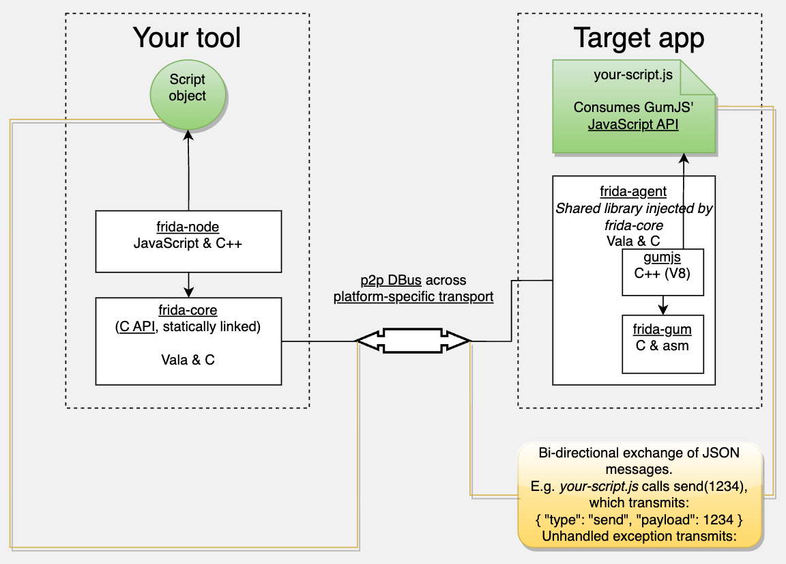

# 代码和架构

* Frida的架构
 *  总体架构
    * client=客户端
      * frida的各种工具
        * [frida](../use_frida/sub_module/frida.md)：frida主体工具本身，用的最多。
        * [frida-tools](../use_frida/sub_module/frida_tools/README.md)：（Win/Mac等）PC端常用到的，除了[frida](../use_frida/sub_module/frida.md)之外的，[frida-trace](../use_frida/sub_module/frida_tools/frida_trace.md)、[frida-ps](../use_frida/sub_module/frida_tools/frida_ps.md)、[frida-ls](../use_frida/sub_module/frida_tools/frida_ls.md)等命令行工具
          * [frida-trace](../use_frida/sub_module/frida_tools/frida_trace.md)：按顺序和带缩进的打印所有函数调用堆栈，极大地方便调试内部逻辑
    * server=服务端
      * [frida-server](../use_frida/sub_module/frida_server.md)
  * 原理图=架构图
    * 
      * 其中可见很多关键的点=frida中的子项
        * `frida-code`
        * `frida-node`
        * `frida-agent`
        * `frida-gum`
        * `GumJS`
      * 对应着源码中的各个子项目：详见下面内容。

# Frida源码

* Frida源码
  * 总入口: https://github.com/frida/frida
    * `core`: [frida-core](https://github.com/frida/frida-core)
      * Frida core library intended for static linking into bindings
    * `gum`: [frida-gum](https://github.com/frida/frida-gum)
      * Cross-platform instrumentation and introspection library written in C
        * This library is consumed by frida-core through its `JavaScript` bindings, `GumJS`.
    * `tools`: [frida-tools](https://github.com/frida/frida-tools)
      * Frida CLI tools
    * `bindings`
      * python -> [frida-python](https://github.com/frida/frida-python)
      * Node.js -> [frida-node](https://github.com/frida/frida-node)
      * Swift -> [frida-swift](https://github.com/frida/frida-swift)
      * .NET -> [frida-clr](https://github.com/frida/frida-clr)
      * GO -> [frida-go](https://github.com/frida/frida-go)
      * Rust -> [frida-rust](https://github.com/frida/frida-rust)
      * QT/qml -> [frida-qml](https://github.com/frida/frida-qml)
    * `其他`
      * Frida支持多个移动端的互操作，所以有分别的内部的互操作相关的内容
        * iOS端的：[frida-objc-bridge](https://github.com/frida/frida-objc-bridge)
          * Objective-C runtime interop from Frida
        * Android端的：[frida-java-bridge](https://github.com/frida/frida-java-bridge)
          * Java runtime interop from Frida
      * [Capstone](https://github.com/frida/capstone)
        * 记得是：Frida内部用到了Capstone，但是有些额外的内容要微调，所以单独fork了Capstone源码，自己同步更新了
