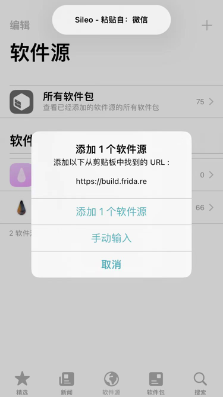
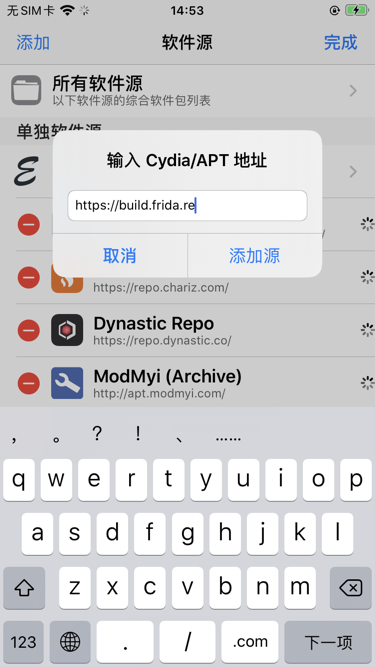
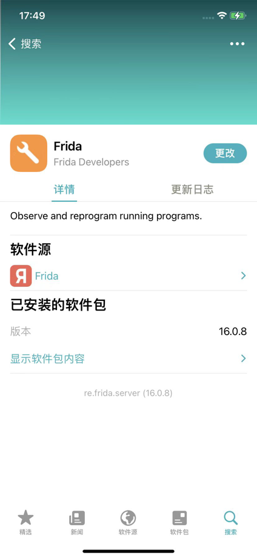
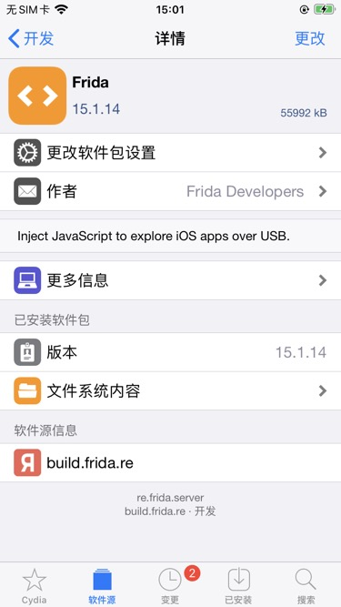
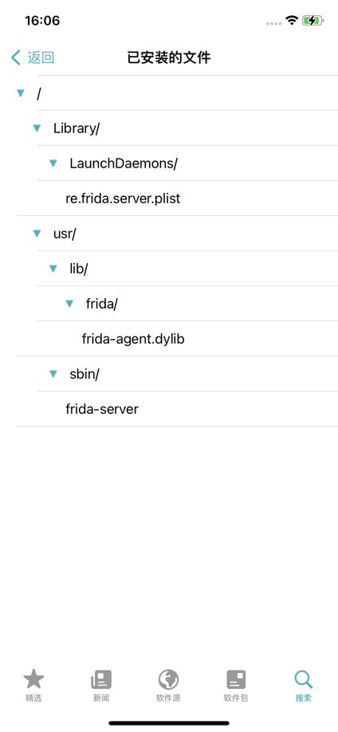
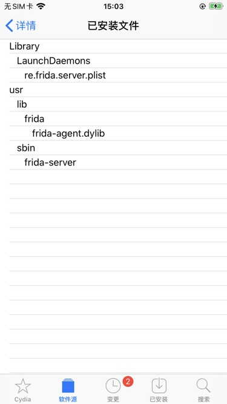

# 安装Frida

在能使用Frida之前，先要去安装Frida：

* PC端
  * Mac
    * 安装`frida` => 使得有[frida命令行工具](../use_frida/frida_cli/README.md)可用
      ```bash
      pip3 install frida
      ```
      * 安装后查看版本
        ```bash
        pip show frida
        ```
    * 安装`frida-tools` => 使得有[frida-trace](../use_frida/frida_trace/README.md)、[frida-ps](../use_frida/frida_tools/frida_ps.md)、[frida-ls](../use_frida/frida_tools/frida_ls.md)等命令行工具可用
      ```bash
      pip3 install frida-tools
      ```
      * 安装后查看版本
        ```bash
        pip show frida-tools
        ```
      * 额外说明
        * 如果前面没有先单独安装`frida`，则安装`frida-tools`时会自动安装所依赖的`frida`
    * 【可选】
      * 安装Frida的`gadget` => 使得后续使用[frida-ios-dump](https://book.crifan.org/books/ios_re_crack_shell_ipa/website/crack_example/frida_ios_dump/)时而不报错`need Gadget to attach on jailed iOS`
        * 下载gadget库文件
          * 从[Frida的Github的release](https://github.com/frida/frida/releases/)页面中，下载对应版本的`frida-gadget`的`dylib`
            * 举例
              * https://github.com/frida/frida/releases/download/16.0.8/frida-gadget-16.0.8-ios-universal.dylib.gz
                * 解压得到：`frida-gadget-16.0.8-ios-universal.dylib`
        * 拷贝到对应位置：`~/.cache/frida/gadget-ios.dylib`
          * 举例
            ```bash
            cp frida-gadget-16.0.8-ios-universal.dylib /Users/crifan/.cache/frida/gadget-ios.dylib
            ```
      * 安装：Frida的Node.js bindings -> 用得到，才需要安装，默认不用安装
        ```bash
        npm install frida
        ```
* 移动端
  * （越狱）iPhone
    * 安装步骤
      * 用`Sileo`/`Cydia`，添加软件源：`https://build.frida.re`，搜索并安装`frida`，即可
        * Sileo
          * 
        * Cydia
          * 
    * Frida安装后
      * 确保iPhone端`frida-server`已经正常运行
        ```bash
        iPhone8-150:~ root# ps -A | grep frida
        2150 ??         0:00.02 /usr/sbin/frida-server
        2194 ttys000    0:00.00 grep frida
        ```
      * 插件详情页
        * Sileo
          * 
        * Cydia
          * 
      * 已安装的文件
        * 列表
          * `/Library/LaunchDaemons/re.frida.server.plist`
          * `/usr/lib/frida/frida-agent.dylib`
          * `/usr/sbin/frida-server`
        * 图：
          * Sileo
            * 
          * Cydia
            * 
  * 已root的安卓
    * 安装步骤
      * 概述
        * 安装`Magisk`插件：[MagiskFrida](https://github.com/ViRb3/magisk-frida)
      * 详解
        * [初始化Frida开发环境 · Android逆向：动态调试 (crifan.org)](https://book.crifan.org/books/android_re_dynamic_debug/website/frida_debug_android/init_frida_dev_env.html)

## 常见问题

* XinaA15
  * 截至`XinaA15 v1.1.8` + `Sileo Nightly v2.4` + `Frida v16.0.11`：在rootless越狱的`XinaA15`中，无法通过`Sileo Nightly`正常安装和使用`Frida`
    * 只要一使用frida工具（比如`frida-ps -U`等）就会导致iPhone重启
    * 且安装和卸载都会出现一些异常报错
      * 安装Frida
        * `/var/jb/var/ib/Library/LaunchDaemons/re.frida.server.plist service is disabled`
        * 且此处`Sileo Nightly v2.4`中看到的最新版`Frida v16.0.13`，竟然还会出现无法安装：404错误
          * 
      * 卸载Frida
        * `/var/jb/var/jb/Library/LaunchDaemons/re.frida.server.plist: Could not find specified service`
