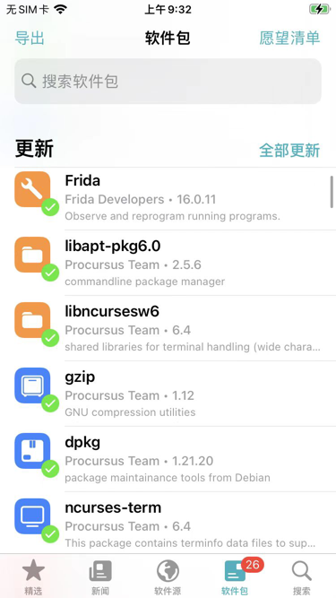
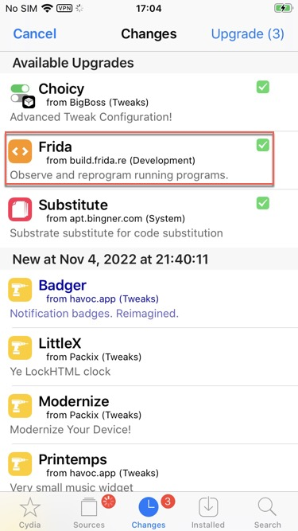

# 升级Frida

## 什么时候才要升级Frida版本？

当遇到如下场景时，（可能）需要升级Frida：

* 当（两端的）Frida版本不匹配时
  * （iPhone等）移动端中的Frida版本
    * 查看现有版本
      ```bash
      frida-server --version
      ```
  * （Mac等）PC端的Frida的版本
    * 查看现有版本
      ```bash
      frida --version
      ```
* Frida有新版可用，想要升级到最新版
  * 举例
    * `Sileo`中提示Frida有新版本`16.0.11`
      * 
    * `Cydia`中提示有新版本Frida
      * 

## 如何升级Frida版本？

和[安装Frida](../install_upgrade/install_frida.md)类似，也是分2部分：

* PC端
  * Mac
    * 用pip升级Frida
      ```bash
      pip install --upgrade frida
      ```
      * 如果需要，也去同时升级`frida-tools`
        ```bash
        pip install --upgrade frida-tools
        ```
* 移动端
  * Android
    * 重复之前
      * 安装`Magisk`插件：[MagiskFrida](https://github.com/ViRb3/magisk-frida)
    * 的步骤，只是下载时，下载**最新版本**的`MagiskFrida`的zip包即可
  * iOS(iPhone)
    * 用（`Cydia`/`Sileo`等）包管理器，升级`Frida`到最新版

### 如何安装指定版本的Frida？

TODO：找之前如何指定frida版本，当用pip安装时
