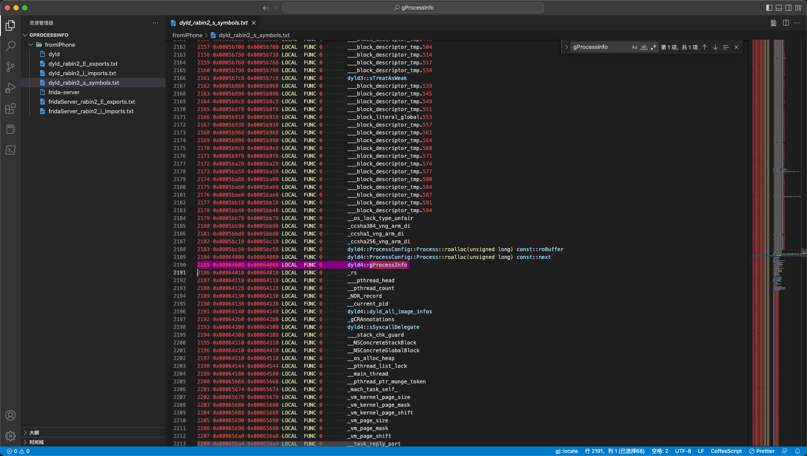
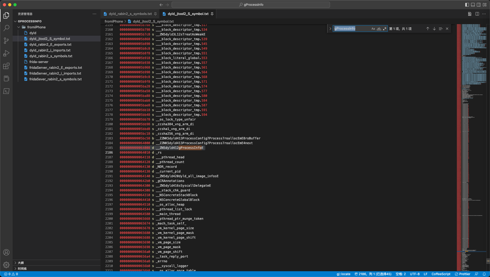

# 自己编译frida-server

`iPhone11`中，已用`XinaA15`进行了`rootless越狱`，然后去用`frida`：

```bash
crifan@licrifandeMacBook-Pro  ~  frida -U -f com.apple.store.Jolly -l /Users/crifan/dev/dev_root/iosReverse/AppleStore/dynamicDebug/frida/hookNSFileManager.js
     ____
    / _  |   Frida 16.0.8 - A world-class dynamic instrumentation toolkit
   | (_| |
    > _  |   Commands:
   /_/ |_|       help      -> Displays the help system
   . . . .       object?   -> Display information about 'object'
   . . . .       exit/quit -> Exit
   . . . .
   . . . .   More info at https://frida.re/docs/home/
   . . . .
   . . . .   Connected to iPhone (id=00008030-00011C49366B802E)
Failed to attach: missing gProcessInfo
```

结果报错：`Failed to attach missing gProcessInfo`

之后就是尝试解决此问题，最终涉及到：自己去编译frida-server的过程。

此处记录相关内容和心得，供参考。

## 研究gProcessInfo的来源

### 之前frida-ios-dump也遇到类似问题

而之前就见过此处的`missing gProcessInfo`，找到之前的：

* 原因是：属于偶尔的bug
* 解决办法：多试几次

-》此处：继续尝试多次，始终无法规避，始终报错。

### 研究frida中是否存在导入外部变量gProcessInfo

从报错信息`Failed to attach: missing gProcessInfo`中推测：

gProcessInfo是（iOS的app启动阶段涉及到的）dyld中的变量

怀疑是类似于：

* frida import 变量：gProcessInfo
* dyld export 变量：gProcessInfo

这种机制

所以去研究看看：

frida中，是否有import的变量，叫做gProcessInfo

后来确认，`missing gProcessInfo`来自iPhone端的`frida-server`

去导出`frida-server`

```bash
scp root@192.168.2.12:/var/sbin/frida-server frida-server
```

然后继续静态分析：

```bash
rabin2 -i frida-server > fridaServer_rabin2_i_imports.txt
rabin2 -E frida-server > fridaServer_rabin2_E_exports.txt
```

没找到`gProcessInfo`


另外找到：

* `dyld/dyldMain.cpp`

```cpp
namespace dyld4 {
...

#if TARGET_OS_OSX
static void* getProcessInfo()
{
    return gProcessInfo;
}
```

而根据：

【记录】dyld相关资料：启动过程

知道了：

* dyld
  * 之前是：dyld2
  * 后来是：dyld3
  * 此处是：dyld4

即：`dyld`有3个版本，`dyld2`、`dyld3`、`dyld4`

最后确认：

不是Frida（的frida-server）引用了外部的变量：

`dyld`源码中的`gProcessInfo`

而是：

frida源码中有gProcessInfo

即：

`frida-core/src/fruity/injector.vala`中就有对应代码：

```c
ensure_libsystem_initialized_for_dyld_v4_and_above
...
  throw new Error.UNSUPPORTED ("Missing gProcessInfo");
```

### Frida源码中找到了：gProcessInfo

`missing gProcessInfo`相关完整的代码：


* `frida-core/src/fruity/injector.vala`
  ```c
  private async void ensure_libsystem_initialized_for_dyld_v4_and_above (uint64 libdyld_initialize,
          Cancellable? cancellable) throws GLib.Error {
      uint64? process_info_ptr = dyld_symbols["_gProcessInfo"];
      if (process_info_ptr == null)
          throw new Error.UNSUPPORTED ("Missing gProcessInfo");
  ...
  ```

其他地方也有：

* `frida-core/src/fruity/helpers/symbol-fetcher.c`
  ```c
  size_t
  frida_fetch_dyld_symbols (char * output_buffer, const void * dyld_load_address)
  {
  ...
    for (i = dyld.dysymtab->ilocalsym; i != dyld.dysymtab->nlocalsym; i++)
    {
      const struct nlist_64 * sym = &symbols[i];
      const char * name = strings + sym->n_un.n_strx;

      if (frida_str_contains (name, "libdyld_initialize") ||
          frida_str_contains (name, "restartWithDyldInCache") ||
          frida_str_equals (name, "_gProcessInfo") ||
          frida_str_contains (name, "launchWithClosure") ||
          frida_str_contains (name, "initializeMainExecutable") ||
          frida_str_contains (name, "registerThreadHelpers") ||
          frida_str_has_prefix (name, "_dlopen") ||
          frida_str_has_prefix (name, "_strcmp") ||
          frida_str_contains (name, "doModInitFunctions") ||
          frida_str_contains (name, "doGetDOFSections"))
      {
        if (n != 0)
          frida_append_char (&cursor, '\n');

        frida_append_uint64 (&cursor, (uint64_t) (dyld.base + sym->n_value));
        frida_append_char (&cursor, '\t');
        frida_append_string (&cursor, name);

        n++;
      }
    }
  ```

* `frida-core/src/darwin/frida-helper-backend-glue.m`

```c
modern_entry_address = gum_darwin_module_resolve_symbol_address (dyld, "__ZN5dyld44APIs19_libdyld_initializeEPKNS_16LibSystemHelpersE");
instance->dyld_flavor = (modern_entry_address != 0) ? FRIDA_DYLD_V4_PLUS : FRIDA_DYLD_V3_MINUS;
if (instance->dyld_flavor == FRIDA_DYLD_V4_PLUS)
{
  instance->modern_entry_address = modern_entry_address;
  legacy_entry_address = 0;


  instance->info_ptr_address = gum_darwin_module_resolve_symbol_address (dyld, "_gProcessInfo");
  if (instance->info_ptr_address == 0)
    goto dyld_probe_failed;
}
...
  instance->dlopen_address = gum_darwin_module_resolve_symbol_address (dyld, "_dlopen");
  if (instance->dlopen_address == 0)
    instance->dlopen_address = gum_darwin_module_resolve_symbol_address (dyld, "_dlopen_internal");
  instance->register_helpers_address = gum_darwin_module_resolve_symbol_address (dyld, "__ZL21registerThreadHelpersPKN4dyld16LibSystemHelpersE");
  instance->dlerror_clear_address = gum_darwin_module_resolve_symbol_address (dyld, "__ZL12dlerrorClearv");
  instance->info_address = gum_darwin_module_resolve_symbol_address (dyld, "__ZN4dyld12gProcessInfoE");
  instance->helpers_ptr_address = gum_darwin_module_resolve_symbol_address (dyld, "__ZN4dyld17gLibSystemHelpersE");
  instance->do_modinit_strcmp_checks = frida_find_modinit_strcmp_checks (task, dyld);
  ...
```

心得：

其中有很多这种：

编译器编译后的固定的函数名：

* `_dlopen`
* `_dlopen_internal`
* `__ZL21registerThreadHelpersPKN4dyld16LibSystemHelpersE`
* `__ZL12dlerrorClearv`
* `__ZN4dyld12gProcessInfoE`
    * 其中包含：`gProcessInfo`
* `__ZN4dyld17gLibSystemHelpersE`

### 研究Frida中Missing gProcessInfo出错的逻辑和原因

经过后续了解：
【记录】dyld源码中的gProcessInfo

应该把：

* 只判断是否存在：_gProcessInfo

改为：

* 同时判断多种情况（先后顺序是）
  * `_gProcessInfo`
    * 对应原始代码中：`gProcessInfo`
  * `__ZN5dyld412gProcessInfoE`
    * 对应原始代码中：`dyld4::gProcessInfo`
  * `__ZN4dyld12gProcessInfoE`
    * 对应原始代码中：`dyld::gProcessInfo`
应该就可以了。

### 研究二进制/usr/lib/dyld中是否包含或导出变量_gProcessInfo

对于iPhone中的dyld：

```bash
iPhone11-151:~ root# ls -lh /usr/lib/dyld
-rwxr-xr-x 1 root wheel 630K Oct 15  2021 /usr/lib/dyld*
```

用：

```bash
scp root@192.168.2.12:/usr/lib/dyld dyld
```

导出后，再从dyld中导出符号：

```bash
rabin2 -s dyld > dyld_rabin2_s_symbols.txt
```

发现是有的：

* `dyld_rabin2_s_symbols.txt`

```bash
2185 0x00064008 0x00064008 LOCAL  FUNC 0        dyld4::gProcessInfo
```



另外，突然注意到：

* `fromiPhone/dyld_rabin2_s_symbols.txt`
  ```bash
  891  0x0002e500 0x0002e500 LOCAL  FUNC 0        dyld4::APIs::_dyld_shared_cache_optimized()
  892  0x0002e57c 0x0002e57c LOCAL  FUNC 0        dyld4::APIs::_dyld_register_for_image_loads(void (*)(mach_header const*, char const*, bool))
  893  0x0002e680 0x0002e680 LOCAL  FUNC 0        ____ZN5dyld44APIs30_dyld_register_for_image_loadsEPFvPK11mach_headerPKcbE_block_invoke
  894  0x0002e76c 0x0002e76c LOCAL  FUNC 0        ____ZN5dyld44APIs30_dyld_register_for_image_loadsEPFvPK11mach_headerPKcbE_block_invoke_2
  895  0x0002e7b4 0x0002e7b4 LOCAL  FUNC 0        ____ZN5dyld44APIs35_dyld_register_for_bulk_image_loadsEPFvjPPK11mach_headerPPKcE_block_invoke_2
  896  0x0002e7c8 0x0002e7c8 LOCAL  FUNC 0        dyld4::APIs::dyld_shared_cache_file_path()
  897  0x0002e810 0x0002e810 LOCAL  FUNC 0        dyld4::APIs::dyld_has_inserted_or_interposing_libraries()
  898  0x0002e874 0x0002e874 LOCAL  FUNC 0        dyld4::APIs::dyld_shared_cache_find_iterate_text(unsigned char const*, char const**, void ( block_pointer)(dyld_shared_cache_dylib_text_info const*))
  899  0x0002ea8c 0x0002ea8c LOCAL  FUNC 0        dyld4::findCacheInDirAndMap(dyld4::RuntimeState&, unsigned char const*, char const*, unsigned long&)
  900  0x0002eb5c 0x0002eb5c LOCAL  FUNC 0        ____ZN5dyld44APIs35dyld_shared_cache_find_iterate_textEPKhPPKcU13block_pointerFvPK33dyld_shared_cache_dylib_text_infoE_block_invoke.173
  901  0x0002ebe0 0x0002ebe0 LOCAL  FUNC 0        dyld4::APIs::dyld_shared_cache_iterate_text(unsigned char const*, void ( block_pointer)(dyld_shared_cache_dylib_text_info const*))
  902  0x0002ec60 0x0002ec60 LOCAL  FUNC 0        dyld4::APIs::_dyld_fork_child()
  ```

即：

此处symbol中，也是有一些：

* ____ZN5dyld44APIs30_dyld_register_for_image_loadsEPFvPK11mach_headerPKcbE_block_invoke

这种编译后的函数名的值的

同时，也有，编译前的，普通的函数名：

* dyld4::APIs::_dyld_register_for_image_loads(void (*)(mach_header const*, char const*, bool))

-》所以突然想到：

估计是，编译前的，普通函数名，是：

此处rabin2，自动帮忙翻译的（因为其懂得编译和反编译函数名 symbol的内在逻辑？）

-》所以去找找：

是否有机会，让rabin2，只输出：

编译后的symbol名字？

这样就能找到，确认：

`dyld4::gProcessInfo`

是不是：

`__ZN5dyld44gProcessInfo`

了

去找找看：

rabin2的其他参数，能输出原始的symbol的？

对了，或许也可以用另外的工具：`jtool2`

```bash
jtool2 -S dyld > dyld_jtool2_S_symbol.txt
```

果然是我们希望的，原始的，编译后的，没有被解析的：`gProcessInfo`

* `dyld_jtool2_S_symbol.txt`
  ```bash
  0000000000064008 d __ZN5dyld412gProcessInfoE
  ```



所以就是：

* `dyld4::gProcessInfo`
  * 编译生成：`__ZN5dyld412gProcessInfoE`
  * 不是我以为的：`__ZN5dyld44gProcessInfo`

再去dyld源码中，多搜搜：

`namespace dyld4`

看看是否有其他新发现

`namespace dyld4`

* `/Users/crifan/dev/dev_src/ios_reverse/AppleOpenSource/dyld/dyld-dyld-1042.1/dyld/DebuggerSupport.h`

```c
namespace dyld4 {
    using lsl::Allocator;
    void addImagesToAllImages(RuntimeState& state, uint32_t infoCount, const dyld_image_info info[],  uint32_t initialImageCount);
    void removeImageFromAllImages(const mach_header* loadAddress);
...
}

extern "C" void lldb_image_notifier(enum dyld_image_mode mode, uint32_t infoCount, const dyld_image_info info[]);

extern dyld_all_image_infos*        gProcessInfo;
```

->也还是：`gProcessInfo`

->不是放在`namespace dyld4`中的

* `/Users/crifan/dev/dev_src/ios_reverse/AppleOpenSource/dyld/dyld-dyld-1042.1/dyld/DyldAPIs.cpp`

```c
// internal libc.a variable that needs to be reset during fork()
extern mach_port_t mach_task_self_;

using dyld3::MachOFile;
using dyld3::MachOLoaded;

extern const dyld3::MachOLoaded __dso_handle;

...

namespace dyld4 {
...
}
```

-》自己当前是dyld4的namespace，但是也会引用外部变量：

* 其中也有：
  * 没有namespace的：
    * `extern mach_port_t mach_task_self_;`
  * 和另外的namespace的：`dyld3`
    * `extern const dyld3::MachOLoaded __dso_handle;`

然后去：

【未解决】rabin2输出C++的未解析的原始的编译后的函数名mangle name

所以去：

【未解决】C++代码中函数变量编译生成符号symbol的规则

期间去：

【已解决】从C++的编译后的符号symbol得到原始的变量函数名

另外，看看此处的dyld版本：

```bash
iPhone11-151:~ root# /usr/lib/dyld --version
-sh: /usr/lib/dyld: cannot execute binary file: Exec format error
```

无法查看。

【已解决】iOS 13.3的iPhone7中/usr/lib/dyld的版本和gProcessInfo相关信息

### 也去研究：dyld源码中的gProcessInfo

至此找到：
* `gProcessInfo`
  * 变量来源：
    * `dyld/dyld-dyld-1042.1/dyld/DebuggerSupport.cpp`
      ```c
      struct dyld_all_image_infos* gProcessInfo = &dyld_all_image_infos;
      ```
以及：
* `struct dyld_all_image_infos`
  * 定义
    * `libdyld/dyld_process_info_internal.h`
      * `struct dyld_all_image_infos_32`
      * `struct dyld_all_image_infos_64`
    * `include/mach-o/dyld_images.h`
      * `struct __attribute__((aligned(16))) dyld_all_image_infos`


具体定义详见：

（1）`include/mach-o/dyld_images.h`

```c
// Must be aligned to support atomic updates
// Note sim cannot assume alignment until all host dylds are new enough
#if TARGET_OS_SIMULATOR
struct dyld_all_image_infos
#else
struct __attribute__((aligned(16))) dyld_all_image_infos
#endif
{
    uint32_t                        version;        /* 1 in Mac OS X 10.4 and 10.5 */
    uint32_t                        infoArrayCount;
#if defined(__cplusplus) && (BUILDING_LIBDYLD || BUILDING_DYLD)
    std::atomic<const struct dyld_image_info*>    infoArray;
#else
    const struct dyld_image_info*    infoArray;
#endif
    dyld_image_notifier                notification;        
    bool                            processDetachedFromSharedRegion;
    /* the following fields are only in version 2 (Mac OS X 10.6, iPhoneOS 2.0) and later */
    bool                            libSystemInitialized;
    const struct mach_header*        dyldImageLoadAddress;
    /* the following field is only in version 3 (Mac OS X 10.6, iPhoneOS 3.0) and later */
    void*                            jitInfo;
    /* the following fields are only in version 5 (Mac OS X 10.6, iPhoneOS 3.0) and later */
    const char*                        dyldVersion;
    const char*                        errorMessage;
    uintptr_t                        terminationFlags;
    /* the following field is only in version 6 (Mac OS X 10.6, iPhoneOS 3.1) and later */
    void*                            coreSymbolicationShmPage;
    /* the following field is only in version 7 (Mac OS X 10.6, iPhoneOS 3.1) and later */
    uintptr_t                        systemOrderFlag;
    /* the following field is only in version 8 (Mac OS X 10.7, iPhoneOS 3.1) and later */
    uintptr_t                        uuidArrayCount;
    const struct dyld_uuid_info*    uuidArray;        /* only images not in dyld shared cache */
    /* the following field is only in version 9 (Mac OS X 10.7, iOS 4.0) and later */
    struct dyld_all_image_infos*    dyldAllImageInfosAddress;
    /* the following field is only in version 10 (Mac OS X 10.7, iOS 4.2) and later */
    uintptr_t                        initialImageCount;
    /* the following field is only in version 11 (Mac OS X 10.7, iOS 4.2) and later */
    uintptr_t                        errorKind;
    const char*                        errorClientOfDylibPath;
    const char*                        errorTargetDylibPath;
    const char*                        errorSymbol;
    /* the following field is only in version 12 (Mac OS X 10.7, iOS 4.3) and later */
    uintptr_t                        sharedCacheSlide;
    /* the following field is only in version 13 (Mac OS X 10.9, iOS 7.0) and later */
    uint8_t                            sharedCacheUUID[16];
    /* the following field is only in version 15 (macOS 10.12, iOS 10.0) and later */
    uintptr_t                        sharedCacheBaseAddress;
#if defined(__cplusplus) && (BUILDING_LIBDYLD || BUILDING_DYLD)
    // We want this to be atomic in libdyld so that we can see updates when we map it shared
    std::atomic<uint64_t>           infoArrayChangeTimestamp;
#else
    uint64_t                        infoArrayChangeTimestamp;
#endif
    const char*                        dyldPath;
    mach_port_t                        notifyPorts[DYLD_MAX_PROCESS_INFO_NOTIFY_COUNT];
#if __LP64__
    uintptr_t                        reserved[11-(DYLD_MAX_PROCESS_INFO_NOTIFY_COUNT/2)];
#else
    uintptr_t                        reserved[9-DYLD_MAX_PROCESS_INFO_NOTIFY_COUNT];
#endif
    // The following fields were added in version 18 (previously they were reserved padding fields)
    uint64_t                        sharedCacheFSID;
    uint64_t                        sharedCacheFSObjID;
    /* the following field is only in version 16 (macOS 10.13, iOS 11.0) and later */
    uintptr_t                       compact_dyld_image_info_addr;
    size_t                          compact_dyld_image_info_size;
    uint32_t                        platform; // FIXME: really a dyld_platform_t, but those aren't exposed here.


    /* the following field is only in version 17 (macOS 10.16) and later */
    uint32_t                          aotInfoCount;
    const struct dyld_aot_image_info* aotInfoArray;
    uint64_t                          aotInfoArrayChangeTimestamp;
    uintptr_t                         aotSharedCacheBaseAddress;
    uint8_t                           aotSharedCacheUUID[16];
};
```

（2）还有个分32和64的：

* `struct dyld_all_image_infos_32`
* `struct dyld_all_image_infos_64`

->

* `libdyld/dyld_process_info_internal.h`

```c
struct dyld_all_image_infos_32 {
    uint32_t                        version;
    uint32_t                        infoArrayCount;
    std::atomic<uint32_t>           infoArray;
    uint32_t                        notification;
    bool                            processDetachedFromSharedRegion;
    bool                            libSystemInitialized;
    uint32_t                        dyldImageLoadAddress;
    uint32_t                        jitInfo;
    uint32_t                        dyldVersion;
    uint32_t                        errorMessage;
    uint32_t                        terminationFlags;
    uint32_t                        coreSymbolicationShmPage;
    uint32_t                        systemOrderFlag;
    uint32_t                        uuidArrayCount;
    uint32_t                        uuidArray;
    uint32_t                        dyldAllImageInfosAddress;
    uint32_t                        initialImageCount;
    uint32_t                        errorKind;
    uint32_t                        errorClientOfDylibPath;
    uint32_t                        errorTargetDylibPath;
    uint32_t                        errorSymbol;
    uint32_t                        sharedCacheSlide;
    std::array<uint8_t, 16>         sharedCacheUUID;
    uint32_t                        sharedCacheBaseAddress;
    std::atomic<uint64_t>           infoArrayChangeTimestamp;
    uint32_t                        dyldPath;
    uint32_t                        notifyMachPorts[8];
    uint32_t                        reserved;
    uint64_t                        sharedCacheFSID;
    uint64_t                        sharedCacheFSObjID;
    uint32_t                        compact_dyld_image_info_addr;
    uint32_t                        compact_dyld_image_info_size;
    uint32_t                        platform;
    // the aot fields below will not be set in the 32 bit case
    uint32_t                        aotInfoCount;
    std::atomic<uint64_t>           aotInfoArray;
    uint64_t                        aotInfoArrayChangeTimestamp;
    uint64_t                        aotSharedCacheBaseAddress;
    std::array<uint8_t, 16>         aotSharedCacheUUID[16];
};


struct dyld_all_image_infos_64 {
    uint32_t                version;
    uint32_t                infoArrayCount;
    std::atomic<uint64_t>   infoArray;
    uint64_t                notification;
    bool                    processDetachedFromSharedRegion;
    bool                    libSystemInitialized;
    uint32_t                paddingToMakeTheSizeCorrectOn32bitAndDoesntAffect64b; // NOT PART OF DYLD_ALL_IMAGE_INFOS!
    uint64_t                dyldImageLoadAddress;
    uint64_t                jitInfo;
    uint64_t                dyldVersion;
    uint64_t                errorMessage;
    uint64_t                terminationFlags;
    uint64_t                coreSymbolicationShmPage;
    uint64_t                systemOrderFlag;
    uint64_t                uuidArrayCount;
    uint64_t                uuidArray;
    uint64_t                dyldAllImageInfosAddress;
    uint64_t                initialImageCount;
    uint64_t                errorKind;
    uint64_t                errorClientOfDylibPath;
    uint64_t                errorTargetDylibPath;
    uint64_t                errorSymbol;
    uint64_t                sharedCacheSlide;
    std::array<uint8_t, 16> sharedCacheUUID;
    uint64_t                sharedCacheBaseAddress;
    std::atomic<uint64_t>   infoArrayChangeTimestamp;
    uint64_t                dyldPath;
    uint32_t                notifyMachPorts[8];
    uint64_t                reserved[7];
    uint64_t                sharedCacheFSID;
    uint64_t                sharedCacheFSObjID;
    uint64_t                compact_dyld_image_info_addr;
    uint64_t                compact_dyld_image_info_size;
    uint32_t                platform;
    uint32_t                aotInfoCount;
    std::atomic<uint64_t>   aotInfoArray;
    uint64_t                aotInfoArrayChangeTimestamp;
    uint64_t                aotSharedCacheBaseAddress;
    std::array<uint8_t, 16> aotSharedCacheUUID[16];
};
```

然后：

【未解决】dyld-932.4中gProcessInfo编译后symbol却是__ZN5dyld412gProcessInfoE

## 自己编译arm64e版的Frida

安装依赖库：

```bash
pip install colorama prompt-toolkit pygments
```

设置Python用新版`3.10.6`

```bash
local再去设置为3.10.6的版本：
 crifan@licrifandeMacBook-Pro  ~/dev/dev_src/ios_reverse/frida  pyenv versions
  system
  3.5.2
  3.6.6
  3.7.3
* 3.9.4 (set by /Users/crifan/.pyenv/version)
  3.10.6
 crifan@licrifandeMacBook-Pro  ~/dev/dev_src/ios_reverse/frida  pyenv local 3.10.6
 crifan@licrifandeMacBook-Pro  ~/dev/dev_src/ios_reverse/frida  python --version
Python 3.10.6
```

clone frida的代码：

```bash
git clone --recurse-submodules https://github.com/frida/frida.git
```

先make看看有哪些编译选项：

```bash
crifan@licrifandeMacBook-Pro  ~/dev/dev_src/ios_reverse/frida/frida   main  make
make[1]: Entering directory '/Users/crifan/dev/dev_src/ios_reverse/frida/frida'

Usage: make TARGET [VARIABLE=value]

Where TARGET specifies one or more of:

  /* gum */
  gum-macos                  Build for macOS
  gum-ios                    Build for iOS
  gum-watchos                Build for watchOS
  gum-tvos                   Build for tvOS
  gum-android-x86            Build for Android/x86
  gum-android-x86_64         Build for Android/x86-64
  gum-android-arm            Build for Android/arm
  gum-android-arm64          Build for Android/arm64
  check-gum-macos            Run tests for macOS

  /* core */
  core-macos                 Build for macOS
  core-ios                   Build for iOS
  core-watchos               Build for watchOS
  core-tvos                  Build for tvOS
  core-android-x86           Build for Android/x86
  core-android-x86_64        Build for Android/x86-64
  core-android-arm           Build for Android/arm
  core-android-arm64         Build for Android/arm64
  check-core-macos           Run tests for macOS

  /* python */
  python-macos               Build Python bindings for macOS
  check-python-macos         Test Python bindings for macOS

  /* node */
  node-macos                 Build Node.js bindings for macOS
  check-node-macos           Test Node.js bindings for macOS

  /* tools */
  tools-macos                Build CLI tools for macOS
  check-tools-macos          Test CLI tools for macOS

And optionally also VARIABLE values:
  PYTHON                     Absolute path of Python interpreter including version suffix
  NODE                       Absolute path of Node.js binary

For example:
  $ make python-macos PYTHON=/usr/local/bin/python3.6
  $ make node-macos NODE=/usr/local/bin/node

make[1]: Leaving directory '/Users/crifan/dev/dev_src/ios_reverse/frida/frida'
```

此处要去编译：`iOS`的，所以看起来是：

`core-ios                   Build for iOS`

所以最后去：

```bash
make core-ios
```

期间解决了证书问题：

* 【已解决】Mac中编译frida-core报错：FAILED /usr/bin/codesign IOS_CERTID not set

继续：

```bash
✘ crifan@licrifandeMacBook-Pro  ~/dev/dev_src/ios_reverse/frida/frida   main  export MACOS_CERTID=frida-cert
 crifan@licrifandeMacBook-Pro  ~/dev/dev_src/ios_reverse/frida/frida   main  export IOS_CERTID=frida-cert
 crifan@licrifandeMacBook-Pro  ~/dev/dev_src/ios_reverse/frida/frida   main  export WATCHOS_CERTID=frida-cert
 crifan@licrifandeMacBook-Pro  ~/dev/dev_src/ios_reverse/frida/frida   main  export TVOS_CERTID=frida-cert
 crifan@licrifandeMacBook-Pro  ~/dev/dev_src/ios_reverse/frida/frida   main  make core-ios
make[1]: Entering directory '/Users/crifan/dev/dev_src/ios_reverse/frida/frida'
. build/frida-env-ios-arm64.rc; \
builddir=build/tmp-ios-arm64/frida-core; \
if [ ! -f $builddir/build.ninja ]; then \
            meson_args="--native-file build/frida-macos-x86_64.txt"; if [ ios-arm64 != macos-x86_64 ]; then meson_args="$meson_args --cross-file build/frida-ios-arm64.txt"; fi; python3 /Users/crifan/dev/dev_src/ios_reverse/frida/frida/releng/meson/meson.py setup $meson_args \
        --prefix /usr \
        --default-library static -Doptimization=s -Db_ndebug=true --strip -Dconnectivity=enabled -Dmapper=auto \
        -Dassets=installed \
        frida-core $builddir || exit 1; \
fi \
    && python3 /Users/crifan/dev/dev_src/ios_reverse/frida/frida/releng/meson/meson.py compile -C $builddir \
    && DESTDIR="/Users/crifan/dev/dev_src/ios_reverse/frida/frida/build/frida-ios-arm64" python3 /Users/crifan/dev/dev_src/ios_reverse/frida/frida/releng/meson/meson.py install -C $builddir
INFO: autodetecting backend as ninja
INFO: calculating backend command to run: /Users/crifan/dev/dev_src/ios_reverse/frida/frida/build/toolchain-macos-x86_64/bin/ninja -C /Users/crifan/dev/dev_src/ios_reverse/frida/frida/build/tmp-ios-arm64/frida-core
ninja: Entering directory `/Users/crifan/dev/dev_src/ios_reverse/frida/frida/build/tmp-ios-arm64/frida-core'
[85/85] Generating lib/gadget/frida-gadget with a custom command
ninja: Entering directory `/Users/crifan/dev/dev_src/ios_reverse/frida/frida/build/tmp-ios-arm64/frida-core'
ninja: no work to do.
Installing lib/base/libfrida-base-1.0.a to /Users/crifan/dev/dev_src/ios_reverse/frida/frida/build/frida-ios-arm64/usr/lib
Installing lib/base/frida-base.h to /Users/crifan/dev/dev_src/ios_reverse/frida/frida/build/frida-ios-arm64/usr/include/frida-1.0
Installing lib/base/frida-base-1.0.vapi to /Users/crifan/dev/dev_src/ios_reverse/frida/frida/build/frida-ios-arm64/usr/share/vala/vapi
Installing lib/payload/libfrida-payload-1.0.a to /Users/crifan/dev/dev_src/ios_reverse/frida/frida/build/frida-ios-arm64/usr/lib
Installing lib/payload/frida-payload.h to /Users/crifan/dev/dev_src/ios_reverse/frida/frida/build/frida-ios-arm64/usr/include/frida-1.0
Installing lib/payload/frida-payload-1.0.vapi to /Users/crifan/dev/dev_src/ios_reverse/frida/frida/build/frida-ios-arm64/usr/share/vala/vapi
Installing lib/agent/frida-agent.dylib to /Users/crifan/dev/dev_src/ios_reverse/frida/frida/build/frida-ios-arm64/usr/lib/frida
Installing lib/gadget/frida-gadget.dylib to /Users/crifan/dev/dev_src/ios_reverse/frida/frida/build/frida-ios-arm64/usr/lib/frida
Installing src/frida-helper to /Users/crifan/dev/dev_src/ios_reverse/frida/frida/build/frida-ios-arm64/usr/lib/frida
Installing src/api/frida-core.h to /Users/crifan/dev/dev_src/ios_reverse/frida/frida/build/frida-ios-arm64/usr/include/frida-1.0
Installing src/api/frida-core-1.0.vapi to /Users/crifan/dev/dev_src/ios_reverse/frida/frida/build/frida-ios-arm64/usr/share/vala/vapi
Installing src/api/frida-core-1.0.deps to /Users/crifan/dev/dev_src/ios_reverse/frida/frida/build/frida-ios-arm64/usr/share/vala/vapi
Installing src/api/libfrida-core-1.0.a to /Users/crifan/dev/dev_src/ios_reverse/frida/frida/build/frida-ios-arm64/usr/lib
Installing server/frida-server to /Users/crifan/dev/dev_src/ios_reverse/frida/frida/build/frida-ios-arm64/usr/bin
Installing portal/frida-portal to /Users/crifan/dev/dev_src/ios_reverse/frida/frida/build/frida-ios-arm64/usr/bin
Installing inject/frida-inject to /Users/crifan/dev/dev_src/ios_reverse/frida/frida/build/frida-ios-arm64/usr/bin
Installing /Users/crifan/dev/dev_src/ios_reverse/frida/frida/build/tmp-ios-arm64/frida-core/meson-private/frida-base-1.0.pc to /Users/crifan/dev/dev_src/ios_reverse/frida/frida/build/frida-ios-arm64/usr/lib/pkgconfig
Installing /Users/crifan/dev/dev_src/ios_reverse/frida/frida/build/tmp-ios-arm64/frida-core/meson-private/frida-payload-1.0.pc to /Users/crifan/dev/dev_src/ios_reverse/frida/frida/build/frida-ios-arm64/usr/lib/pkgconfig
Installing /Users/crifan/dev/dev_src/ios_reverse/frida/frida/build/tmp-ios-arm64/frida-core/meson-private/frida-core-1.0.pc to /Users/crifan/dev/dev_src/ios_reverse/frida/frida/build/frida-ios-arm64/usr/lib/pkgconfig
make[1]: Leaving directory '/Users/crifan/dev/dev_src/ios_reverse/frida/frida'
```

即可：编译完成。

我们要找到的：frida-server，貌似是：

* Installing server/frida-server to /Users/crifan/dev/dev_src/ios_reverse/frida/frida/build/frida-ios-arm64/usr/bin

去看看build目录

```bash
crifan@licrifandeMacBook-Pro  ~/dev/dev_src/ios_reverse/frida/frida   main  cd build
 crifan@licrifandeMacBook-Pro  ~/dev/dev_src/ios_reverse/frida/frida/build   main  ll
total 56
-rw-r--r--  1 crifan  staff   190B  1 16 11:45 frida-env-ios-arm64.rc
-rw-r--r--  1 crifan  staff   193B  1 16 11:45 frida-env-macos-x86_64.rc
drwxr-xr-x  3 crifan  staff    96B  1 16 11:47 frida-ios-arm64
-rwxr-xr-x  1 crifan  staff   430B  1 16 11:45 frida-ios-arm64-pkg-config
-rw-r--r--  1 crifan  staff   2.9K  1 16 11:45 frida-ios-arm64.txt
-rwxr-xr-x  1 crifan  staff   436B  1 16 11:45 frida-macos-x86_64-pkg-config
-rw-r--r--  1 crifan  staff   2.9K  1 16 11:45 frida-macos-x86_64.txt
-rw-r--r--  1 crifan  staff   217B  1 16 11:44 frida-version.h
drwxr-xr-x  8 crifan  staff   256B  1 16 11:45 sdk-ios-arm64
drwxr-xr-x  8 crifan  staff   256B  1 16 11:44 sdk-macos-x86_64
drwxr-xr-x  4 crifan  staff   128B  1 16 11:47 tmp-ios-arm64
drwxr-xr-x  8 crifan  staff   256B  1 16 11:44 toolchain-macos-x86_64
 crifan@licrifandeMacBook-Pro  ~/dev/dev_src/ios_reverse/frida/frida/build   main  cd frida-ios-arm64
 crifan@licrifandeMacBook-Pro  ~/dev/dev_src/ios_reverse/frida/frida/build/frida-ios-arm64   main  ll
total 0
drwxr-xr-x  6 crifan  staff   192B  1 16 11:47 usr
 crifan@licrifandeMacBook-Pro  ~/dev/dev_src/ios_reverse/frida/frida/build/frida-ios-arm64   main  cd usr
 crifan@licrifandeMacBook-Pro  ~/dev/dev_src/ios_reverse/frida/frida/build/frida-ios-arm64/usr   main  ll
total 0
drwxr-xr-x   6 crifan  staff   192B  1 16 15:14 bin
drwxr-xr-x   3 crifan  staff    96B  1 16 11:47 include
drwxr-xr-x  13 crifan  staff   416B  1 16 15:14 lib
drwxr-xr-x   3 crifan  staff    96B  1 16 11:47 share
 crifan@licrifandeMacBook-Pro  ~/dev/dev_src/ios_reverse/frida/frida/build/frida-ios-arm64/usr   main  cd bin
 crifan@licrifandeMacBook-Pro  ~/dev/dev_src/ios_reverse/frida/frida/build/frida-ios-arm64/usr/bin   main  ll
total 40752
-rwxr-xr-x  1 crifan  staff   6.2M  1 16 15:13 frida-inject
-rwxr-xr-x  1 crifan  staff   5.2M  1 16 15:13 frida-portal
-rwxr-xr-x  1 crifan  staff   6.4M  1 16 15:13 frida-server
-rwxr-xr-x  1 crifan  staff   2.1M  1 16 11:47 gum-graft
 crifan@licrifandeMacBook-Pro  ~/dev/dev_src/ios_reverse/frida/frida/build/frida-ios-arm64/usr/bin   main  file ./frida-server
./frida-server: Mach-O 64-bit executable arm64
```

的确是编译成功了

回去看看之前frida-server的大小和file输出信息

```bash
crifan@licrifandeMacBook-Pro  ~/dev/dev_root/iosReverse/AppleStore/debug/gProcessInfo/iPhone11_151  ll
total 55248
-rwxr-xr-x@ 1 crifan  staff   629K  1 13 10:06 dyld
-rw-r--r--  1 crifan  staff   2.5M  1 13 22:14 dyld.id0
-rw-r--r--  1 crifan  staff   1.6M  1 13 22:13 dyld.id1
-rw-r--r--  1 crifan  staff    40K  1 13 22:13 dyld.nam
-rw-r--r--  1 crifan  staff   1.3K  1 13 22:13 dyld.til
-rw-r--r--  1 crifan  staff   173K  1 13 10:44 dyld_jtool2_S_symbol.txt
-rw-r--r--  1 crifan  staff   277B  1 13 10:07 dyld_rabin2_E_exports.txt
-rw-r--r--  1 crifan  staff   125B  1 13 10:07 dyld_rabin2_i_imports.txt
-rw-r--r--  1 crifan  staff   249K  1 13 21:33 dyld_rabin2_s_r_symbols.txt
-rw-r--r--  1 crifan  staff   381K  1 13 10:13 dyld_rabin2_s_symbols.txt
-rwxr-xr-x  1 crifan  staff    20M  1 12 17:55 frida-server
-rw-r--r--  1 crifan  staff   169B  1 12 17:58 fridaServer_rabin2_E_exports.txt
-rw-r--r--  1 crifan  staff    17K  1 12 17:58 fridaServer_rabin2_i_imports.txt
-rw-r--r--  1 crifan  staff   1.9M  1 13 10:18 fridaSever_rabin2_s_symbols.txt
 crifan@licrifandeMacBook-Pro  ~/dev/dev_root/iosReverse/AppleStore/debug/gProcessInfo/iPhone11_151  file ./frida-server
./frida-server: Mach-O universal binary with 3 architectures: [arm64:Mach-O 64-bit executable arm64] [arm64e] [arm64e]
./frida-server (for architecture arm64):    Mach-O 64-bit executable arm64
./frida-server (for architecture arm64e):    Mach-O 64-bit executable arm64e
./frida-server (for architecture arm64e):    Mach-O 64-bit executable arm64e
```

-》此处frida-server很大：20M

不过明显是：FAT格式，包含多个架构：

* `arm64`
* `arm64e`

那看起来，貌似有个问题：

此处，从iPhone导出的真实在用的`frida-server`，支持：`arm64e`

而此处自己编译出来的，只支持`arm64`，不支持`arm64e`

而记得：此处的`iPhone`中的架构都是：`arm64e`的？

感觉需要：

* 确认`iOS 15.1`的`iPhone11`中，此处`arm`的架构是：`arm64e`还是`arm64`
  * 确定其中的`frida-server`是否需要支持`arm64e`
* 如果需要支持`arm64e`，再去看：`frida`编译`core-ios`时，如何指定或加上`arm64e`的支持

先去：

【基本解决】iOS 15.1的iPhone11中frida-server所用架构是arm64e还是arm64

-》`arm64`的二进制，是能放到`arm64e`的`A13`的`iPhone11`中运行的。

那先继续看看：

【未解决】自己编译出的arm64的frida-server能否在iPhone11正常运行

---

其他过程详见：

* 【未解决】用frida源码自己编译出frida的iOS的包含frida-server的deb安装包
* 【未解决】自己编译出包含arm64和arm64e的FAT格式的frida-server二进制
* 【未解决】自己修改编译frida-core源码以尝试解决Frida的Missing gProcessInfo问题
* 【未解决】Frida中如何编译出iOS的arm64e的frida-server二进制
* 【未解决】自己编译Frida的frida-core代码生成可用二进制frida-server

## 找arm64e版的Frida

### 从Frida源码和build中找

* 【未解决】找Frida中iOS的arm6e4：从Frida源码和build中找

### 从Frida的github中找

* 【未解决】找Frida中iOS的arm6e4：从Frida的github中找

### 自己给make加echo打印日志调试

* 【未解决】找Frida中iOS的arm6e4：自己给make加echo打印日志调试

### 从github的ci的workflow中找arm64e

* 【未解决】找Frida中iOS的arm6e4：从github的ci的workflow中找arm64e

### 从编译日志中的Downloading ios-arm64入手

* 【未解决】找Frida中iOS的arm6e4：从编译日志中的Downloading ios-arm64入手

### make时如何传入arm64e的arch参数

* 【未解决】找Frida中iOS的arm6e4：make时如何传入arm64e的arch参数

### 从make编译时的log日志入手

* 【未解决】找Frida中iOS的arm6e4：从make编译时的log日志入手
