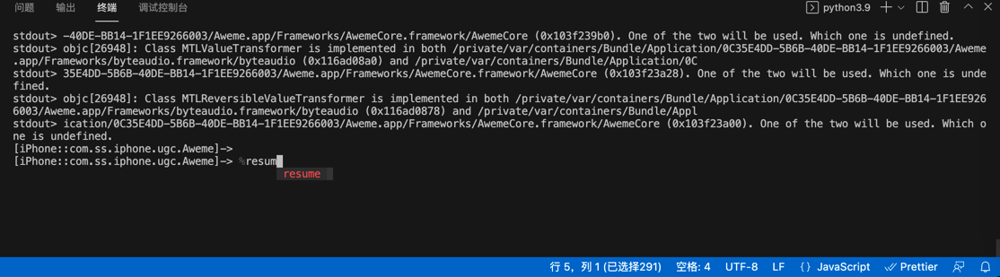
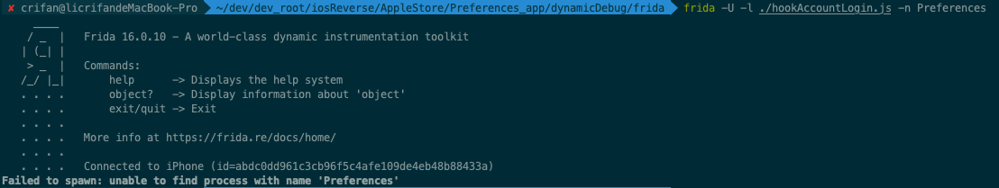
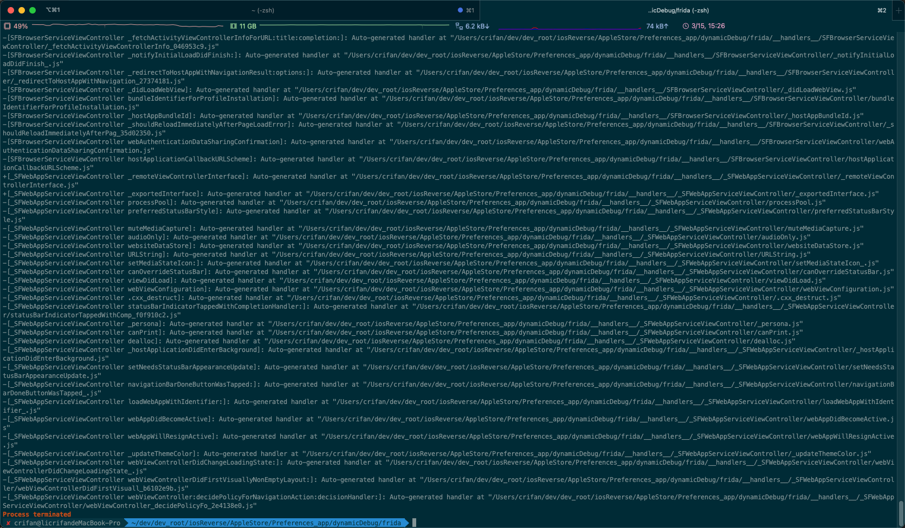
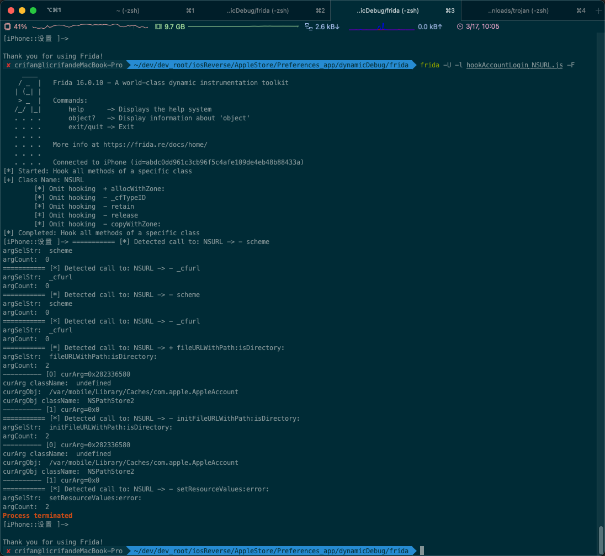

# 常见问题和报错

## 常见问题

### 关于frida启动后，被调试的目标，是否暂停运行的问题

* 背景
  * frida启动调试后，被调试的目标（app或进程），是否已经暂停运行
    * 旧版frida：自动暂停运行
      * 支持参数：`--no-pause`
    * 新版frida：（逻辑已经变成了）不暂停运行 = 已经继续运行了
      * * 支持参数：`--pause`
* 所以
  * 旧版frida
    * 常会遇到一个问题：每次frida（以Attach后Spawn去）启动调试后，程序自动暂停运行
      * 解决办法：手动输入`%resume`
        * 
    * 所以就希望：frida调试开始后，自动继续运行，不要每次都输入`%resume`才继续运行
      * 解决办法：加`--no-pause`参数
        * 参数含义：`--no-pause            automatically start main thread after startup`
        * 举例
          ```bash
          frida -U --no-pause -f com.ss.iphone.ugc.Aweme -l frida/dyldImage.js
          ```
  * 新版frida
    * 用新版frida，加了参数`--no-pause`，报错不支持此参数：`frida: error: unrecognized arguments: --no-pause`
      * 解决办法：不要加任何参数
        * 举例
          ```bash
          frida -U -N com.apple.Preferences -l hookAccountLogin_singleClassAllMethod.js
          ```
    * -》
      * 如果需要启动后
        * 自动继续运行
          * 则：无需加任何参数
            * 因为新版frida已经变成这个逻辑了
        * 自动暂停运行
          * 再去加新版才支持的参数：`--pause`
            * 参数含义：`--pause               leave main thread paused after spawning program`

### 导致iPhone重启

之前遇到过：

XinaA15的rootless越狱的iPhone11中，用最新版`v16.0.10`的`Frida`，但是却：会导致iPhone重启（从而丢失XinaA15的越狱，需要再去恢复越狱）

但是：没有解决方案。

目前的结论是：

（XinaA15等）rootless越狱后，`Frida`的使用，基本上是个大问题，有时候（某个旧版本）能用，有时候（此处新版`v16.0.10`）却又无法正常使用。

## 常见报错

### Waiting for USB device to appear

* 问题：Mac中运行frida去调试app
  ```bash
  frida -U -f com.apple.store.Jolly
  ```
  * 但是报错
    ```bash
    Waiting for USB device to appear...
    ```
* 原因：（连接iPhone到Mac的）USB数据线没插好
* 解决办法：重新拔插USB数据线，确保USB连接正常
  * 注：
    * 如何确认iPhone是否已插好
      * 方式1：通过爱思助手可以确认
        * 已插好：能看到iPhone详情
        * 没插好：看不到iPhone设备
      * 方式2：用frida的工具[frida-ls-devices](../../use_frida/frida_tools/frida_ls_devices.md)

### Failed to attach: need Gadget to attach on jailed iOS

* 问题：Mac中用frida启动iOS版抖音
  ```bash
  frida -U -f com.ss.iphone.ugc.Aweme
  ```
  * 报错
    ```bash
    Failed to attach: need Gadget to attach on jailed iOS; its default location is: /Users/crifan/.cache/frida/gadget-ios.dylib
    ```
* 原因：缺少对应的Frida的`gadget`库文件
* 解决办法
  * 概述：下载对应版本的`gadget`库文件，放到对应位置（此处提示的`/Users/crifan/.cache/frida/gadget-ios.dylib`）即可
  * 详见：[安装Frida](../../install_upgrade/install_frida.md)中的`安装Frida的gadget`

### Failed to spawn: unable to find process with name 'Preferences'

* 报错：`Failed to spawn: unable to find process with name 'Preferences'`
  * 
* 原因：frida命令用的是
  ```bash
  frida -U -l ./hookAccountLogin.js -n Preferences
  ```
  * 其中`-n`是加二进制名称，此处`Preferences`是app，所以属于参数使用错误，调试目标语法搞错了
* 解决办法：
  * 搞懂frida的调试目标方式，改为别的方式即可
    * 方式1：用`-N app_package_id`
      ```bash
      frida -U -l ./hookAccountLogin.js -N com.apple.Preferences
      ```
    * 方式2：换`-p PID`
      ```bash
      frida -U -l ./hookAccountLogin.js -p 18031
      ```
      * 其中是用iPhone中ssh中通过ps查看到
        ```bash
        ~ ps -A | grep Preferences
        ...
        18031 ??         0:02.43 /Applications/Preferences.app/Preferences
        ```
        * 得知`Preferences`的`PID`是`18031`
    * 方式3：用`-F`
      ```bash
      frida -U -l ./hookAccountLogin.js -F
      ```
      * 注：确保`Preferences`=系统的设置app，处于最前台在运行才能用`-F`

### Error: unable to intercept function at 0x202be0460; please file a bug

* 现象：Frida的hook的js代码中，函数地址写的是：
  ```js
  var akdSymbol2575_functionAddress = 0x1000a0460;
  ```
  * 导致报错：
    ```bash
    moduleName= akd moduleBaseAddress= 0x102b40000
    functionRealAddress)= 0x202be0460
    Error: unable to intercept function at 0x202be0460; please file a bug
        at value (frida/runtime/core.js:367)
    ```
* 原因：函数地址写错了 -》 找不到函数地址 -》 所以报错
* 解决办法：确保函数地址是正确的
* 具体做法：代码改为：
  ```js
  var akdSymbol2575_functionAddress = 0xa0460;
  ```
  * 说明
    * `0x1000a0460` 是 加了`VM` 虚拟地址后的 akd二进制内函数的地址
      * `0xa0460`：是不带VM的，真正的函数内的偏移地址

### ValueError: file descriptor cannot be a negative integer (-42)

* 问题：`frida-ps`、`frida-ls-devices`等frida-tools工具运行时报错：`ValueError: file descriptor cannot be a negative integer (-42)`
* 原因：当前`12.0.3`的`frida-tools`有bug
* 解决办法：升级到最新版`frida-tools`
* 具体步骤：
  ```bash
  pip install --upgrade frida_tools
  ```
  * 注：查看当前frida-tools的版本：
    ```bash
    pip show frida_tools
    ```

### Process terminated=进程结束=崩溃退出

目前遇到多种现象和可能原因：

#### 由于hook函数太多导致崩溃

* 现象一：用frida-trace去hook太多的类Obj的函数
  ```bash
  frida-trace -U -F com.apple.Preferences -m "*[AA* *]" -m "*[AK* *]" -m "*[AS* *]" -m "*[NS* *]" -M "-[ASDBundle copyWithZone:]" -M "-[ASDInstallationEvent copyWithZone:]"
  ```
  * 导致崩溃退出报错：`Process terminated`
    * 
* 原因：`frida-trace`去hook的函数太多了，估计是，加了`-m "*[NS* *]"`后导致崩溃
  * 注：iOS的ObjC的内部的多数，甚至是大多数，都是`NS`开头的，导致匹配到太多的类和函数，系统处理不过来了，导致frida崩溃，同时导致被调试的app崩溃。
    * 注：`NS`=`NextStep`，是iOS系统前身的苹果收购的NextStep公司名字
  * 解决办法：减少hook的范围=缩小匹配范围，比如此处改为：`-m "*[NSXPC* *]"`，暂时只关注我们要调试的`NSXPCConnection`的相关内容，基本上可以：避免崩溃

#### frida的`new ObjC.Object`方面的bug

* 现象：
  * 概述`frida`调试时，由于加了`new ObjC.Object(someArg)`的`ptr`转换成`ObjC的对象`，结果就会时不时的遇到`Process terminated`，而崩溃停止退出调试
  * 详解=具体现象

代码：

```js
...
function hook_class_method(class_name, method_name)
{
    var hook = ObjC.classes[class_name][method_name];
    Interceptor.attach(hook.implementation, {
        onEnter: function(args) {
            console.log("=========== [*] Detected call to: " + class_name + " -> " + method_name);
            //objc的函数，第0个参数是id，第1个参数是SEL，真正的参数从args[2]开始
            const argId = args[0];
            // console.log("argId: ", argId);

            const argSel = args[1];
            // console.log("argSel: ", argSel);

            const argSelStr = ObjC.selectorAsString(argSel);
            console.log("argSelStr: ", argSelStr);


            const argCount = occurrences(argSelStr, ":");
            console.log("argCount: ", argCount);


            for (let curArgIdx = 0; curArgIdx < argCount; curArgIdx++) {
                const curArg = args[curArgIdx + 2];
                // console.log("[%d] curArg: ", curArgIdx, curArg);
                // console.log("[%d]=", curArgIdx, " ,curArg=", curArg);
                // console.log("[%d]=" + curArgIdx + " ,curArg=" + curArg);
                console.log("---------- [" + curArgIdx + "] curArg=" + curArg);
                if (curArg && (curArg != 0x0)) {
                    console.log("curArg className: ", curArg.$className);
                    const curArgObj = new ObjC.Object(curArg);
                    console.log("curArgObj: ", curArgObj);
                    console.log("curArgObj className: ", curArgObj.$className);
                }
            }
        }
    });
}
...
```

可以hook输出部分log日志，但是很快，时不时的，就崩溃退出了：

```bash
✘ crifan@licrifandeMacBook-Pro  ~/dev/dev_root/iosReverse/AppleStore/Preferences_app/dynamicDebug/frida  frida -U -l hookAccountLogin_NSURL.js -F
     ____
    / _  |   Frida 16.0.10 - A world-class dynamic instrumentation toolkit
   | (_| |
    > _  |   Commands:
   /_/ |_|       help      -> Displays the help system
   . . . .       object?   -> Display information about 'object'
   . . . .       exit/quit -> Exit
   . . . .
   . . . .   More info at https://frida.re/docs/home/
   . . . .
   . . . .   Connected to iPhone (id=abdc0dd961c3cb96f5c4afe109de4eb48b88433a)
[*] Started: Hook all methods of a specific class
[+] Class Name: NSURL
    [*] Omit hooking  + allocWithZone:
    [*] Omit hooking  - _cfTypeID
    [*] Omit hooking  - retain
    [*] Omit hooking  - release
    [*] Omit hooking  - copyWithZone:
[*] Completed: Hook all methods of a specific class
[iPhone::设置 ]-> =========== [*] Detected call to: NSURL -> - scheme
argSelStr:  scheme
argCount:  0
=========== [*] Detected call to: NSURL -> - _cfurl
argSelStr:  _cfurl
argCount:  0
=========== [*] Detected call to: NSURL -> - scheme
argSelStr:  scheme
argCount:  0
=========== [*] Detected call to: NSURL -> - _cfurl
argSelStr:  _cfurl
argCount:  0
=========== [*] Detected call to: NSURL -> + fileURLWithPath:isDirectory:
argSelStr:  fileURLWithPath:isDirectory:
argCount:  2
---------- [0] curArg=0x282336580
curArg className:  undefined
curArgObj:  /var/mobile/Library/Caches/com.apple.AppleAccount
curArgObj className:  NSPathStore2
---------- [1] curArg=0x0
=========== [*] Detected call to: NSURL -> - initFileURLWithPath:isDirectory:
argSelStr:  initFileURLWithPath:isDirectory:
argCount:  2
---------- [0] curArg=0x282336580
curArg className:  undefined
curArgObj:  /var/mobile/Library/Caches/com.apple.AppleAccount
curArgObj className:  NSPathStore2
---------- [1] curArg=0x0
=========== [*] Detected call to: NSURL -> - setResourceValues:error:
argSelStr:  setResourceValues:error:
argCount:  2
Process terminated
[iPhone::设置 ]->


Thank you for using Frida!
```



* 原因：暂不完全清楚
  * 可能原因：`frida`的`ObjC`的`Objcect`转换方面的bug，暂时无法解决
    * 详见：
      * 【未解决】frida中hook函数打印参数值时最后app崩溃frida输出Process terminated
      * 【未解决】frida中hook调试iOS的ObjC的函数参数时始终出现崩溃Process terminated
