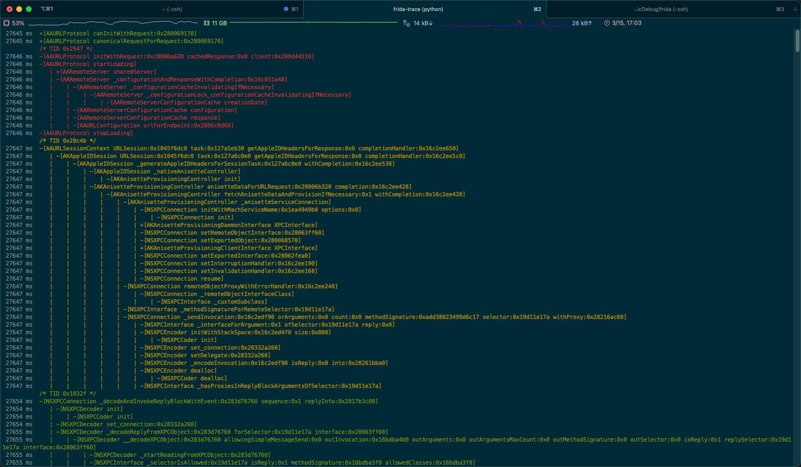
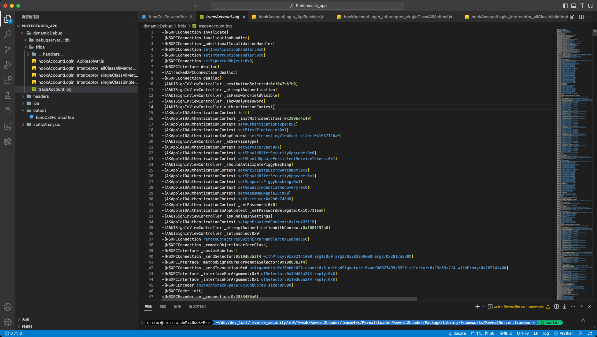
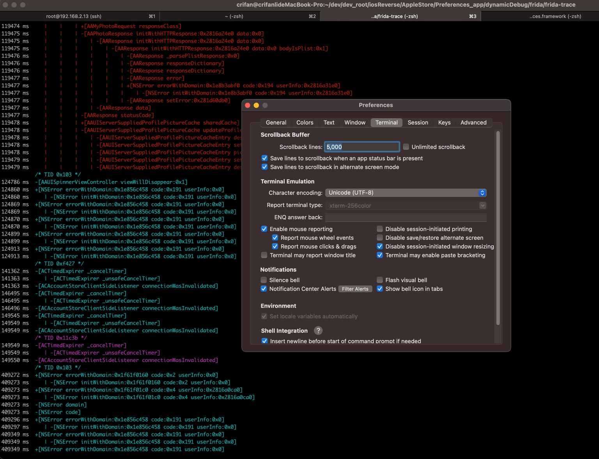
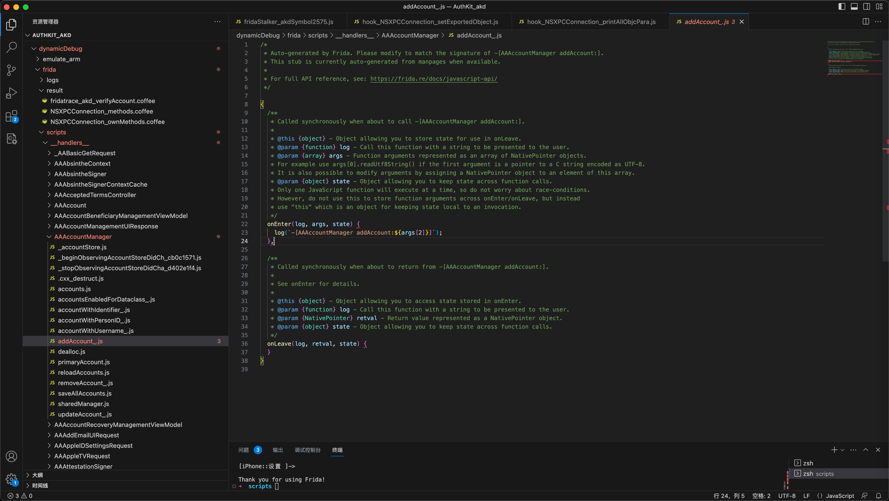

# frida-trace

## hook指定的多个二进制库文件

想要去用frida-trace追踪的iOS的ObjC的库=Framework=二进制：

* AppleAccount
* AppleAccountUI
* Accounts
* AccountsDaemon
* AuthKitUI
* AuthKit
* UserManagement

最后是用：

* 去include 多个 module
```bash
frida-trace -U -F com.apple.Preferences -I "AppleAccount*" -I "UserManagement" -I "Accounts*" -I "AuthKit*"
```

可以运行，但是结果：

* 只找到少数几个函数，不是我们要的
  * -》这么多库，一共才有107个函数
  * -》其中AppleAccount只有7个函数，其中就有上面的_AALogSystem仅仅是日志的函数，而不是我们要的：很多其他账号登录相关的函数
  * -》正常情况下，应该会有非常多的函数才对

注：

也可以换另外写法：

```bash
frida-trace -U -F com.apple.Preferences -i "AppleAccount\!" -i "AppleAccountUI\!"  -i "Accounts\!" -i "AccountsDaemon\!" -i "AuthKit\!" -i "AuthKitUI\!" -i "UserManagement\!"
```

不过结果都一样：hook的函数都很少，不是我们想要的。

## 输出日志到文件中

* 解决办法：加上`-o`参数，去指定输出log到文件
  * 命令
    ```bash
    frida-trace -U -F com.apple.Preferences -o traceAccount.log -m "*[AA* *]" -m "*[AK* *]" -m "*[AS* *]" -m "*[NSXPC* *]" -M "-[ASDBundle copyWithZone:]" -M "-[ASDInstallationEvent copyWithZone:]" -M "-[NSXPCEncoder _encodeArrayOfObjects:forKey:]" -M "-[NSXPCEncoder _encodeUnkeyedObject:]" -M "-[NSXPCEncoder _replaceObject:]" -M "-[NSXPCEncoder _checkObject:]" -M "-[NSXPCEncoder _encodeObject:]" -M "-[NSXPCConnection replacementObjectForEncoder:object:]"
    ```
  * 缺点
    * 之前=输出日志到终端：带颜色和缩进 -> 利于查看函数调用关系
      * 
    * 现在=输出日志到文件：丢失了颜色，更主要是缩进也丢失了 -> 非常不利于查看函数调用关系
      * 

### 想要保留所有的frida-trace的带缩进的日志

如上所述，想要：保留所有的frida-trace的日志，但如果用输出到日志文件，却又丢失缩进（和颜色）

另外有个规避办法：

修改当前终端的最大显示行数 -> 就可以避免输出日志行数太多，之前内容被冲掉，看不到的问题了

比如：

* `Mac`中`iTerm2`中，右键当前tab页顶部-》右键-》`Edit Session`->`Terminal`->`Scrollback Buffer`->`Scrollback line`：改为足够大的数值，比如`5000`
  * 

甚至如果log日志特别长，那么可以考虑：设置为无限行数都保留 == `Unlimited scrollback`


这样就完全不用担心日志行数太多，前面的日志被冲掉，看不到的问题了。

## 通过修改特定函数的hook的js去打印参数值

对于之前的需求：frida-trace时，打印其中特定的某个ObjC函数的参数

之前不知道如何解决，后来参考[这里](https://www.cnblogs.com/witchan/p/16904169.html)，突然想到：

倒是可以借助其所说的，对于frida-trace自动为每个类的函数，所生成的js文件：

* 位置：`__handlers__/{ClassName}/{FunctionName}.js`

去修改js代码，加上打印对应的`args`的代码，即可打印对应参数值了。

### 举例

#### -[AAAccountManager addAccount:]

frida-trace为函数`-[AAAccountManager addAccount:]`自动生成的：

* js文件
  * `/Users/crifan/dev/dev_root/iosReverse/AppleStore/AuthKit_akd/dynamicDebug/frida/scripts/__handlers__/AAAccountManager/addAccount_.js`
    * 
* 完整js代码
  ```js
  /*
  * Auto-generated by Frida. Please modify to match the signature of -[AAAccountManager addAccount:].
  * This stub is currently auto-generated from manpages when available.
  *
  * For full API reference, see: https://frida.re/docs/javascript-api/
  */

  {
    /**
      * Called synchronously when about to call -[AAAccountManager addAccount:].
    *
    * @this {object} - Object allowing you to store state for use in onLeave.
    * @param {function} log - Call this function with a string to be presented to the user.
    * @param {array} args - Function arguments represented as an array of NativePointer objects.
    * For example use args[0].readUtf8String() if the first argument is a pointer to a C string encoded as UTF-8.
    * It is also possible to modify arguments by assigning a NativePointer object to an element of this array.
    * @param {object} state - Object allowing you to keep state across function calls.
    * Only one JavaScript function will execute at a time, so do not worry about race-conditions.
    * However, do not use this to store function arguments across onEnter/onLeave, but instead
    * use "this" which is an object for keeping state local to an invocation.
    */
    onEnter(log, args, state) {
      log(`-[AAAccountManager addAccount:${args[2]}]`);
    },

    /**
      * Called synchronously when about to return from -[AAAccountManager addAccount:].
    *
    * See onEnter for details.
    *
    * @this {object} - Object allowing you to access state stored in onEnter.
    * @param {function} log - Call this function with a string to be presented to the user.
    * @param {NativePointer} retval - Return value represented as a NativePointer object.
    * @param {object} state - Object allowing you to keep state across function calls.
    */
    onLeave(log, retval, state) {
    }
  }
  ```

可以拷贝把其中的：

```js
log(`-[AAAccountManager addAccount:${args[2]}]`);
```

改为：

```js
log(`-[AAAccountManager addAccount:${new ObjC.Object(args[2])}]`);
```

应该就可以：打印出**ObjC对象的信息**了，而不仅仅是：`ptr`=`NativePointer`的**指针的字符串**而已。
