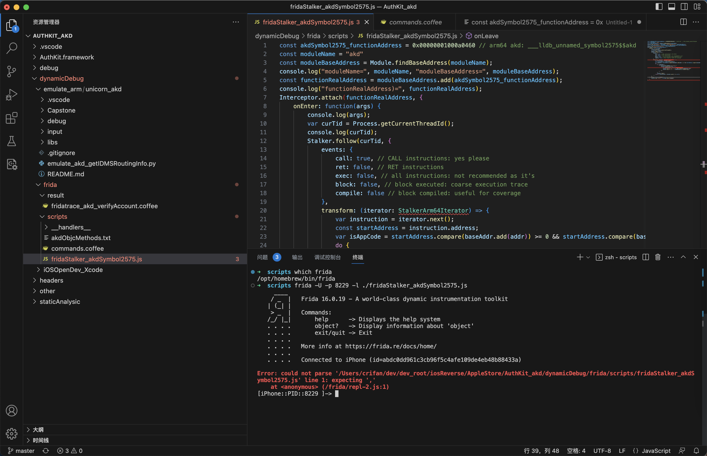

# js

此处整理Frida中js的一些经验心得。

## 常见错误

### RangeError: invalid array index

* 错误：Frida的hook脚本js中
  ```js
  Interceptor.attach(functionRealAddress, {
    onEnter: function(args) {
      console.log(args);
  ```
  * 会报错：`RangeError: invalid array index`
* 原因：无法知道准确的`args`的数组的大小，无法直接打印，所以报错
* 解决办法：不去直接打印，而改为去获取对应的前几个参数（前提：已知参数个数），再去打印：
  ```js
  Interceptor.attach(functionRealAddress, {
    onEnter: function(args) {
      var arg0 = args[0]
      var arg1 = args[1]
      var arg2 = args[2]
      console.log("arg0=" + arg0 + ", arg1=" + arg1 + ", arg2=" + arg2);
  ```
  * 进一步优化：甚至是，计算出此处的ObjC的参数的个数，循环批量打印所有参数
    * 具体详见：[ObjC的参数](../../use_frida/frida_cli/ios_objc/objc_para.md)中的`计算ObjC的函数的真正参数的个数 + 打印全部参数`

## Frida对于js支持的不够好

Frida对于js支持的不够好，不够完美：

* js报错时，代码错误行数指示有误
* console.log的参数格式化不支持
* putCallout中传递有名的独立函数会导致崩溃，改为匿名函数即可

下面详细解释：

### js报错时，代码错误行数指示有误

* 问题：

Frida的`js`代码文件中，参考别人的`ts`的代码，写了：

```js
transform: (iterator: StalkerArm64Iterator) => {
...
var arm64Context = ctx as Arm64CpuContext;
```

结果语法报错

```bash
Error: could not parse ‘xxxf/ridaStalker_akdSymbol2575.js' line 1: expecting ','
    at <anonymous> (/frida/repl-2.js:1)
```



* 解决过程
  * Frida中对js代码报错，始终是第一行代码有问题
  * 后来是，花了很长时间和精力，才定位到真正问题：
* 原因：js代码中，后面的某2行中，先后出现的2个变量，没有定义
  * 2个变量是：`StalkerArm64Iterator`和`Arm64CpuContext`
  * 导致的整体js代码无法运行而报错
* 解决办法：注释掉2个未定义的变量（`StalkerArm64Iterator`和`Arm64CpuContext`）
* 心得：
  * 总之说明，js代码的解析，是Frida整个框架去基于js引擎（v8或其他？）去解析的
  * 所以最终输出的报错信息，不够友好，导致容易让人误判错误原因，从而增加解决问题的难度

### putCallout中传递有名的独立函数会导致崩溃

* 问题概述
  * 给putCallout传递函数：
    * 传递有名的独立的函数：会导致崩溃
    * 传递匿名的函数：就可以正常运行
* 详解

Frida的Stalker的transform中去写putCallout代码

注：完整代码详见：[___lldb_unnamed_symbol2575$$akd](../../frida_example/frida/ios_objc/stalker/akd_lldb_unnamed_symbol2575.md)

如果把putCallout写成是传入一个**独立的js函数**：

```js
transform: function (iterator) {
...
    if (curOffsetInt == 8516) {
        iterator.putCallout(needDebug);
    }
}

...
      function needDebug (context) {
          console.log("into needDebug: context=" + context);
          ...
      }
```

->就会导致此处出现崩溃：

```bash
。。。
Process terminated

Thank you for using Frida!
Fatal Python error: _enter_buffered_busy: could not acquire lock for <_io.BufferedReader name='<stdin>'> at interpreter shutdown, possibly due to daemon threads
Python runtime state: finalizing (tstate=0x000000010308e0c8)

Current thread 0x00000001f4ab4140 (most recent call first):
  <no Python frame>
```

而如果改为：**js匿名名函数**

```js
transform: function (iterator) {
...
    if (curOffsetInt == 8516) {
        // iterator.putCallout(needDebug);
        iterator.putCallout((context) => {
            console.log("into needDebug: context=" + context);
        });
    }
}
```

就不会崩溃

很是诡异。暂时不清楚具体原因。

* 心得：Frida中对于js的支持，还是不够完善
  * 容易遇到一些诡异的bug

### console.log的参数格式化不支持

详见后续章节：[console.log日志](../../summary_note/js/console_log.md)
