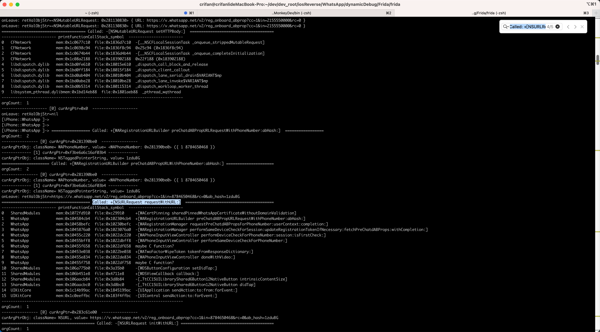
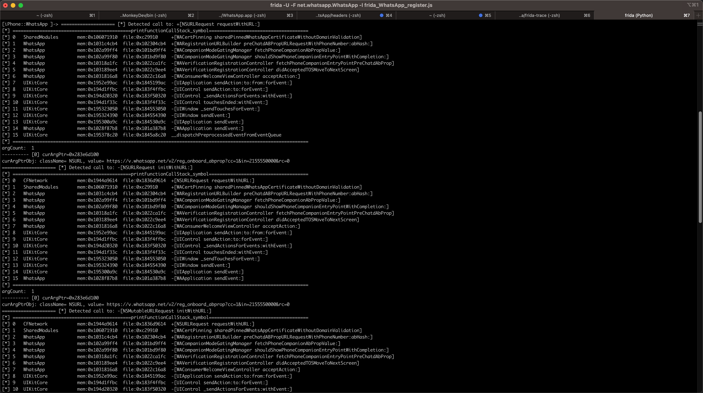

# iOS函数调用堆栈

对于Frida中，打印iOS函数调用堆栈，此处整理出2个函数：

* 地址版本 = 精简版：`printFunctionCallStack_addr`
  * 解释：（尤其是对于自己的二进制）只能输出地址，无法输出完整精确的符号名
    * 优点：代码简洁
    * 缺点：只有地址，没有符号，不够用
* 符号版本 = 详细版：`printFunctionCallStack_symbol`
  * 解释：从地址解析后得到准确的符号=函数名的版本
    * 优点：能看到函数名=解析后的符号名，更好用
    * 缺点：代码比较多比较复杂
  * 说明
    * 参考自
      * https://github.com/4ch12dy/FridaLib/blob/master/iOS/iOSFridaLib.js
    * 且做了额外优化
      * 加上cache缓存，提高解析速度

## printFunctionCallStack_addr

```js
function printFunctionCallStack_addr(curContext){
	console.log('Stack:\n' +
		Thread.backtrace(curContext, Backtracer.ACCURATE)
		.map(DebugSymbol.fromAddress).join('\n') + '\n');
}
```

用法举例：

```js
Interceptor.attach(curMethod.implementation, {
  onEnter: function(args) {
    printFunctionCallStack_addr(this.context)
```

输出：

```bash
Stack:
0x109afd910 SharedModules!WAGetWCIHttpImpl
0x106a14cb4 !0x2304cb4 (0x102304cb4)
0x1062e9ff4 !0x1bd9ff4 (0x101bd9ff4)
0x1062e9f80 !0x1bd9f80 (0x101bd9f80)
0x1069da1fc !0x22ca1fc (0x1022ca1fc)
0x1069d9ee4 !0x22c9ee4 (0x1022c9ee4)
0x1069d16a8 !0x22c16a8 (0x1022c16a8)
0x1952e99ac UIKitCore!-[UIApplication sendAction:to:from:forEvent:]
0x194d1ffbc UIKitCore!-[UIControl sendAction:to:forEvent:]
0x194d20320 UIKitCore!-[UIControl _sendActionsForEvents:withEvent:]
0x194d1f33c UIKitCore!-[UIControl touchesEnded:withEvent:]
0x195323050 UIKitCore!-[UIWindow _sendTouchesForEvent:]
0x195324390 UIKitCore!-[UIWindow sendEvent:]
0x195300a9c UIKitCore!-[UIApplication sendEvent:]
0x1061487b8 !0x1a387b8 (0x101a387b8)
0x195378c20 UIKitCore!__dispatchPreprocessedEventFromEventQueue
```

## printFunctionCallStack_symbol

代码：

```js

/*******************************************************************************
 * Config && Settings
*******************************************************************************/

// Print Function Stack Call
let isUseCache = true

// print only once stack for every function
let isPrintOnlyOnceStack = true

let cfgPrintOnceStackExceptionList = [
	"+[NSURLRequest requestWithURL:]",
]

/*******************************************************************************
 * Global Variables
*******************************************************************************/

var gPrintedStackDict = {}

var gAddrToModuleInfoDict = {}
var gModulePathToSlideDict = {}
var gModulePathToClassesDict = {}
var gModulePathAddrToSymbolDict = {}
var gClassnameToAllMethodsDict = {}


var free = null
var objc_getClass = null
var class_copyMethodList = null
var objc_getMetaClass = null
var method_getName = null
var dladdr = null
var _dyld_image_count = null
var _dyld_get_image_name = null
var _dyld_get_image_vmaddr_slide = null
var objc_copyClassNamesForImage = null

/******************** iOS Common Lib Functions ********************/

function initCommonLibFunctions(){
	console.log("Init common functions in common libs:")

	// free
	free = new NativeFunction(
		Module.findExportByName(null, 'free'),
		'void',
		['pointer']
	)
	console.log("free=" + free)

	objc_getClass = new NativeFunction(
		Module.findExportByName(null, 'objc_getClass'),
		'pointer',
		['pointer']
	)
	console.log("objc_getClass=" + objc_getClass)

	class_copyMethodList = new NativeFunction(
		Module.findExportByName(null, 'class_copyMethodList'),
		'pointer',
		['pointer', 'pointer']
	)
	console.log("class_copyMethodList=" + class_copyMethodList)

	objc_getMetaClass = new NativeFunction(
		Module.findExportByName(null, 'objc_getMetaClass'),
		'pointer',
		['pointer']
	)
	console.log("objc_getMetaClass=" + objc_getMetaClass)

	method_getName = new NativeFunction(
		Module.findExportByName(null, 'method_getName'),
		'pointer',
		['pointer']
	)
	console.log("method_getName=" + method_getName)

	/*
	int dladdr(const void *, Dl_info *);

	typedef struct dl_info {
					const char      *dli_fname;     // Pathname of shared object
					void            *dli_fbase;     // Base address of shared object
					const char      *dli_sname;     // Name of nearest symbol
					void            *dli_saddr;     // Address of nearest symbol
	} Dl_info;

	*/
	dladdr = new NativeFunction(
		Module.findExportByName(null, 'dladdr'),
		'int',
		['pointer','pointer']
	)
	console.log("dladdr=" + dladdr)

	// uint32_t  _dyld_image_count(void)
	_dyld_image_count = new NativeFunction(
		Module.findExportByName(null, '_dyld_image_count'),
		'uint32',
		[]
	)
	console.log("_dyld_image_count=" + _dyld_image_count)

	// const char*  _dyld_get_image_name(uint32_t image_index) 
	_dyld_get_image_name = new NativeFunction(
		Module.findExportByName(null, '_dyld_get_image_name'),
		'pointer',
		['uint32']
	)
	console.log("_dyld_get_image_name=" + _dyld_get_image_name)


	// intptr_t   _dyld_get_image_vmaddr_slide(uint32_t image_index)
	_dyld_get_image_vmaddr_slide = new NativeFunction(
		Module.findExportByName(null, '_dyld_get_image_vmaddr_slide'),
		'pointer',
		['uint32']
	)
	console.log("_dyld_get_image_vmaddr_slide=" + _dyld_get_image_vmaddr_slide)

	// const char * objc_copyClassNamesForImage(const char *image, unsigned int *outCount)
	objc_copyClassNamesForImage = new NativeFunction(
		Module.findExportByName(null, 'objc_copyClassNamesForImage'),
		'pointer',
		['pointer', 'pointer']
	);
	console.log("objc_copyClassNamesForImage=" + objc_copyClassNamesForImage)
}

// https://github.com/4ch12dy/FridaLib/blob/master/iOS/iOSFridaLib.js

// xia0 log
function XLOG(log) {
	console.log("[*] " + log)
}

// format string with width
function format(str,width){	
	str = str + ""
	var len = str.length;
	
	if(len > width){
			return str
	}

	for(var i = 0; i < width-len; i++){
			str += " "
	}
	return str
}

function getExecFileName(modulePath){
	modulePath += ""
	return modulePath.split("/").pop()
}

// get module info from address
function get_info_form_address(address){
	var moduleInfoDict = null
	var needAddToCache = false

	if (isUseCache){
		if (address in gAddrToModuleInfoDict){
			moduleInfoDict = gAddrToModuleInfoDict[address]
			// XLOG("Found: address=" + address + " in gAddrToModuleInfoDict, moduleInfoDict=" + toJsonStr(moduleInfoDict))
			return moduleInfoDict
		} else {
			needAddToCache = true
		}
	}

	var dl_info = Memory.alloc(Process.pointerSize*4);

	dladdr(ptr(address), dl_info)

	var dli_fname = Memory.readCString(Memory.readPointer(dl_info))
	var dli_fbase = Memory.readPointer(dl_info.add(Process.pointerSize))
	var dli_sname = Memory.readCString(Memory.readPointer(dl_info.add(Process.pointerSize*2)))
	var dli_saddr = Memory.readPointer(dl_info.add(Process.pointerSize*3))
	
	//XLOG("dli_fname:"+dli_fname)
	//XLOG("dli_fbase:"+dli_fbase)
	//XLOG("dli_sname:"+dli_sname)
	//XLOG("dli_saddr:"+dli_saddr)
	
	// var addrInfo = new Array();
	
	// addrInfo.push(dli_fname);
	// addrInfo.push(dli_fbase);
	// addrInfo.push(dli_sname);
	// addrInfo.push(dli_saddr);
	
	// //XLOG(addrInfo)
	// return addrInfo;

	moduleInfoDict = {
		"fileName": dli_fname,
		"fileAddress": dli_fbase,
		"symbolName": dli_sname,
		"symbolAddress": dli_saddr,
	}

	if (needAddToCache){
		// XLOG("Add: address=" + address + ", moduleInfoDict=" + toJsonStr(moduleInfoDict) + " into cache gAddrToModuleInfoDict")
		gAddrToModuleInfoDict[address] = moduleInfoDict
	}

	return moduleInfoDict
}

function get_image_vm_slide(modulePath){
	var moduleSlide = 0

	var needAddToCache = false

	if (isUseCache){
		if (modulePath in gModulePathToSlideDict){
			moduleSlide = gModulePathToSlideDict[modulePath]
			// XLOG("Found: modulePath=" + modulePath + " in gModulePathToSlideDict, moduleSlide=" + moduleSlide)
			return moduleSlide
		} else {
			needAddToCache = true
		}
	}

	var image_count = _dyld_image_count()

	for (var i = 0; i < image_count; i++) {
			var image_name_ptr = _dyld_get_image_name(i)
			var image_silde_ptr = _dyld_get_image_vmaddr_slide(i)
			var image_name = Memory.readUtf8String(image_name_ptr)

			if (image_name == modulePath) {
					//XLOG(Memory.readUtf8String(image_name_ptr) + " slide:"+image_silde_ptr)
					// return image_silde_ptr
					moduleSlide = image_silde_ptr
					break
			}
			//XLOG(Memory.readUtf8String(image_name_ptr) + "slide:"+image_silde_ptr)
	}

	// return 0

	if (needAddToCache){
		// XLOG("Add: modulePath=" + modulePath + ", moduleSlide=" + moduleSlide + " into cache gModulePathToSlideDict")
		gModulePathToSlideDict[modulePath] = moduleSlide
	}

	return moduleSlide
}


function get_all_objc_class(modulePath){
	var classes = new Array()

	var needAddToCache = false

	if (isUseCache){
		if (modulePath in gModulePathToClassesDict){
			classes = gModulePathToClassesDict[modulePath]
			// XLOG("Found: modulePath=" + modulePath + " in gModulePathToClassesDict, classes=" + classes)
			// XLOG("Found: modulePath=" + modulePath + " in gModulePathToClassesDict, classes.length=" + classes.length)
			return classes
		} else {
			needAddToCache = true
		}
	}

	// if given modulePath nil, default is mainBundle
	if(!modulePath){
		var path = ObjC.classes.NSBundle.mainBundle().executablePath().UTF8String()
	}else{
		var path = modulePath
	}

	// create args
	var pPath = Memory.allocUtf8String(path)
	var p = Memory.alloc(Process.pointerSize)
	Memory.writeUInt(p, 0)

	var pClasses = objc_copyClassNamesForImage(pPath, p)
	var count = Memory.readUInt(p)
	classes = new Array(count)

	for (var i = 0; i < count; i++) {
			var pClassName = Memory.readPointer(pClasses.add(i * Process.pointerSize))
			classes[i] = Memory.readUtf8String(pClassName)
	}

	free(pClasses)

	if (needAddToCache){
		// XLOG("Add: modulePath=" + modulePath + ", classes=" + classes + " into cache gModulePathToClassesDict")
		// XLOG("Add: modulePath=" + modulePath + ", classes.length=" + classes.length + " into cache gModulePathToClassesDict")
		gModulePathToClassesDict[modulePath] = classes
	}

	// XLOG(classes)
	return classes
}


function get_all_class_methods(classname){
	var allMethods = new Array()

	var needAddToCache = false

	if (isUseCache){
		if (classname in gClassnameToAllMethodsDict){
			allMethods = gClassnameToAllMethodsDict[classname]
			// XLOG("Found: classname=" + classname + " in gClassnameToAllMethodsDict, allMethods=" + toJsonStr(allMethods))
			// XLOG("Found: classname=" + classname + " in gClassnameToAllMethodsDict, allMethods.length=" + allMethods.length)
			return allMethods
		} else {
			needAddToCache = true
		}
	}

	// get objclass and metaclass
	var name = Memory.allocUtf8String(classname)
	var objClass = objc_getClass(name)
	var metaClass = objc_getMetaClass(name)
	
	// get obj class all methods
	var size_ptr = Memory.alloc(Process.pointerSize)
	Memory.writeUInt(size_ptr, 0)
	var pObjMethods = class_copyMethodList(objClass, size_ptr)
	var count = Memory.readUInt(size_ptr)
	
	var allObjMethods = new Array()
	
	// get obj class all methods name and IMP
	for (var i = 0; i < count; i++) {
		var curObjMethod = new Array()
		var pObjMethodSEL = method_getName(pObjMethods.add(i * Process.pointerSize))
		var pObjMethodName = Memory.readCString(Memory.readPointer(pObjMethodSEL))
		var objMethodIMP = Memory.readPointer(pObjMethodSEL.add(2*Process.pointerSize))
		// XLOG("-["+classname+ " " + pObjMethodName+"]" + ":" + objMethodIMP)
		curObjMethod.push(pObjMethodName)
		curObjMethod.push(objMethodIMP)
		allObjMethods.push(curObjMethod)
	}
	
	var allMetaMethods = new Array()
	
	// get meta class all methods name and IMP
	var pMetaMethods = class_copyMethodList(metaClass, size_ptr)
	var count = Memory.readUInt(size_ptr)
	for (var i = 0; i < count; i++) {
		var curMetaMethod = new Array()
		
		var pMetaMethodSEL = method_getName(pMetaMethods.add(i * Process.pointerSize))
		var pMetaMethodName = Memory.readCString(Memory.readPointer(pMetaMethodSEL))
		var metaMethodIMP = Memory.readPointer(pMetaMethodSEL.add(2*Process.pointerSize))
		//XLOG("+["+classname+ " " + pMetaMethodName+"]" + ":" + metaMethodIMP)
		curMetaMethod.push(pMetaMethodName)
		curMetaMethod.push(metaMethodIMP)
		allMetaMethods.push(curMetaMethod)
	}
	
	allMethods.push(allObjMethods)
	allMethods.push(allMetaMethods)
	
	free(pObjMethods)
	free(pMetaMethods)

	if (needAddToCache){
		// XLOG("Add: classname=" + classname + ", allMethods=" + toJsonStr(allMethods) + " into cache gClassnameToAllMethodsDict")
		// XLOG("Add: classname=" + classname + ", allMethods.length=" + allMethods.length + " into cache gClassnameToAllMethodsDict")
		gClassnameToAllMethodsDict[classname] = allMethods
	}

	return allMethods
}

function find_symbol_from_address(modulePath, addr){
	var symbol = "???"
	var modulePathAddr = modulePath + "|" + addr

	var needAddToCache = false

	if (isUseCache){
		if (modulePathAddr in gModulePathAddrToSymbolDict){
			symbol = gModulePathAddrToSymbolDict[modulePathAddr]
			// XLOG("Found: modulePathAddr=" + modulePathAddr + " in gModulePathAddrToSymbolDict, symbol=" + symbol)
			return symbol
		} else {
			needAddToCache = true
		}
	}

	var frameAddr = addr
	var theDis = 0xffffffffffffffff
	var tmpDis = 0
	var theClass = "None"
	var theMethodName = "None"
	var theMethodType = "-"
	var theMethodIMP = 0
	
	var allClassInfo = {}

	var allClass = get_all_objc_class(modulePath)
	
	for(var i = 0, len = allClass.length; i < len; i++){
		var curClassName = allClass[i]
		// var mInfo = get_all_class_method(curClassName)
		var mInfo = get_all_class_methods(curClassName)
		
		var objms = mInfo[0]
		for(var j = 0, olen = objms.length; j < olen; j++){
			var mname = objms[j][0]
			var mIMP = objms[j][1]
			if(frameAddr >= mIMP){
				var tmpDis = frameAddr-mIMP
				if(tmpDis < theDis){
					theDis = tmpDis
					theClass = curClassName
					theMethodName = mname
					theMethodIMP = mIMP
					theMethodType = "-"
				}
			}
		}

		var metams = mInfo[1]
		for(var k = 0, mlen = metams.length; k < mlen; k++){
			var mname = metams[k][0]
			var mIMP = metams[k][1]
			if(frameAddr >= mIMP){
				var tmpDis = frameAddr-mIMP
				if(tmpDis < theDis){
					theDis = tmpDis
					theClass = curClassName
					theMethodName = mname
					theMethodIMP = mIMP
					theMethodType = "+"
				}
			}
		}
	}

	symbol = theMethodType+"["+theClass+" "+theMethodName+"]"

	if(symbol.indexOf(".cxx") != -1){
			symbol = "maybe C function?"
	}
	
	// if distance > 3000, maybe a c function
	if(theDis > 3000){
			symbol = "maybe C function? symbol:" + symbol
	}

	if (needAddToCache){
		// XLOG("Add: modulePathAddr=" + modulePathAddr + ", symbol=" + symbol + " into cache gModulePathAddrToSymbolDict")
		gModulePathAddrToSymbolDict[modulePathAddr] = symbol
	}

	return symbol
}


function generateFunctionCallStackList(context){
	var functionCallList = new Array()

	var mainPath = ObjC.classes.NSBundle.mainBundle().executablePath().UTF8String()
	// XLOG("mainPath=" + mainPath)
	var mainModuleName = getExecFileName(mainPath)
	// XLOG("mainModuleName=" + mainModuleName)

	var backtrace = Thread.backtrace(context, Backtracer.ACCURATE).map(DebugSymbol.fromAddress)
	for (var i = 0;i < backtrace.length;i ++)
	{
		// curStackFrame=0x10a1d1910 SharedModules!WAGetWCIHttpImpl
		// curStackFrame=0x1070f0cb4 !0x2304cb4 (0x102304cb4)
		// curStackFrame=0x1944a9614 /System/Library/Frameworks/CFNetwork.framework/CFNetwork!+[NSURLRequest requestWithURL:]
		var curStackFrame = backtrace[i] + ''
		// XLOG("curStackFrame=" + curStackFrame)

		// var curSym = curStackFrame.split("!")[1]
		var stackFrameSplittedArr = curStackFrame.split("!")
		var curAddrAndModuleStr = stackFrameSplittedArr[0]
		// XLOG("curAddrAndModuleStr=" + curAddrAndModuleStr)
		var curSym = stackFrameSplittedArr[1]
		// XLOG("curSym=" + curSym)

		// var curAddr = curStackFrame.split("!")[0].split(" ")[0]
		var curAddrAndModuleArr = curAddrAndModuleStr.split(" ")
		// XLOG("curAddrAndModuleArr=" + curAddrAndModuleArr)
		var curAddr = curAddrAndModuleArr[0]
		// XLOG("curAddr=" + curAddr)
		// var curModuleName = curStackFrame.split("!")[0].split(" ")[1]
		var curModuleName = curAddrAndModuleArr[1]
		// XLOG("curModuleName=" + curModuleName)
		
		var moduleInfoDict = get_info_form_address(curAddr);
		// XLOG("moduleInfoDict=" + toJsonStr(moduleInfoDict))

		var curModulePath = moduleInfoDict["fileName"]
		// XLOG("curModulePath=" + curModulePath)
		var fileAddress = moduleInfoDict["fileAddress"]
		// XLOG("fileAddress=" + fileAddress)
		var symbolName = moduleInfoDict["symbolName"]
		// XLOG("symbolName=" + symbolName)
		var symbolAddress = moduleInfoDict["symbolAddress"]
		// XLOG("symbolAddress=" + symbolAddress)

		// skip frida call stack
		if(!curModulePath){
			XLOG("! Omit for empty module path, parsed from curAddr=" + curAddr + ", moduleInfoDict=" + moduleInfoDict)
			continue
		}

		// var fileAddr = curAddr - get_image_vm_slide(curModulePath);
		var curModuleSlide = get_image_vm_slide(curModulePath)
		// XLOG("curModuleSlide=" + curModuleSlide)
		var fileAddr = curAddr - curModuleSlide
		// XLOG("fileAddr=" + fileAddr)

		// is the image in app dir?
		if (curModulePath.indexOf(mainModuleName) != -1 ) {
			curSym = find_symbol_from_address(curModulePath, curAddr)
			// XLOG("new curSym=" + curSym)
		}

		var curFunctionCallDict = {
			"curModulePath": curModulePath,
			"curAddr": curAddr,
			"fileAddr": fileAddr,
			"curSym": curSym,
		}
		functionCallList.push(curFunctionCallDict)
	}

	return functionCallList
}

function generateFunctionCallStackStr(functionCallList){
	var functionCallStackStr = "------------------------ printFunctionCallStack_symbol  ------------------------"
	functionCallStackStr += "\n"
	for (var i = 0;i < functionCallList.length; i++){
		var curFunctionCallDict = functionCallList[i]
		var curModulePath = curFunctionCallDict["curModulePath"]
		var curAddr = curFunctionCallDict["curAddr"]
		var fileAddr = curFunctionCallDict["fileAddr"]
		var curSym = curFunctionCallDict["curSym"]
		var executableFilename = getExecFileName(curModulePath)
		let execMaxWidth = 20
		// let execMaxWidth = 25
		var curFuncCallStr = format(i, 4)+format(executableFilename, execMaxWidth)+"mem:"+format(ptr(curAddr),13)+"file:"+format(ptr(fileAddr),13)+format(curSym,80)
		functionCallStackStr += curFuncCallStr + "\n"
	}
	functionCallStackStr += "--------------------------------------------------------------------------------"
	return functionCallStackStr
}

function printFunctionCallStack_symbol(context){
	var functionCallStackList = generateFunctionCallStackList(context)
	var functionCallStackStr = generateFunctionCallStackStr(functionCallStackList)
	console.log(functionCallStackStr)
	return functionCallStackStr
}
```

调用举例：

```js
/*******************************************************************************
 * Main
*******************************************************************************/

initCommonLibFunctions()

...
				Interceptor.attach(curMethod.implementation, {
					onEnter: function(args) {
						// console.log("==================== [*] Detected call to: " + iOSObjCallStr);
						var logstr = "Called: " + iOSObjCallStr
						var lineStr = generateLineStr(logstr)
						console.log(lineStr)

						var shouldPrintStack = true
						if (iOSObjCallStr in gPrintedStackDict){
							// console.log("iOSObjCallStr=" + iOSObjCallStr + " in gPrintedStackDict=" + toJsonStr(gPrintedStackDict.keys))
							if (isPrintOnlyOnceStack){
								// if (iOSObjCallStr in cfgPrintOnceStackExceptionList){
								if (isItemInList(iOSObjCallStr, cfgPrintOnceStackExceptionList)){
									// console.log("iOSObjCallStr=" + iOSObjCallStr + " in cfgPrintOnceStackExceptionList=" + toJsonStr(cfgPrintOnceStackExceptionList))
									shouldPrintStack = true
								} else {
									shouldPrintStack = false
								}
							}
						}

						// console.log("shouldPrintStack=" + shouldPrintStack)

						if (shouldPrintStack) {
							// printFunctionCallStack_addr(this.context)

							// printFunctionCallStack_symbol(this.context)
							var functionCallStackList = generateFunctionCallStackList(this.context)
							var functionCallStackStr = generateFunctionCallStackStr(functionCallStackList)
							console.log(functionCallStackStr)

							gPrintedStackDict[iOSObjCallStr] = functionCallStackStr
						}
...
```

（相关）输出：

```bash
======================================= Called: +[NSURLRequest requestWithURL:]  =======================================
------------------------ printFunctionCallStack_symbol  ------------------------
0   SharedModules       mem:0x1072fd910  file:0xc29910     +[WACertPinning sharedPinnedWhatsAppCertificateWithoutDomainValidation]
1   WhatsApp            mem:0x104584cb4  file:0x102304cb4  +[WARegistrationURLBuilder preChatdABPropURLRequestWithPhoneNumber:abHash:]
2   WhatsApp            mem:0x10458befc  file:0x10230befc  -[WARegistrationManager requestPreChatdABPropsForPhoneNumber:userContext:completion:]
3   WhatsApp            mem:0x1045876a0  file:0x1023076a0  -[WARegistrationManager performSameDeviceCheckForSession:updateRegistrationTokenIfNecessary:fetchPreChatdABProps:withCompletion:]
4   WhatsApp            mem:0x10455c220  file:0x1022dc220  -[WAPhoneInputViewController performDeviceCheckForPhoneNumber:session:isFirstCheck:]
5   WhatsApp            mem:0x10455bff8  file:0x1022dbff8  -[WAPhoneInputViewController performSameDeviceCheckForPhoneNumber:]
6   WhatsApp            mem:0x10455f658  file:0x1022df658  maybe C function?
7   WhatsApp            mem:0x10453e038  file:0x1022be038  +[WATwoFactorWipeToken tokenFromResponseDictionary:]
8   WhatsApp            mem:0x10455e834  file:0x1022de834  -[WAPhoneInputViewController doneWithVideo:]
9   WhatsApp            mem:0x10455f758  file:0x1022df758  maybe C function?
10  SharedModules       mem:0x106a775b0  file:0x3a35b0     -[WDSButtonConfiguration setDidTap:]
11  SharedModules       mem:0x106b451e8  file:0x4711e8     +[WDSViewCallback callback:]
12  SharedModules       mem:0x106aacb84  file:0x3d8b84     -[_TtCC15UILibraryShared6Button12NativeButton intrinsicContentSize]
13  SharedModules       mem:0x106aacbc0  file:0x3d8bc0     -[_TtCC15UILibraryShared6Button12NativeButton didTap]
14  UIKitCore           mem:0x1c14b99ac  file:0x1845199ac  -[UIApplication sendAction:to:from:forEvent:]
15  UIKitCore           mem:0x1c0eeffbc  file:0x183f4ffbc  -[UIControl sendAction:to:forEvent:]
--------------------------------------------------------------------------------
argCount:  1
---------------- [0] curArgPtr=0x283c61e00  ----------------
curArgPtrObj: className= NSURL, value= https://v.whatsapp.net/v2/reg_onboard_abprop?cc=1&in=8784650468&rc=0&ab_hash=1zduBG
```

* 截图
  * 新
    * 
  * 旧
    * 


