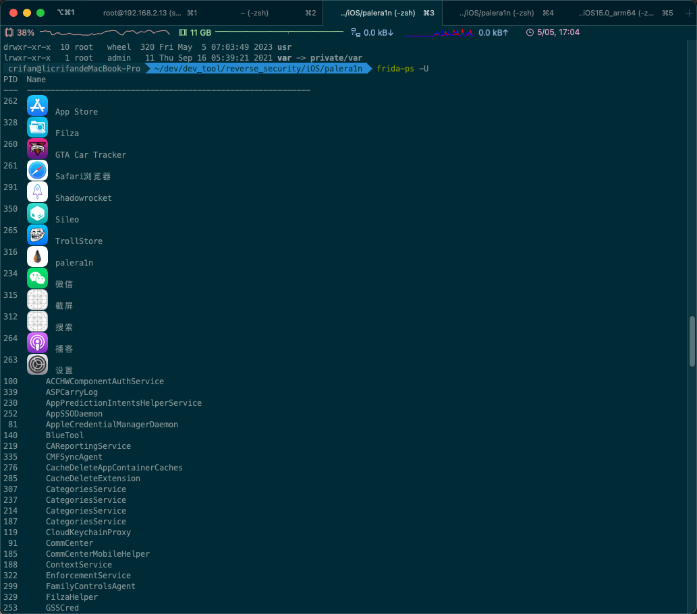

# frida-ps

* `frida-ps`
  * 是[frida-tools](../../../use_frida/sub_module/frida_tools/README.md)中一个常用的工具
  * 作用：显示系统进程列表
    * 类似于`ps`
    * 支持显示当前（Mac等）**PC端**的进程和（iPhone等）**移动端**中的进程
  * 官网文档
    * [frida-ps](https://frida.re/docs/frida-ps/)

## 用法

* 显示当前PC端进程：不加参数
  ```bash
  frida-ps
  ```
* 显示**USB**连接的（iPhone等）移动端中的（默认显示）所有进程，进程：`-U`
  ```bash
  frida-ps -U
  ```
* 显示**USB**连接的（iPhone等）移动端中的**应用程序**的进程：`-Ua` = `USB` + `only applications`
  ```bash
  frida-ps -Ua
  ```

## 举例

###  frida-ps -U

```bash
crifan@licrifandeMacBook-Pro  ~/dev/dev_tool/reverse_security/iOS/palera1n  frida-ps -U
PID  Name
---  ------------------------------------------------------------
262
      App Store
328
      Filza
260
      GTA Car Tracker
261
      Safari浏览器
291
      Shadowrocket
350
      Sileo
265
      TrollStore
316
      palera1n
234
      微信
315
      截屏
312
      搜索
264
      播客
263
      设置
100      ACCHWComponentAuthService
339      ASPCarryLog
230      AppPredictionIntentsHelperService
252      AppSSODaemon
 81      AppleCredentialManagerDaemon
140      BlueTool
219      CAReportingService
335      CMFSyncAgent
276      CacheDeleteAppContainerCaches
285      CacheDeleteExtension
307      CategoriesService
237      CategoriesService
214      CategoriesService
187      CategoriesService
119      CloudKeychainProxy
 91      CommCenter
185      CommCenterMobileHelper
188      ContextService
322      EnforcementService
...
```



### frida-ps -Ua

```bash
➜  ~ frida-ps -Ua
  PID  Name    Identifier
5  ------  ---------------------
23650
        微信  com.tencent.xin
11941
        日历  com.apple.mobilecal
19641
        设置  com.apple.Preferences
```

## 语法help

```bash
➜  ~ frida-ps --help
usage: frida-ps [options]

options:
  -h, --help            show this help message and exit
  -D ID, --device ID    connect to device with the given ID
  -U, --usb             connect to USB device
  -R, --remote          connect to remote frida-server
  -H HOST, --host HOST  connect to remote frida-server on HOST
  --certificate CERTIFICATE
                        speak TLS with HOST, expecting CERTIFICATE
  --origin ORIGIN       connect to remote server with “Origin” header set to ORIGIN
  --token TOKEN         authenticate with HOST using TOKEN
  --keepalive-interval INTERVAL
                        set keepalive interval in seconds, or 0 to disable (defaults to -1 to auto-
                        select based on transport)
  --p2p                 establish a peer-to-peer connection with target
  --stun-server ADDRESS
                        set STUN server ADDRESS to use with --p2p
  --relay address,username,password,turn-{udp,tcp,tls}
                        add relay to use with --p2p
  -O FILE, --options-file FILE
                        text file containing additional command line options
  --version             show program's version number and exit
  -a, --applications    list only applications
  -i, --installed       include all installed applications
  -j, --json            output results as JSON
```